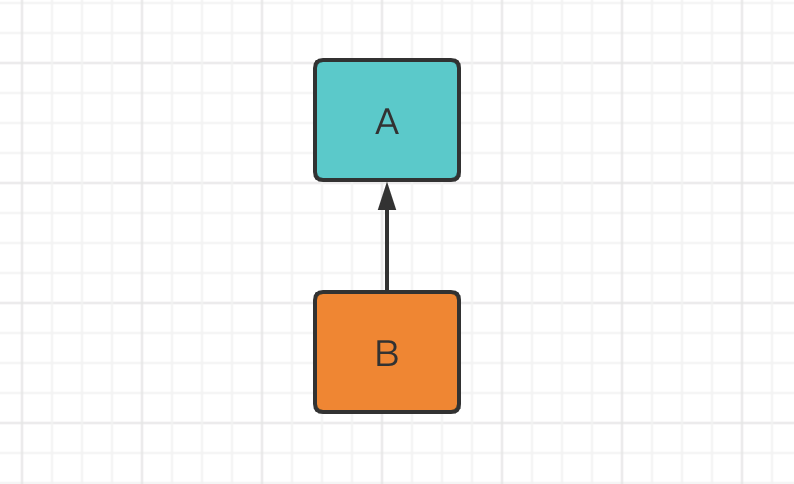
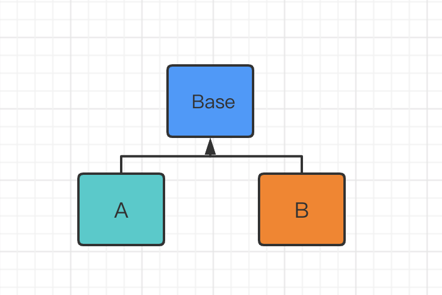

# 概述

Table of Contents
-----------------

* [1. 什么是设计模式？](#1-什么是设计模式)
* [2. 为什么要使用设计模式？](#2-为什么要使用设计模式)
* [3. 设计模式类型](#3-设计模式类型)
* [4. 单一职责](#4-单一职责)
* [5. 接口隔离](#5-接口隔离)
* [6. 依赖倒转](#6-依赖倒转)
* [7. 里氏替换](#7-里氏替换)
* [8. 开闭（重要）](#8-开闭重要)
* [9. 迪米特](#9-迪米特)
* [10. 设计模式修炼之道](#10-设计模式修炼之道)
* [参考资料](#参考资料)

## 1. 什么是设计模式？

设计模式，即 Design Patterns，是指在软件设计中，被反复使用的一种代码设计经验。使用设计模式的目的是为了可重用代码，提高代码的可扩展性和可维护性。

## 2. 为什么要使用设计模式？

- 代码重用性：相同功能的代码，不需要多次编写
- 代码可读性：编程规范性，便于其他程序员阅读
- 代码可扩展性：当增加新的功能后，原有功能不受影响

## 3. 设计模式类型

设计模式分三类，共 23 种：

- 创建型

- 结构型

- 行为型

## 4. 单一职责

一个类只负责一项职责

## 5. 接口隔离

类不应该依赖他不需要对接口，接口尽量小颗粒划分

## 6. 依赖倒转

> 依赖倒置原则基于这样一个事实：相对于细节的多变性，抽象的东西要稳定的多。以抽象为基础搭建起来的架构比以细节为基础搭建起来的架构要稳定的多。在java中，抽象指的是接口或者抽象类，细节就是具体的实现类，使用接口或者抽象类的目的是制定好规范和契约，而不去涉及任何具体的操作，把展现细节的任务交给他们的实现类去完成。

要从底层往上思考，尽量抽象类和接口

即面向接口编程

## 7. 里氏替换

子类可以扩展父类的功能，但不能改变父类原有的功能

继承的缺点：当父类需要改动方法，那么需要考虑是否对继承其的子类造成影响

为了缓解这一影响，里氏替换原则诞生了

B 继承 A

  
 

当 B 需要新增 / 重写很多方法或 A 也需要经常改动时

可以考虑增加一个 `base` 类，让 A 和 B 继承 `base`

  
 

## 8. 开闭（重要）

当软件需要变化时，尽量通过扩展软件实体店行为来实现变化，而不是通过修改已有的代码来实现变化

**用抽象构建框架，用实现扩展细节**

## 9. 迪米特

“与直接的朋友通信”

尽量将逻辑封装在类的内部，对外除了提供 `public` 方法，不泄露任何信息

 

## 10. 设计模式修炼之道

1. 刚开始学习编程不久，听过什么是设计模式
2. 有长时间的编程经验，其中用到了设计模式，但自己不知道
3. 学过了设计模式，使用中，发现了一些新的模式挺好用的
4. 阅读了很多源码和框架，在看别人的设计模式，能够体会设计模式的精妙和带来的好处
5. 编写代码的过程中不知不觉写出了设计模式

## 参考资料

- [万字总结之设计模式七大原则](https://juejin.im/post/6844904065806106632)
- [设计模式六大原则（1）：单一职责原则](https://blog.csdn.net/zhengzhb/article/details/7278174)
- [设计模式六大原则（2）：里氏替换原则](https://blog.csdn.net/zhengzhb/article/details/7281833)
- [设计模式六大原则（3）：依赖倒置原则](https://blog.csdn.net/zhengzhb/article/details/7289269)
- [设计模式六大原则（5）：迪米特法则](https://blog.csdn.net/zhengzhb/article/details/7296930)
- [设计模式六大原则（6）：开闭原则](https://blog.csdn.net/zhengzhb/article/details/7296944)

