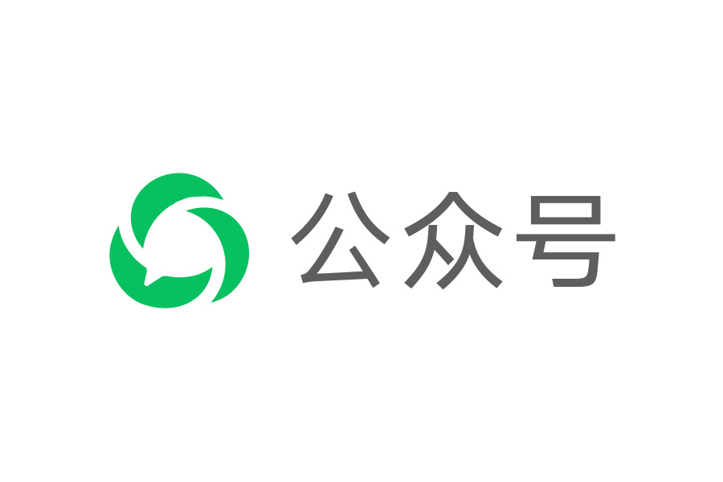
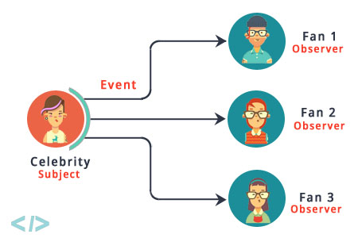

# 观察者模式（行为型）

Table of Contents
-----------------

* [1. 什么是观察者模式？](#1-什么是观察者模式)
* [2. 何时使用观察者模式？](#2-何时使用观察者模式)
* [3. 为何使用观察者模式？](#3-为何使用观察者模式)
* [4. Demo](#4-demo)
* [总结](#总结)
* [参考链接](#参考链接)


## 1. 什么是观察者模式？

维基百科

> 一个目标对象管理所有相依于它的观察者对象，并且在它本身的状态改变时主动发出通知。这通常透过呼叫各观察者所提供的方法来实现。此种模式通常被用来实时事件处理系统。


要更好地了解观察者模式（`Observer pattern`），先看看微信公众号订阅的例子：

<div align="center">  </div><br>

公众号的业务就是发文章 / 视频 / 音频

作为用户，当你订阅了该公众号，你就可以获取其最新的动态；当你不想再看时，可以取消订阅，就无法收到其动态

只要公众号还在运营，就会有人一直订阅 / 取消公众号


**出版者 + 订阅者 = 观察者模式**


在观察者模式中，出版者（微信公众号）称作主题（`Subject`），订阅者称作观察者（`Observer`）


**定义：**

定义对象间的一种一对多的依赖关系，当一个对象的状态发生改变时，所有依赖于它的对象都得到通知并被自动更新


<div align="center">  </div><br>


## 2. 何时使用观察者模式？

一个对象（目标对象）的状态发生改变，所有的依赖对象（观察者对象）都将得到通知，进行广播通知。

## 3. 为何使用观察者模式？

一个对象状态改变给其他对象通知的问题，而且要考虑到易用和低耦合，保证高度的协作。

## 4. Demo

定义 `Subject` ，他的一举一动都会受到观察者监视（这里和微信公众号的例子有一点点出入，主动权掌握在 `Subject` 中）

其中定义了 3 个方法：

- 注册观察者
- 移除观察者
- 通知观察者

**Subject.java**

```java
/**
 * Subject
 */
public interface Subject {

    void registerObserver(Observer observer);

    void removeObserver(Observer observer);

    void notifyObservers();

}
```

定义 `Observer` 接口

**Observer.java**

```java
/**
 * Observer
 */
public interface Observer {
}
```

定义 `WeatherType` 作为天气的枚举类

**WeatherType.java**

```java
public enum WeatherType {
    SUNNY("sunny"),
    RAINY("rainy"),
    WINDY("windy"),
    COLD("cold");

    private final String description;

    WeatherType(String description) {
        this.description = description;
    }

    public String getDescription() {
        return description;
    }

}
```

定义 `Weather` 作为出版者，实现 `Subject` 接口

其成员变量有两个：

- 当前的天气 `currentWeatherType`
- 观察者列表 `observers`

其中 `timePass()` 为业务逻辑，模拟天气的变化

**Weather.java**

```java
/**
 * Subject: Weather
 */
public class Weather implements Subject {

    private static final Logger LOGGER = Logger.getLogger(Weather.class.getName());

    private WeatherType currentWeatherType;
    private List<WeatherObserver> observers;

    public Weather() {
        currentWeatherType = WeatherType.RAINY;
        observers = new ArrayList<>();
    }


    @Override
    public void registerObserver(Observer observer) {
        observers.add((WeatherObserver) observer);
    }

    @Override
    public void removeObserver(Observer observer) {
        int index = observers.indexOf(observer);
        if (index >= 0) {
            observers.remove(index);
        }
    }

    @Override
    public void notifyObservers() {
        for (WeatherObserver observer : observers) {
            observer.update(currentWeatherType);
        }
    }

    public void timePass() {

        WeatherType[] weatherTypes = WeatherType.values();

        // simulate weather changes
        currentWeatherType = weatherTypes[(currentWeatherType.ordinal() + 1) % weatherTypes.length];

        LOGGER.info("Weather have changed to " + currentWeatherType);

        notifyObservers();
    }

}
```

定义 `WeatherObserver` 接口，让不同的观察者去实现（面向接口编程）

```java
/**
 * Observer: Weather observer
 */
public interface WeatherObserver extends Observer {
    /**
     * update weather type
     *
     * @param weatherType
     */
    void update(WeatherType weatherType);
}
```

接下来定义了 2 个观察者，实现 `WeatherObserver` 接口

- `Hobbits`
- `Orcs`

**Hobbits.java**

```java
public class Hobbits implements WeatherObserver {

    private static final Logger LOGGER = Logger.getLogger(Hobbits.class.getName());

    @Override
    public void update(WeatherType weatherType) {
        LOGGER.info("Hobbits are facing " + weatherType.getDescription() + " now!");
    }
}
```

**Orcs.java**

```java
public class Orcs implements WeatherObserver {

    private static final Logger LOGGER = Logger.getLogger(Orcs.class.getName());

    @Override
    public void update(WeatherType weatherType) {
        LOGGER.info("Orcs are facing " + weatherType.getDescription() + " now!");
    }
}
```

最后，定义函数入口类：

**App.java**

```java
import java.util.logging.Logger;
public class App {

    private static final Logger LOGGER = Logger.getLogger(App.class.getName());

    /**
     * Program entry point
     *
     * @param args
     */
    public static void main(String[] args) {
        
        Weather weather = new Weather();
        weather.registerObserver(new Hobbits());
        weather.registerObserver(new Orcs());

        weather.timePass();
        weather.timePass();

    }

}
```

:hammer: BUILD SUCCESS!

<div align="center">  </div><br>

当有新类型的观察者出现，只需要实现观察者接口，然后注册为观察者即可

当出版者有变动时，所有被注册的观察者都能收到通知

## 总结

1. 初看设计模式的时候会有点抽象，可以先上手 `demo` ，再回头看会发现设计的思想非常巧妙 
2. 第一遍先有个概念，遇到真实场景再回炉，温故而知新

## 参考链接

- [看懂UML类图和时序图](https://design-patterns.readthedocs.io/zh_CN/latest/read_uml.html)
- [使用JDK Logging](https://www.liaoxuefeng.com/wiki/1252599548343744/1264738568571776)
- [观察者模式](https://www.runoob.com/design-pattern/observer-pattern.html)

