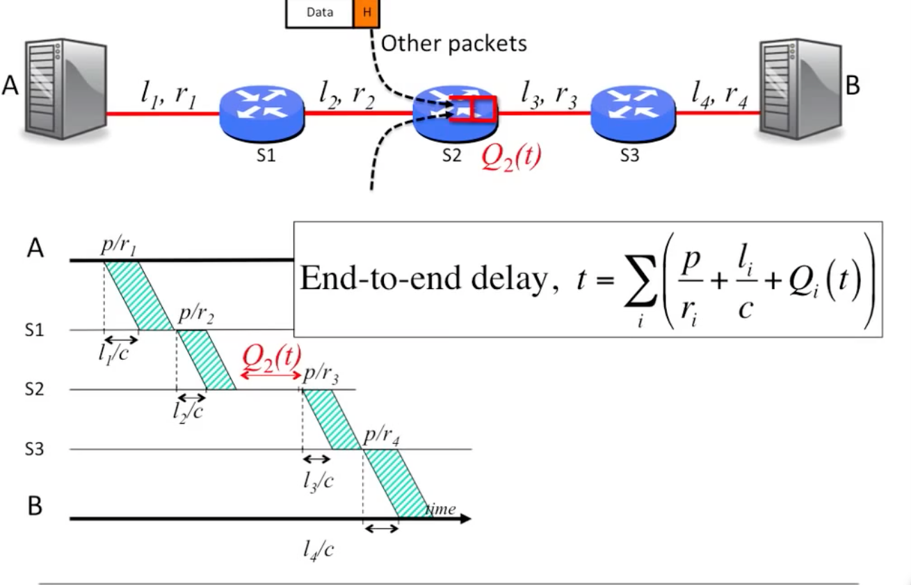
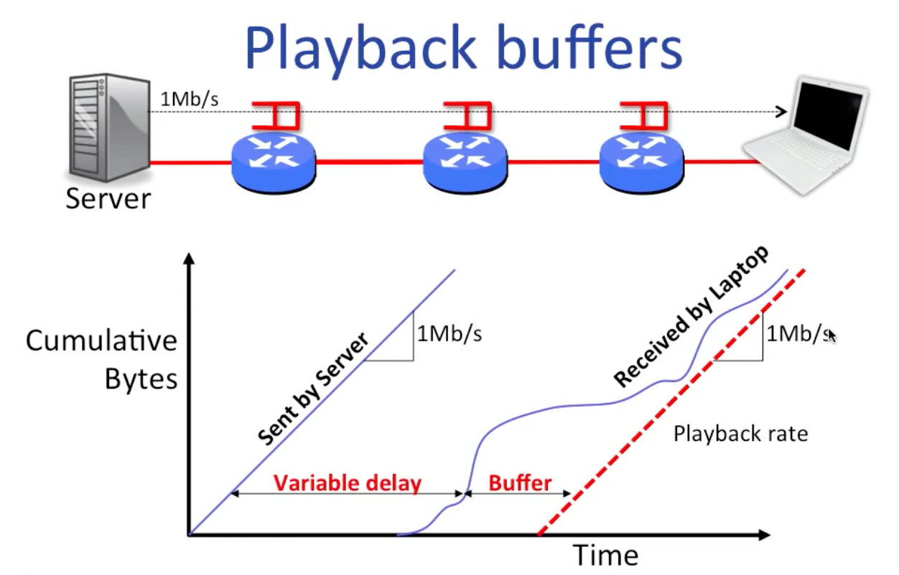
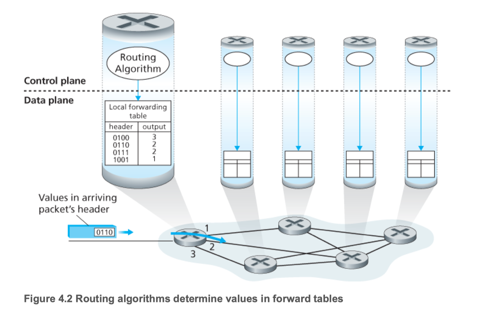
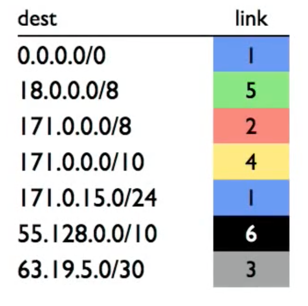
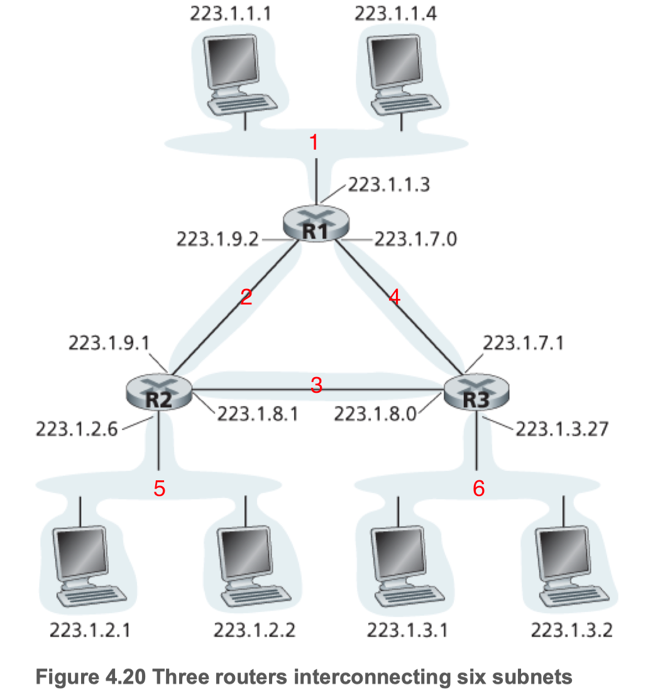

# Network Layer

Table of Contents
-----------------

* [1. Overview](#1-overview)
   * [1.1 Packet Switching](#11-packet-switching)
   * [1.2 Delay](#12-delay)
      * [1.2.1 Propagation](#121-propagation)
      * [1.2.2 Transmission](#122-transmission)
      * [1.2.3 Queueing](#123-queueing)
* [2. Router](#2-router)
   * [2.1 Overview](#21-overview)
   * [2.2 Lookup Address](#22-lookup-address)
* [3. Routing](#3-routing)
* [4. IP](#4-ip)
   * [4.1 Segment](#41-segment)
   * [4.2 Addressing](#42-addressing)
      * [4.2.1 IPv4 vs. IPv6](#421-ipv4-vs-ipv6)
* [References](#references)

## 1. Overview

### 1.1 Packet Switching

**Generic packet switching**

  
 

### 1.2 Delay

**Overview**

 
 

#### 1.2.1 Propagation

  
 

**Example**

A bit takes 5ms to travel 1,000 km in an optical fiber w/ propagation speed 2 x 108 m/s

#### 1.2.2 Transmission

  
 

**Example**

A 64B packet takes 5.12µs to be transmitted onto a 100Mb/s link

**End-to-end delay**

  
 

**Playback buffers**

  
 

#### 1.2.3 Queueing

- *A(t):* the average rate at which packets arrived at the queue
- *D(t):* the transmission rate (*R*), that is, it is the rate at which bits are pushed out of the queue

At *t* moment, the occupancy of queue *Q(t)* is: 
$$
Q(t) = A(t) - D(t)
$$

**simple model of queue**

  
 

**Little's law**

- *L:* inventory
- *λ:* throughput
- *W:* queue time

$$
L=λW
$$

  
 

**Example**

If there is 10 jobs in the system, and the throughput is 50 per second

so, the response time is calculated as 10 / 50 = 0.2s

## 2. Router

### 2.1 Overview

**Outline**

  
 

**Router**

  
 

**Workflow**

1. If the Ethernet *dest address* of the arriving frame belongs to the router, accept the frame. Else drop it
2. Examine the IP *version* and *length* of the datagram
3. Decrement the *TTL*, update the IP header *checksum*
4. Check to see if *TTL* == 0
5. If the IP *dest address* is in the *forwarding table*, forward to the correct egress ports for the next hop
6. Find the Ethernet *dest address* for the next hop router
7. Create a new Ethernet frame and send it

### 2.2 Lookup Address

**Longest prefix match**

  
 

## 3. Routing

**Example**

| Source       | Destination  | Netmask         | Same Network? |
| ------------ | ------------ | --------------- | ------------- |
| 128.34.1.15  | 128.35.1.15  | 255.255.0.0     | No            |
| 10.0.1.4     | 10.0.1.5     | 255.255.255.0   | Yes           |
| 10.0.1.4     | 10.0.2.5     | 255.255.255.0   | No            |
| 171.64.15.33 | 171.64.15.5  | 255.255.255.224 | No            |
| 171.64.15.33 | 171.19.201.2 | 255.0.0.0       | Yes           |

**Example**

  
 

|     Dest     | Link |
| :----------: | :--: |
|  63.19.5.3   |  3   |
| 171.15.15.0  |  4   |
|  63.19.5.32  |  1   |
| 44.199.230.1 |  1   |
| 171.128.16.0 |  2   |

## 4. IP

### 4.1 Segment

**IPv4**

  
  

**IPv6**

  
 

### 4.2 Addressing

> Any device connected to the internet requires an IP address

**Subnet**

  
 

**IPv4**

  
 

**IPv6**

  
 

#### 4.2.1 IPv4 vs. IPv6

| Characteristics       | IPv4                                                | IPv6                                                         |
| --------------------- | --------------------------------------------------- | ------------------------------------------------------------ |
| IP Address Size       | Has a 32-bit address size                           | Has a 128-bit address size                                   |
| Addressing Type       | Numeric address type. Octets are separated by a dot | Alphanumeric address type. Binary bits are separated by a colon (:) |
| Fragmentation         | Performed by the sender and the forwarding routes   | Performed by the sender                                      |
| Address configuration | Manually or through DHCP                            | Stateless address autoconfiguration through Internet Control Message Protocol version 6 (ICMPv6) or DHCPv6 |

## References

- [Little's law - Wikipedia](https://en.wikipedia.org/wiki/Little%27s_law)
- [Little's Law - The ONE thing you can do to improve process performance](https://www.youtube.com/watch?v=lHQZcMRr2n0)
- [Networking: IPv4 vs. IPv6 Addresses](https://www.baeldung.com/cs/ipv4-vs-ipv6)

