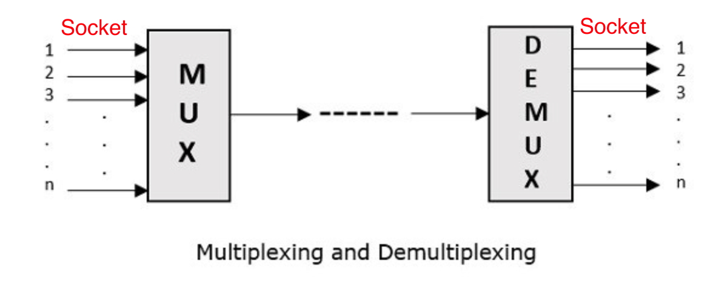
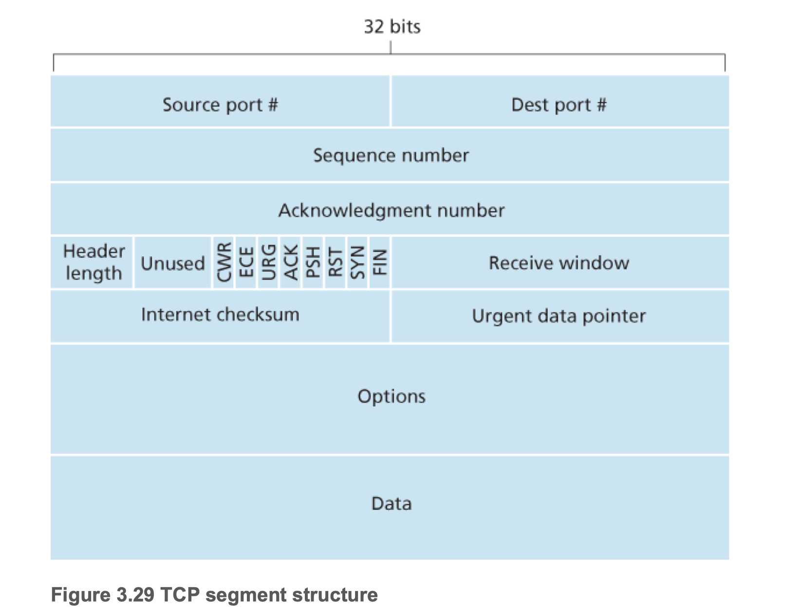
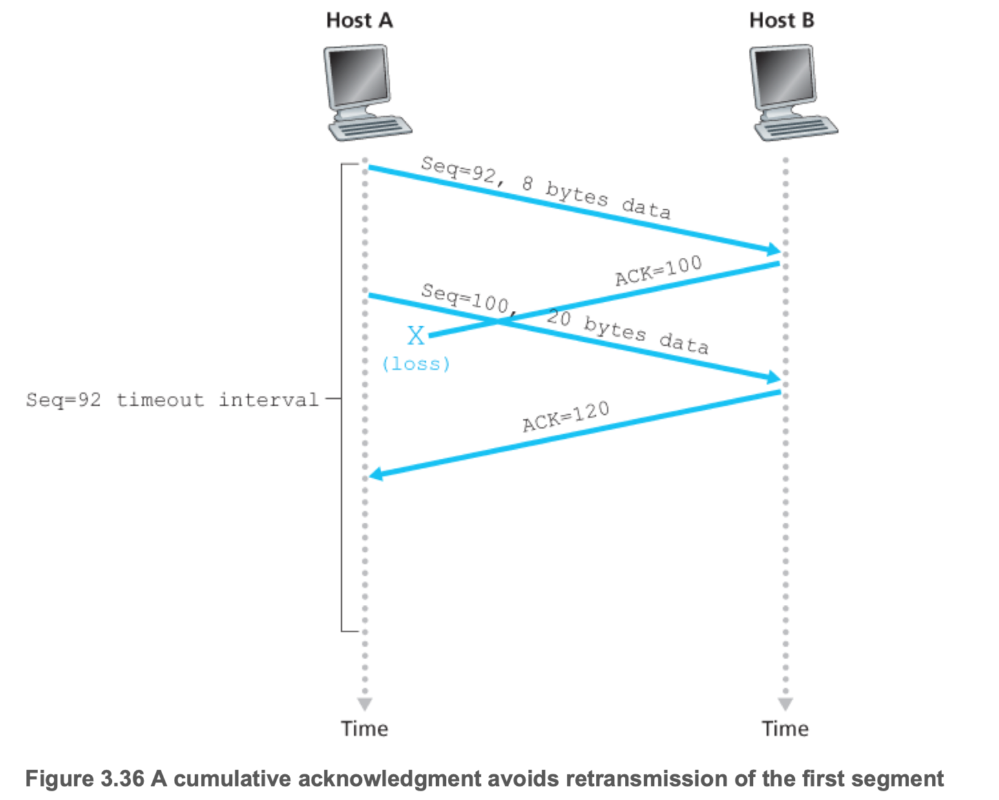
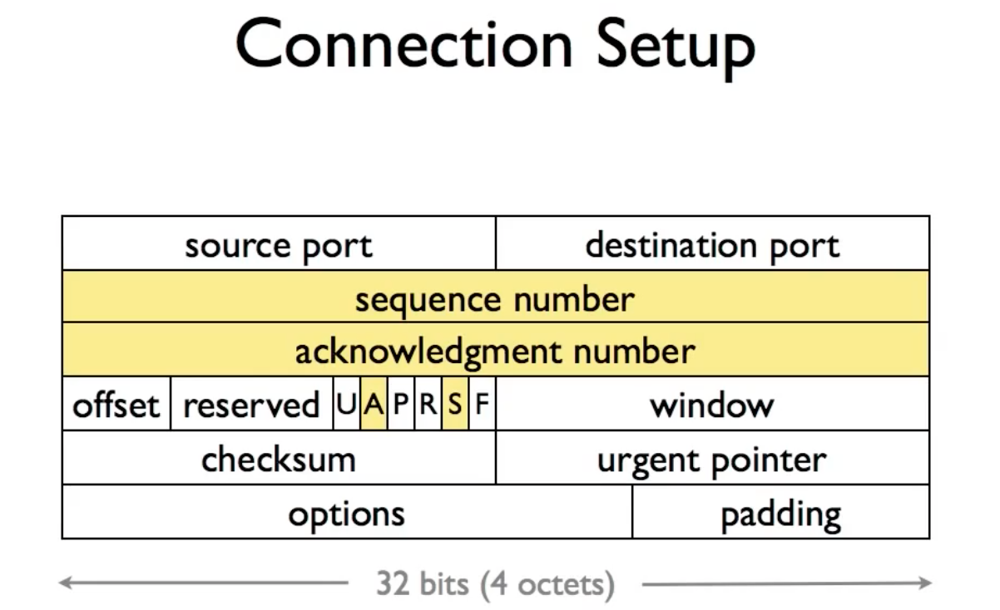
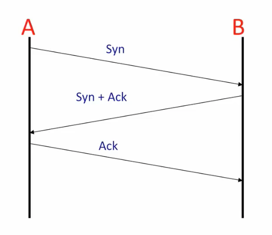
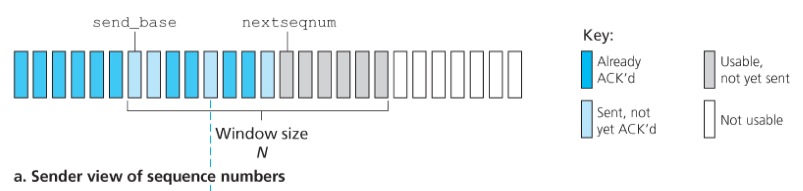
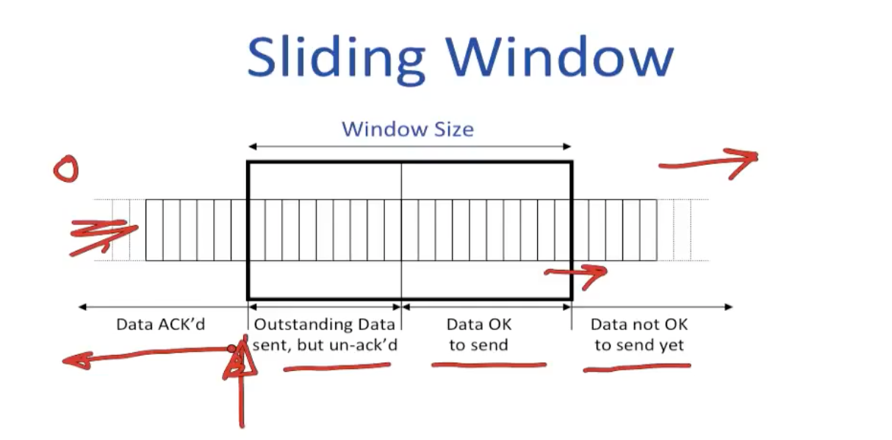

# Transport Layer

Table of Contents
-----------------

* [1. MUX &amp; DEMUX](#1-mux--demux)
* [2. UDP](#2-udp)
* [3. TCP](#3-tcp)
   * [3.1 Overview](#31-overview)
   * [3.2 Connection](#32-connection)
      * [3.2.1 Setup](#321-setup)
      * [3.2.2 Teardown](#322-teardown)
   * [3.3 Reliable Delivery](#33-reliable-delivery)
      * [3.3.1 Go-back-N](#331-go-back-n)
      * [3.3.2 Selective Repeat](#332-selective-repeat)
      * [3.3.3 Fast Retransmit](#333-fast-retransmit)
   * [3.4 Flow Control](#34-flow-control)
   * [3.5 Congestion Control](#35-congestion-control)
      * [3.5.1 Congestion Window](#351-congestion-window)
      * [3.5.2 Slow Start](#352-slow-start)
      * [3.5.3 Why AIMD](#353-why-aimd)
* [References](#references)

## 1. MUX & DEMUX

**Port vs. Socket**

  
 

**Multiplexing and Demultiplexing**

  
 

## 2. UDP

**UDP segment**

  
 

## 3. TCP

### 3.1 Overview

**TCP segment**

  
 

**Sequence number**

- TCP views data as unstructed, but ordered, stream of bytes
- In truth, both sides of a TCP connection **randomly** choose an initial sequence number

  
 

**Acknowledgement number**

- the sequence number of the next byte Host A is expecting from Host B
- TCP only acknowledges bytes up to the first missing byte in the stream

**Example**

  
 

  
 

  
 

### 3.2 Connection

#### 3.2.1 Setup

**Connection setup**

  
 

**3-way handshake**

  
 

*step 1:* SYN = 1, seq = client_isn

*step 2:* SYN = 1, ACK = client_isn + 1, seq = server_isn

*step 3:* SYN = 0, ACK = server_isn, seq = client_isn + 1 (data)

#### 3.2.2 Teardown

**Connection teardown**

  
 

**4-way handshake**

  
 

**FSM: TCP Connection**

  
 

### 3.3 Reliable Delivery

#### 3.3.1 Go-back-N

  
 

**Initialization**

send_base = 0, nextseqnum = 0

#### 3.3.2 Selective Repeat

**Sender**

- *Data received above:* If the sequence number is within the sender's window -> the data is packetized and sent
- *Timeout:* Each packet has its own logical timer
- *ACK received:*
  - In the window: marked as received
  - Equal to *send_base*: *send_base* **move forward to the unacknowledged packet w/ the smallest sequence number**

  
 

**Receiver**

- *Packet in [rcv_base, rcv_base + N - 1]:* 
  - Sent back an ACK
  - And if this packet's number equals to *rcv_base*, and any pre buffered and consecutively numbered -> delivery to the upper layer -> window move forward *x* units
- *Packet in [rcv_base - N, rcv_base - 1]:* Sent back an ACK

  
 

**Example**

  
 

#### 3.3.3 Fast Retransmit

> A hybrid of GBN and SR protocol

  
 

### 3.4 Flow Control

**Sliding window**

  
 

**Send & Receive buffer**

  
 

  
 

**Sending rate for a single flow**

  
 

**Receive window**
$$
rwnd = RcvBuffer - (LastByteRcvd - LastByteRead)
$$

  
 

**Receiver**
$$
LastByteRcvd - LastByteRead <= RcvBuffer
$$

**Sender**
$$
LastByteSend - LastByteAcked <= rwnd
$$

### 3.5 Congestion Control

#### 3.5.1 Congestion Window

- *cwnd:* congestion window
- *rwnd:* receive window

$$
LastByteSent - LastByteAcked <= min
\left\{
cwnd, rwnd
\right\}
$$

#### 3.5.2 Slow Start

  
 

**TCP Tahoe**

  
 

**TCP Reno**

  
 

**TCP Tahoe vs. TCP Reno**

  
 

#### 3.5.3 Why AIMD

**AIMD**

  
 

**Chiu J ain Plot**

  
 

## References

- [Go-Back-N Protocol - Baeldung](https://www.baeldung.com/cs/networking-go-back-n-protocol)
- [Selective Repeat Protocol](https://media.pearsoncmg.com/aw/ecs_kurose_compnetwork_7/cw/content/interactiveanimations/selective-repeat-protocol/index.html)
- [The Difference Between a Port and a Socket](https://www.baeldung.com/cs/port-vs-socket)
- [What is "Fair" ?](http://www.mathcs.emory.edu/~cheung/Courses/558/Syllabus/11-Fairness/Fair.html)