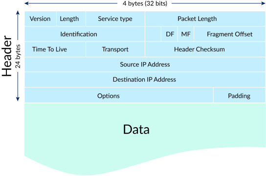
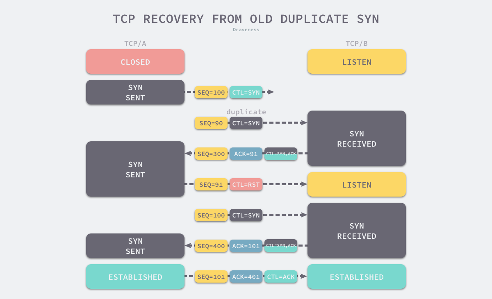
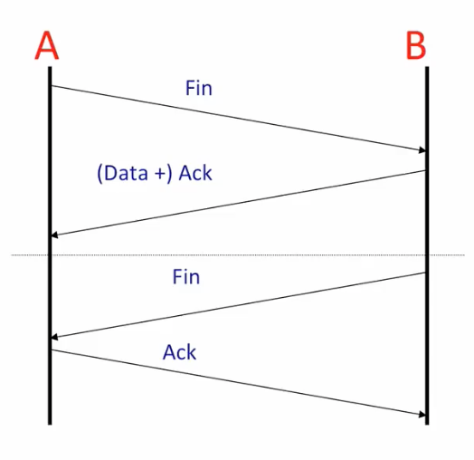
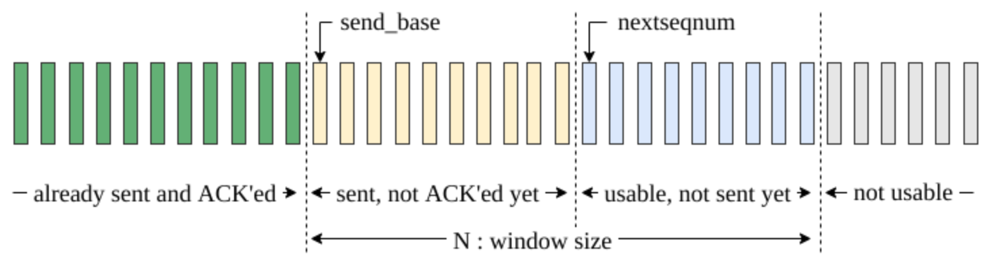
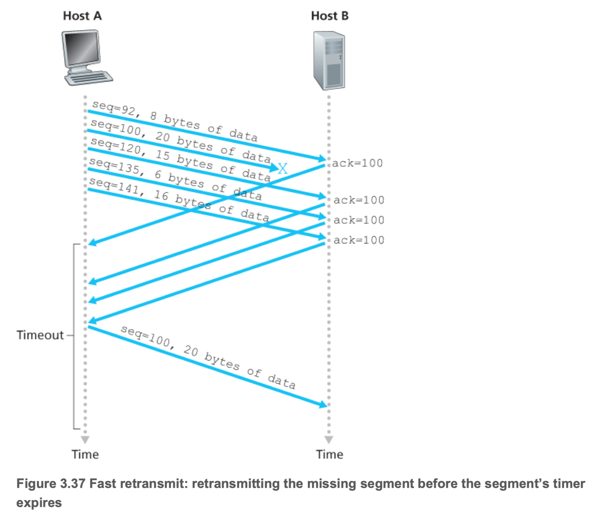
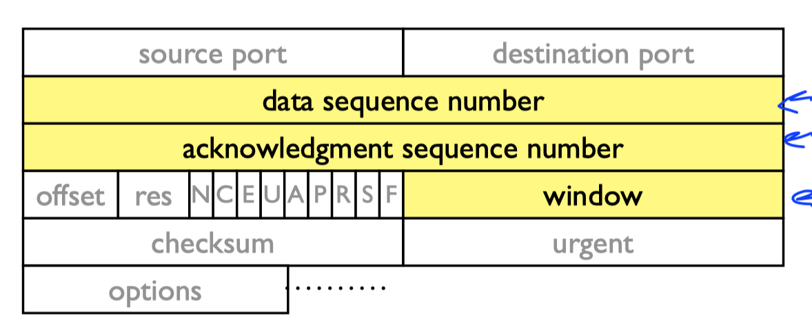
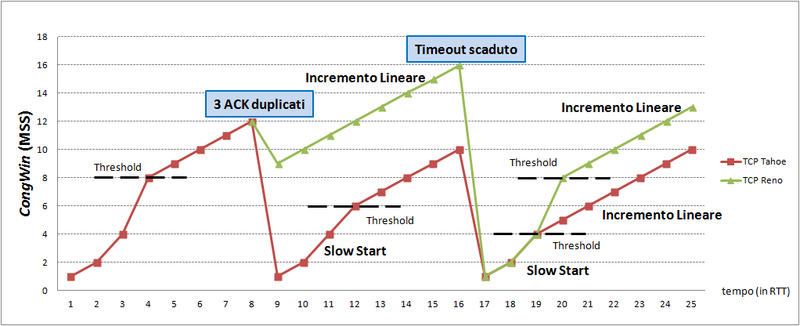

# TCP/IP

Table of Contents
-----------------

- [1. Brainstorming](#1-brainstorming)
- [2. Link](#2-link)
- [3. Network](#3-network)
	- [3.1 IP](#31-ip)
- [4. Transport](#4-transport)
	- [4.1 TCP](#41-tcp)
		- [4.1.1 Overview](#411-overview)
- [5. Application](#5-application)
- [References](#references)

## 1. Brainstorming

  
 

## 2. Link

// TODO

## 3. Network

### 3.1 IP

**IP Header**

  
 

## 4. Transport

### 4.1 TCP

#### 4.1.1 Overview

**特点**

- 面向连接
- 可靠
- 字节流
  - 没有标记记录
  - 不解释内容

**TCP header**

  
 

- 端口号
  - **标识**发送/接收的应用程序
  - ( *src ip*, *src port*, *dest ip*, *dest port* ) 标识了两端唯一的连接
  - ( *ip*, *port* ) 又称 *socket*
- 序列号
  - **标识**该 *segment* 的第一个字节（编号）
- *ACK*
  - 下一个希望接收的字节（编号）
  - 该编号之前的已成功接收
- 窗口
  - 用于 *flow control*

**Connection setup**

  
 

**3-way handshake**

  
 

*step 1:* SYN = 1, seq = client_isn (*isn* means initial sequence number)

*step 2:* SYN = 1, ACK = client_isn + 1, seq = server_isn

*step 3:* SYN = 0, ACK = server_isn + 1, seq = client_isn + 1 (data)

**为什么 TCP 需要三次握手?**

建立一个连接需要确定**三种信息**：

1. *socket*
2. *window size*
3. *sequence number*

**1. 阻止重复历史连接的初始化（主要原因）**

  
 

- 当 *seq* 是历史连接（过期 / 超时），发送方会发送 *RST* 终止此次连接
- 当 *seq* 不是历史连接，发送方会发送 *ACK* ，成功建立连接

**What's more**

网络作为一个分布式系统，并不存在用于计数的全局时钟，而 TCP 可通过不同的机制来初始化序列号，作为 TCP **接收方**是**无法判断**对方传来的初始化序列号是否过期，只能由发送方判断，TCP **发送方**可以通过**保存发出的序列号**判断连接是否过期

**2. 对通信双方的初始序列号进行初始化**

为什么需要 *sequence number*?

1. 接收方可以通过序列号对重复数据包去重
2. 发送方会在对应数据包未被 ack 时进行重发
3. 接收方根据 *seq* 进行有序排列

**Connection teardown**

  
 

**4-way handshake**

  
 

  
 

**Sender**

  
 

**Receiver**

  
 

> 回退 N 步和选择重传的结合

当收到三个**冗余** ACK 后，表示该 segment 之后的报文已丢失，重传

**Example**

  
 

**Send & Receive buffer**

  
 

**Receive window**

  
 

**Receiver** : LastByteRcvd - LastByteRead <= RcvBuffer

**Sender** : LastByteSend - LastByteAcked <= rwnd

**AIMD**

  
  

每个 TCP 连接都会维护一个拥塞窗口，决定了发送方能向接收方发送多少数据，目的如下：

1. 防止发送方发送过多数据，导致接收方无法处理
2. 防止 TCP 连接的任意一方向网络中发送大量数据，导致网络拥塞崩溃

客户端同时传输的最大数据段的数量为 *min(rwnd, cwnd)*

TCP 采用慢启动阈值 (*slow start threshold*, *ssthresh*) 来决定慢启动或者拥塞避免算法：

- 当 *cwnd* 小于 *ssthresh* 时：慢启动
- 当 *cwnd* 大于 *ssthresh* 时：拥塞避免
- 当 *cwnd* 等于 *ssthresh* 时：慢启动/拥塞避免

**Reno 算法**

  
 

**TCP Tahoe vs. TCP Reno**

  
 

## 5. Application

## References

- [Go-Back-N Protocol - Baeldung](https://www.baeldung.com/cs/networking-go-back-n-protocol)
- [Selective Repeat Protocol](https://media.pearsoncmg.com/aw/ecs_kurose_compnetwork_7/cw/content/interactiveanimations/selective-repeat-protocol/index.html)
- [The Difference Between a Port and a Socket](https://www.baeldung.com/cs/port-vs-socket)
- [What is "Fair" ?](http://www.mathcs.emory.edu/~cheung/Courses/558/Syllabus/11-Fairness/Fair.html)
- [为什么 UDP 头只有 8 个字节](https://draveness.me/whys-the-design-udp-minimum-header/)
- [为什么 TCP 建立连接需要三次握手](https://draveness.me/whys-the-design-tcp-three-way-handshake/)

