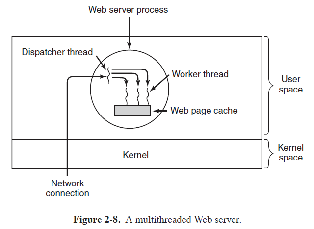
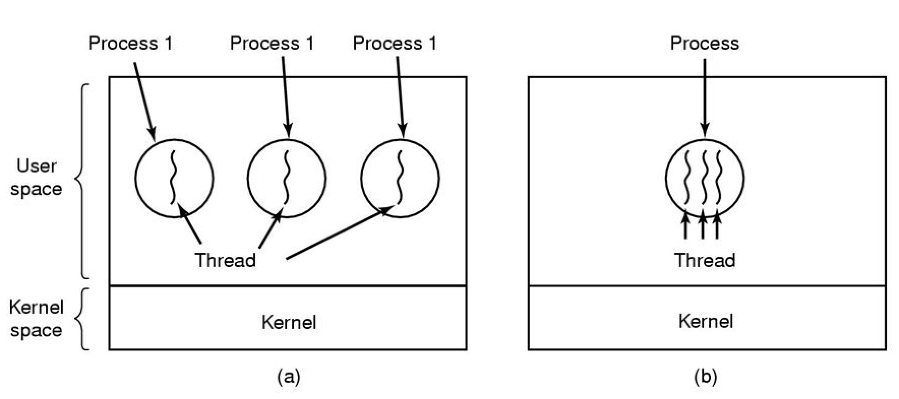
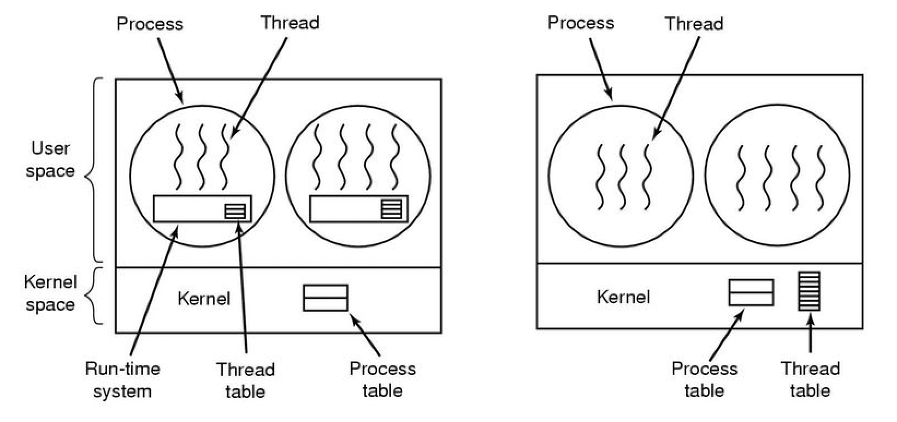
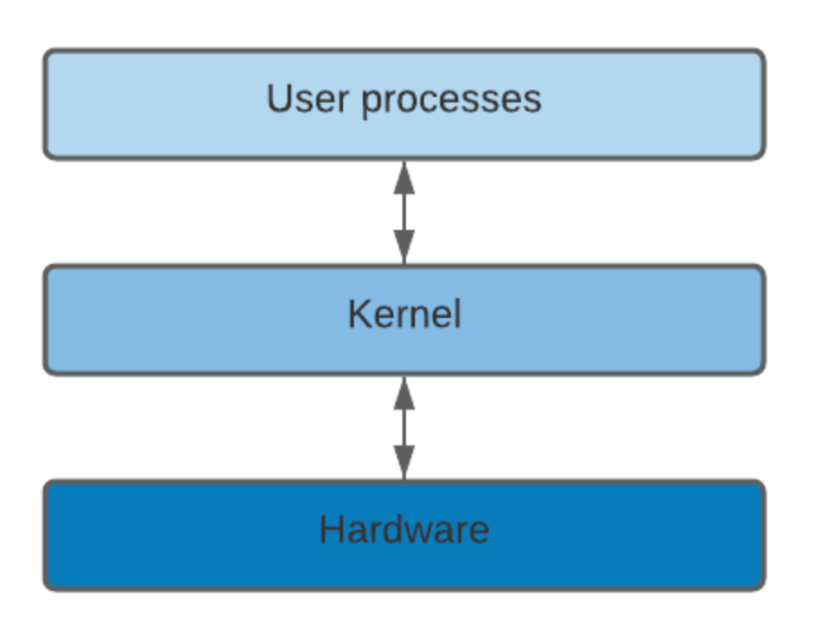

# Process Management

Table of Contents
-----------------

- [1. 进程](#1-进程)
	- [1.1 模型](#11-模型)
	- [1.2 创建与销毁](#12-创建与销毁)
	- [1.3 状态](#13-状态)
- [2. 线程](#2-线程)
	- [2.1 用处](#21-用处)
	- [2.2 模型](#22-模型)
	- [2.3 实现](#23-实现)
		- [2.3.1 User space](#231-user-space)
		- [2.3.2 Kernel space](#232-kernel-space)
- [3. 通信](#3-通信)
- [4. 调度](#4-调度)
- [5. IPC 问题](#5-ipc-问题)
- [6. References](#6-references)

## 1. 进程

> An abstraction of a running program

### 1.1 模型

**Process**

  
 

**进程与程序的区别?**

A process is an **activity** of some kind, including a program, input, output, and a state.

### 1.2 创建与销毁

**fork**

- In *UNIX*, the only one system call to create a new process
- **No writable memory is shared**

**copy-on-write**

Whenever either of the two processes wants to modify part of the memory, that chunk of memory is explicitly **copied first** to make sure the modification occurs in a private memory area. **Again, no writable memory is shared**

### 1.3 状态

  
 

**四种转换**

1. *Process* blocks for input
2. Scheduler picks another *process*
3. Scheduler picks this *process*
4. Input becomes available

## 2. 线程

### 2.1 用处 

- In many applications, **multiple activities** are going on at once, share a **common memory**
- Easier to create and destroy
- Performance

  
 

**线程与进程的区别?**

*Processes* are used to **group resources** together, *threads* are the **entities scheduled for execution** on the *CPU*

  
 

### 2.2 模型

  
 

### 2.3 实现

#### 2.3.1 User space

  
 

#### 2.3.2 Kernel space

**What is kernel?**

  
 

**Where is kernel?**

  
 

**Why kernel?**

- Determines which process is the next process on thc *CPU*, when, and how long
- Monitors how much *memory* is being used to store what and where
- Serves as an interpreter between the *hardware* and *processes*
- Receives requests for service from the process via **system calls**

## 3. 通信

## 4. 调度

## 5. IPC 问题

## 6. References

- [What Is the Difference Between Trap and Interrupt?](https://www.baeldung.com/cs/os-trap-vs-interrupt)
- [What is an OS Kernel?](https://www.baeldung.com/cs/os-kernel)
- [What’s the Difference Between User and Kernel Modes?](https://www.baeldung.com/cs/user-kernel-modes)

