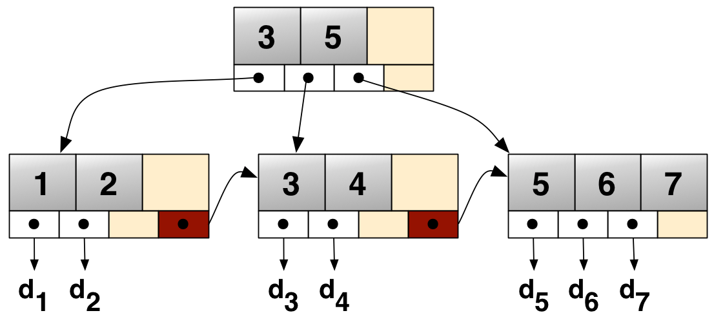

# MySQL

Table of Contents
-----------------

- [1. 架构](#1-架构)
- [2. Schema](#2-schema)
  - [2.1 指导原则](#21-指导原则)
- [3. 索引](#3-索引)
- [4. 查询优化](#4-查询优化)
- [References](#references)

## 1. 架构

## 2. Schema

> 选择正确的数据类型对于获得高性能至关重要

### 2.1 设计原则

- 更小的通常更好
  - 占用更少的磁盘，内存，*CPU* 缓存
- 简单就好
  - 整型比字符串操作的代价更低
- 尽量避免 *NULL*
  - 若计划在列上建索引，就应该避免设计成可为 *NULL* 的列

### 2.2 数据类型

**整数**

- 有符号/无符号使用相同的存储空间，具有相同的性能
- 整数类型指定宽度，对大多数应用是无意义的，其不会限制值的合法范围

**实数**

- *DECIMAL* 支持高精度计算

**字符串**

-  *VARCHAR*
   -  可变长字符串，只使用必要的空间
   -  过长的行会导致 *innodb* 分裂页

-  *CHAR*
   -  定长，不容易产生碎片

**日期**

- *DATETIME*
  - 8 字节，精度为秒
  - 与时区无关
- *TIMESTAMP*
  - 4 字节，*unix* 时间戳
  - 按照 *DATETIME* 格式化时间值，依赖时区

## 3. 索引 

### 3.1 类型

#### 3.1.1 B Tree

  
 

**查询类型**

- 全键值
- 键值范围
- 键最左前缀

## 4. 查询优化

## References

- *高性能 MySQL*
-  *MySQL技术内幕：InnoDB存储引擎*
- [为什么 MySQL 使用 B+ 树](https://draveness.me/whys-the-design-mysql-b-plus-tree/)
