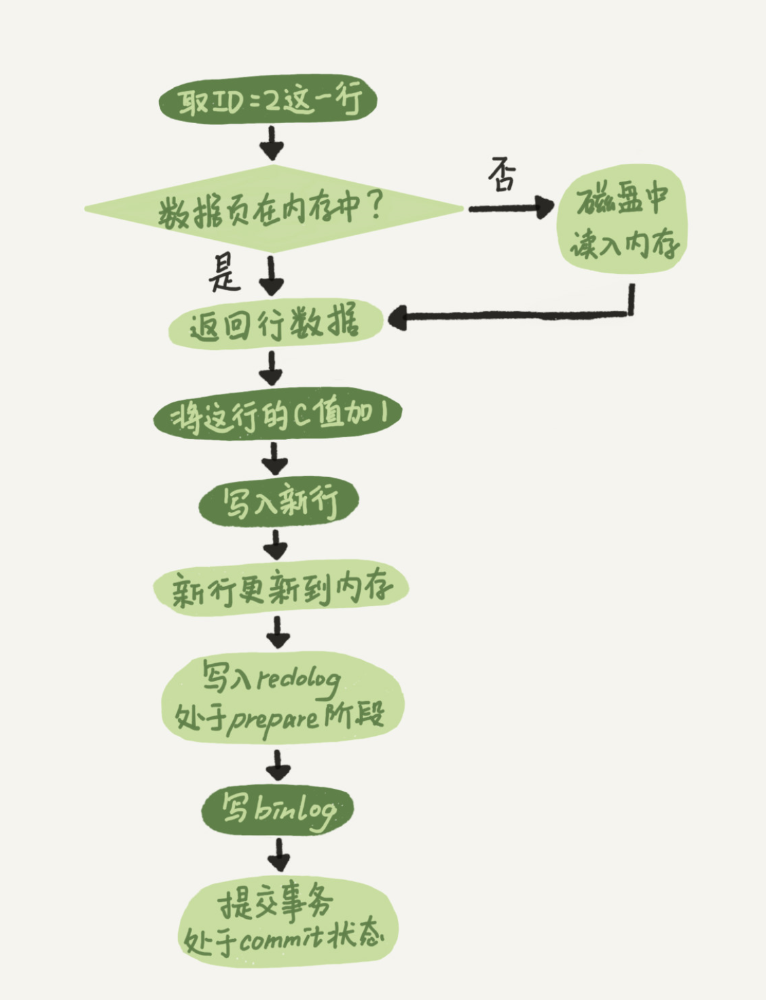
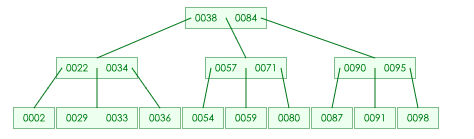
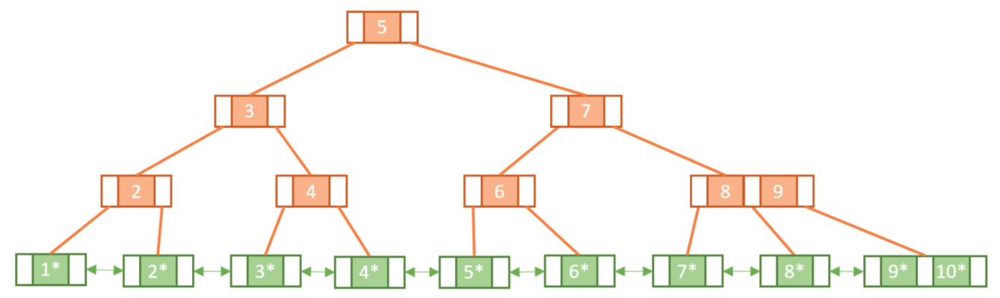

# MySQL 实战 45 讲

Table of Contents
-----------------

* [1. 一条 SQL 查询语句是如何执行的?](#1-一条-sql-查询语句是如何执行的)
   * [1.1 连接器](#11-连接器)
   * [1.2 分析器](#12-分析器)
   * [1.3 优化器](#13-优化器)
   * [1.4 执行器](#14-执行器)
* [2. 一条 SQL 更新语句是如何执行的?（待补充）](#2-一条-sql-更新语句是如何执行的待补充)
   * [2.1 redo log](#21-redo-log)
   * [2.2 binlog](#22-binlog)
* [3. 事务隔离: 为什么你改了我还看不见?（待补充）](#3-事务隔离-为什么你改了我还看不见待补充)
   * [3.1 什么是事务?](#31-什么是事务)
   * [3.2 什么是事务的四大特性?](#32-什么是事务的四大特性)
   * [3.3 并发事务会引发什么问题?](#33-并发事务会引发什么问题)
   * [3.4 什么是事务的隔离级别?](#34-什么是事务的隔离级别)
* [4. 深入浅出索引](#4-深入浅出索引)
   * [4.1 什么是索引?](#41-什么是索引)
   * [4.2 索引有什么用?](#42-索引有什么用)
   * [4.3 三种提高读写的数据结构](#43-三种提高读写的数据结构)
   * [4.4 B-trees](#44-b-trees)
   * [4.5 B  trees](#45-b-trees)
   * [4.6 InnoDB 索引模型](#46-innodb-索引模型)
   * [4.7 主键索引和普通查询有什么区别?](#47-主键索引和普通查询有什么区别)
   * [4.8 主键自增和索引有什么关系?](#48-主键自增和索引有什么关系)
* [5. 全局锁和表锁: 给表加个字段怎么有那么多阻碍?](#5-全局锁和表锁-给表加个字段怎么有那么多阻碍)
   * [5.1 全局锁](#51-全局锁)
   * [5.2 表锁](#52-表锁)
   * [5.3 行锁](#53-行锁)
* [6. 怎么减少行锁对性能对影响?](#6-怎么减少行锁对性能对影响)
   * [6.1 什么是死锁?](#61-什么是死锁)
   * [6.2 如何解决死锁?](#62-如何解决死锁)
* [7. 事务到底是隔离的还是不隔离的?](#7-事务到底是隔离的还是不隔离的)
* [8. 普通索引和唯一索引, 应该怎么选择?](#8-普通索引和唯一索引-应该怎么选择)
* [9. MySQL 为什么有时候会选错索引?](#9-mysql-为什么有时候会选错索引)
* [10. 怎么给字符串字段加索引?](#10-怎么给字符串字段加索引)
* [11. 为什么我的 MySQL 会 ”抖“ 一下?](#11-为什么我的-mysql-会-抖-一下)
* [12. 为什么表数据删掉一半, 表文件大小不变?](#12-为什么表数据删掉一半-表文件大小不变)
* [13. count(*) 这么慢, 怎么办?](#13-count-这么慢-怎么办)
* [14. "order by" 如何工作?](#14-order-by-如何工作)
* [15. 如何正确显示随机消息?](#15-如何正确显示随机消息)
* [16. 为什么 SQL 语句逻辑相同, 性能差异却巨大?](#16-为什么-sql-语句逻辑相同-性能差异却巨大)
* [17. 为什么我只查一行的语句, 也执行那么慢?](#17-为什么我只查一行的语句-也执行那么慢)
* [18. 幻读是什么? 有什么问题?](#18-幻读是什么-有什么问题)
* [19. 为什么我只查一行的语句, 锁这么多?](#19-为什么我只查一行的语句-锁这么多)
* [20. 有哪些提高性能的方法?](#20-有哪些提高性能的方法)
* [21. 如何保证数据不丢?](#21-如何保证数据不丢)
* [22. 如何保证主备一致?](#22-如何保证主备一致)
* [23. 如何保证高可用?](#23-如何保证高可用)
* [24. 备库为什么会延迟好几个小时?](#24-备库为什么会延迟好几个小时)
* [25. 主库出问题了, 从库怎么办?](#25-主库出问题了-从库怎么办)
* [26. 读写分离有哪些坑?](#26-读写分离有哪些坑)
* [27. 如何判断一个数据库是不是出问题了?](#27-如何判断一个数据库是不是出问题了)
* [28. 删库除了跑路, 还能怎么办?](#28-删库除了跑路-还能怎么办)
* [29. 为什么还有 kill 不掉的语句?](#29-为什么还有-kill-不掉的语句)
* [30. 我查那么多数据, 会不会把数据库内存打爆？](#30-我查那么多数据-会不会把数据库内存打爆)
* [31. 到底可不可以用 join?](#31-到底可不可以用-join)
* [32. join 语句怎么优化?](#32-join-语句怎么优化)
* [33. 为什么临时表可以重名?](#33-为什么临时表可以重名)
* [34. 什么时候会使用内部临时表?](#34-什么时候会使用内部临时表)
* [35. 还要使用 Memory 引擎吗?](#35-还要使用-memory-引擎吗)
* [36. 自增主键为什么不是连续的?](#36-自增主键为什么不是连续的)
* [37. insert 语句的锁为什么那么多?](#37-insert-语句的锁为什么那么多)
* [38. grant 之后要 flush privileges 吗?](#38-grant-之后要-flush-privileges-吗)
* [39. 怎么最快地复制一张表?](#39-怎么最快地复制一张表)
* [40. 要不要使用分区表?](#40-要不要使用分区表)
* [41. 自增 ID 用完了怎么办?](#41-自增-id-用完了怎么办)
* [参考资料](#参考资料)


## 1. 一条 SQL 查询语句是如何执行的?

大体上，`MySQL` 分为两部分：

- Server 层：涵盖 `MySQL` 大多数核心服务功能
- 存储引擎层：负责数据的存储和提取（插件式）


<div align="center">  </div><br> 

### 1.1 连接器

作用：客户端与 `mysql` 建立连接

```mysql
$ mysql -u root -p
Enter password:
```


### 1.2 分析器

作用：`mysql` 需要知道你做什么

分析器是如何工作的？假设我们输入了一条语句：

```mysql
mysql> select * from T where ID=10；
```

1. 词法分析

   将关键字识别出来，例如 `select`, `T` 和 `ID`

2. 语法分析 

   判断语句是否符合 `mysql` 语法

### 1.3 优化器

作用：`mysql` 需要知道如何做

优化器是如何工作的？假设我们输入了一条语句：

```mysql
mysql> select * from t1 join t2 using(ID)  where t1.c=10 and t2.d=20;
```

既可以从 `t1` 表取出 `c` = 10 的记录的 `ID` 值，再关联到 `t2` 表，再判断 `t2` 里 `d` 的值是否等于 20，也可以反过来

这两种方法的逻辑结果是相同的，但执行效率不同，优化器就是决定选择哪种方案的


### 1.4 执行器

`mysql` 知道了语句的意思，也知道该如何做了，接下来就剩下执行语句了


开始执行之前，先要判断操作者对该表是否有执行查询 / 更新的权限

若有权限（没有权限则直接打回），就打开表直接执行，根据该引擎插件选择其提供的接口


举个例子：

```mysql
mysql> select * from T where ID=10；
```


1. 调用 `InnoDB` 引擎接口取这个表的第一行，判断 `ID` 值是否为 10，若不是则跳过，若有则存在结果集中
2. 遍历
3. 将结果集返回给客户端


## 2. 一条 SQL 更新语句是如何执行的?（待补充）

了解了查询的基本流程，再看看更新语句

举个例子，创建表 `T`

```mysql
mysql> create table T(ID int primary key, c int);
```

更新数据：

```mysql
mysql> update T set c=c+1 where ID=2;
```


更新流程还涉及到两个重要的日志模块：

- redo log（重做日志）
- binlog（归档日志）


下面先看一个例子：

<div align="center">  </div><br> 


### 2.1 redo log

当有一条记录需要更新的时候，`InnoDB` 就会先把记录写到 `redo log`（粉板），并更新内存（保证数据实时性），这个时候更新就算完成。在适当的时候，`InnoDB` 将这个操作更新到磁盘中（打烊后掌柜将粉板的记录更新到汇总账单）


<div align="center">  </div><br> 

值得注意的是：

- `InnoDB` 的 `redo log` 是固定大小的，这块粉板总共可以记录 4GB 的操作（在清楚当前日志前会确保记录写入磁盘中，持久化）
- 有了 `redo log`，`InnoDB` 可以保证即使数据库发生异常重启，之前提交的记录都不会丢失，称为 `crash-safe`（记录在粉板中）


### 2.2 binlog

举个例子来说明两种日志的区别：

```mysql
mysql> update T set c=c+1 where ID=2;
```

1. 执行器找引擎取 `ID` = 2的这一行，若这一行的数据本来就在内存中，直接返回；否则从磁盘中读入内存，再返回
2. 执行器获取数据后，将 `c` 这一列赋予新值，然后调用引擎接口写入数据
3. 引擎将这行数据更新到内存中，同时将这个更新操作记录写到 `redo log` 中，此时 `redo log` 处于 `prepare` 状态。然后告知执行器执行完成了，随时可以提交事务
4. 执行器生成这个操作的 `binlog`，并把 `binlog` 写入磁盘
5. 执行器调用引擎的提交事务接口，引擎把刚刚写入的 `redo log` 改成 `commit` 状态，更新完成

<div align="center">  </div><br> 


## 3. 事务隔离: 为什么你改了我还看不见?（待补充）

### 3.1 什么是事务?

事务就是要保证一组数据库操作要么全部成功，要么全部失败 


举个例子，假如 Jack 要给 Rose 转账 1 个亿。这个动作包含了两个关键操作：

1. Jack 账户将减少 1 个亿
2. Rose 账户将增加 1 个亿


万一这两个操作之间突然出现错误比如银行系统崩溃，导致 Jack 账户余额减少而 Rose 账户余额没有增加， 1 个亿离奇消失！

在现实生活中这种情况是不允许发生的


### 3.2 什么是事务的四大特性?

事务有四大特性：`ACID`（面试常客）

**A:** Atomicity，确保动作要不全部成功，要不全部失败

**C:** Consistency，执行事务前后，数据保持一致（无论事务成功与否，转账人和收款人金额总额不变）

**I:** Isolation，并发访问数据库时，一个用户的事务不被其他事物所干扰

**D:** Durability，一个事务被 `commit` 之后，数据库中的数据改变是持久的


### 3.3 并发事务会引发什么问题?

1. 脏读 `dirty read`：

   当事务 `t1` 正在访问数据并且对数据进行了修改，但仍未提交到数据库中，事务 `t2` 访问了并使用了这个数据，则称这个数据为 "脏数据"

2. 丢失修改 `lost to modify`

   当事务 `t1` 读取一个数据时，事务 `t2` 也访问了该数据，且在事务 `t1` 修改了这个数据后，事务 `t2` 也改了。则事务 `t1` 的修改结果丢失

3. 不可重复读 `non-repeated read`

   在事务 `t1` 多次读同一个数据。在该事务没有结束时，另一个事务 `t2` 也访问该数据，那么在事务 `t1` 中的两次读数据之间，由于事务 `t2` 的修改导致事务 `t1` 两次读取的数据可能不太一样

4. 幻读 `phantom read`

   与 `non-repeated read` 类似。它发生在一个事务 `t1` 读取了几行数据，紧接着另一个并发事务 `t2` 插入了一些数据时，在随后的查询中，`t1` 就会发现多了一些原本不存在的记录（好像发生了幻觉，所以称幻读）


### 3.4 什么是事务的隔离级别?

隔离级别的出现是为了解决多个事务同时执行时可能出现的问题（隔离得越严实，效率越低）

`SQL` 标准的事务隔离级别包括：

- 读未提交 `read uncommited`：事务 `t1` 还没被提交时，它做的变更就可以被其他事务看到
- 读提交 `read commited`：一个事务提交之后，它做的变更才会被其他事务看到
- 可重复读 `repeated read`：一个事务在执行过程中看到的数据，总是跟这个事务在启动时看到的数据是一致的（未提交变更对其他事务也是不可见的）
- 串行化 `serializable`：对同一行记录，写会加 “写锁”，读会加 “读锁”。当出现冲突时，后一个事务必须等前一个事务执行完成才能继续执行


举个例子，

```mysql
mysql> create table T(c int) engine=InnoDB;
insert into T(c) values(1);
```


## 4. 深入浅出索引

### 4.1 什么是索引?

在关系型数据库中，索引是一种存储结构，它对数据库表中的一列 / 多列进行排序


索引就好比一本书的目录，可以根据目录中的页码快速找到我们感兴趣的章节


### 4.2 索引有什么用?

索引的出现是为了提高数据查询的效率


### 4.3 三种提高读写的数据结构

在深入索引模型之前，先来看三种简单的数据结构：


**哈希表**

<div align="center">  </div><br> 


优点：`key-value` 结构，通过 `hash` 函数将 `key` 映射为`value`，查询 `O(1)`，插入采用追加模式

缺点：区间查询慢

适用场景：适合等值查询


**有序数组**

<div align="center">  </div><br> 

优点：查询 `O(logn)`

缺点：插入慢

适用场景：静态存储引擎（冷数据）


**搜索树（N 叉树）**

<div align="center">  </div><br> 

优点：查询 `O(logn)`，适配磁盘的访问模式

缺点：

适用场景：


### 4.4 B-trees

维基百科

> B-tree 是一种自平衡的树，能够保持数据有序。这种数据结构能够让查找数据、顺序访问、插入数据及删除的动作，在对数时间内完成。B树，概括来说是一个一般化的二叉查找树（binary search tree）一个节点可以拥有2个以上的子节点。与自平衡二叉查找树不同，B树适用于读写相对大的数据块的存储系统，例如磁盘。B树减少定位记录时所经历的中间过程，从而加快存取速度。B树这种数据结构可以用来描述外部存储。这种数据结构常被应用在数据库和文件系统的实现上。


`B-tree` 本质是一颗自平衡树，不过是在 `BST` 上加了一些规则限制


看一个 `demo`

当插入的数据为 90 29 91 98 84 87 71 34 36 80 38 54 22 59 57 2 95 33，`degree` 为 3 时：


<div align="center">  </div><br> 


### 4.5 B+ trees

`B+ tree` 是 `B tree` 的 `pro` 版，区别主要有两点：

> - all leaf nodes are linked together in a doubly-linked list
> - satellite data is stored on the leaf nodes only. Internal nodes only hold keys and act as routers to the correct leaf node


<div align="center">  </div><br> 


### 4.6 InnoDB 索引模型

在 `mysql` 中，索引在存储引擎层实现，即不同的存储引擎索引的工作方式不同（即使同类型的索引，底层实现也可能不同）

在 `InnoDB` 中，每个索引都是一颗 `B+` 树

看一个例子，

```mysql
mysql> create table T(
id int primary key, 
k int not null, 
name varchar(16),
index (k))engine=InnoDB;
```

该表有 5 条数据：

R1 (100, 1)

R2 (200, 2)

R3 (300, 3)

R4 (500, 5)

R5 (600, 6)

<div align="center">  </div><br> 

左图为主键索引 / 聚簇索引

右图为非主键索引 / 二级索引


### 4.7 主键索引和普通查询有什么区别?

```mysql
select * from T where ID=500;
```

这种采用主键查询方式，只需要搜索 `id` 索引树


```mysql
select * from T where k=5;
```

这种方式则采用普通索引查询方式，需要搜索 `k` 索引树，得到 `id` 的值，再到 `id` 索引树搜索一次，这个过程称为**回表**


### 4.8 主键自增和索引有什么关系?

主键自增的好处在于插入数据是递增的，在 `b+` 树中每次插入都是追加操作，不涉及挪动其他记录，也不会触发叶子结点的分裂


现在有一个场景：

假设数据表有一个唯一字段：身份证（`string` 类型）


由于每个非主键索引的叶子节点上都是主键的值。如果用身份证号做主键，那么每个二级索引的叶子节点占用约 20 个字节，而如果用整型做主键，则只要 4 个字节，如果是长整型（`bigint`）则是 8 个字节。


**显然，主键长度越小，普通索引的叶子结点越小，占用的空间也就越小**


## 5. 全局锁和表锁: 给表加个字段怎么有那么多阻碍?

数据库锁的出现是为了处理并发问题


根据加锁的范围，`mysql` 里面的锁大致可以分成三类：

- 全局锁
- 表级锁
- 行锁


### 5.1 全局锁

全局锁只允许读，不允许写（包括更新字段等操作）

**适用场景：** 全库逻辑备份（将整库每个表都 `select` 出来存成备份）


### 5.2 表锁

暂略


### 5.3 行锁

`mysql` 的行锁是在引擎层由各个引擎自己实现的，`InnoDB` 支持行锁（这也是 `MyISAM` 被 `InnoDB` 替代的重要原因之一）


行锁就是针对表中行记录的锁，当事务 `t1` 更新了一行，而事务 `t2` 也更新同一行，则必须等 `t1` 更新完毕后才能进行更新


## 6. 怎么减少行锁对性能对影响?

在 `InnoDB` 事务中，行锁是在需要的时候才加上的，但并不是不需要了就立刻释放，而是要等到事务结束时才释放


举个例子，有一个电影票在线出售的业务，顾客 `A` 在影院 `B` 购买电影票：

1. 顾客 `A` 账户余额扣除电影票价
2. 影院 `B` 账户余额增加电影票价
3. 记录一条交易日志


这 3 条操作由同一个事务管理，那么该如何安排 3 条操作的顺序呢？


<div align="center">  </div><br> 


### 6.1 什么是死锁?

当并发系统中不同线程出现循环资源依赖，涉及的线程都在等待别的线程资源释放时，就会导致这几个线程都处于无限等待状态，

称为死锁


举个例子，

<div align="center">  </div><br> 

事务 `A` 在等待事务 `B` 释放 `id` = 2 的行锁，而事务 `B` 在等待事务 `A` 释放 `id` = 1 的行锁

事务 `A` 和 `B` 在互相等待对方的资源释放，进入了死锁状态


### 6.2 如何解决死锁?

有两种方式：

- 直接进入等待，直到超时
- 发起死锁检测，发现死锁后，主动回滚死锁链条中的某一事务，让其他事务得以执行


**这两种方式哪个更适用于实际业务场景呢？**

第一种方式的难点在于如何选取一个合适的超时时间，时间过短，会出现一些误伤；时间过长，不适合某些业务场景（在线服务）

所以，在业界常用第二种方式进行死锁检测


## 7. 事务到底是隔离的还是不隔离的?


## 8. 普通索引和唯一索引, 应该怎么选择?


## 9. MySQL 为什么有时候会选错索引?


## 10. 怎么给字符串字段加索引?


## 11. 为什么我的 MySQL 会 ”抖“ 一下?


## 12. 为什么表数据删掉一半, 表文件大小不变?


## 13. count(*) 这么慢, 怎么办?


## 14. "order by" 如何工作?


## 15. 如何正确显示随机消息?


## 16. 为什么 SQL 语句逻辑相同, 性能差异却巨大?


## 17. 为什么我只查一行的语句, 也执行那么慢?


## 18. 幻读是什么? 有什么问题?


## 19. 为什么我只查一行的语句, 锁这么多?


## 20. 有哪些提高性能的方法?


## 21. 如何保证数据不丢?


## 22. 如何保证主备一致?


## 23. 如何保证高可用?


## 24. 备库为什么会延迟好几个小时?


## 25. 主库出问题了, 从库怎么办?


## 26. 读写分离有哪些坑?


## 27. 如何判断一个数据库是不是出问题了?


## 28. 删库除了跑路, 还能怎么办?


## 29. 为什么还有 kill 不掉的语句?


## 30. 我查那么多数据, 会不会把数据库内存打爆？


## 31. 到底可不可以用 join?


## 32. join 语句怎么优化?


## 33. 为什么临时表可以重名?


## 34. 什么时候会使用内部临时表?


## 35. 还要使用 Memory 引擎吗?


## 36. 自增主键为什么不是连续的?


## 37. insert 语句的锁为什么那么多?


## 38. grant 之后要 flush privileges 吗?


## 39. 怎么最快地复制一张表?


## 40. 要不要使用分区表?

## 41. 自增 ID 用完了怎么办?


## 参考资料

- [MySQL实战45讲-极客时间](https://time.geekbang.org/column/intro/100020801)
- [MySQL 的 crash-safe 原理解析](https://juejin.im/post/6844904167782236167)
- [事务隔离级别(图文详解)](https://github.com/Snailclimb/JavaGuide/blob/master/docs/database/%E4%BA%8B%E5%8A%A1%E9%9A%94%E7%A6%BB%E7%BA%A7%E5%88%AB(%E5%9B%BE%E6%96%87%E8%AF%A6%E8%A7%A3).md)
- [10.2 B Trees and B+ Trees. How they are useful in Databases](https://www.youtube.com/watch?v=aZjYr87r1b8&t=15s)
- [Introduction of B-Tree](https://www.geeksforgeeks.org/introduction-of-b-tree-2/)
- [B-Tree Visualization](https://www.cs.usfca.edu/~galles/visualization/BTree.html)
- [平衡二叉树、B树、B+树、B*树 理解其中一种你就都明白了](https://zhuanlan.zhihu.com/p/27700617)
- [The Difference Between B-trees and B+trees](https://www.baeldung.com/cs/b-trees-vs-btrees)