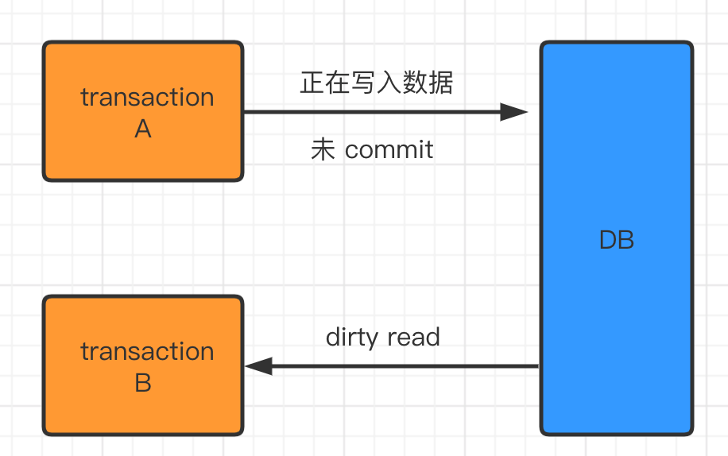
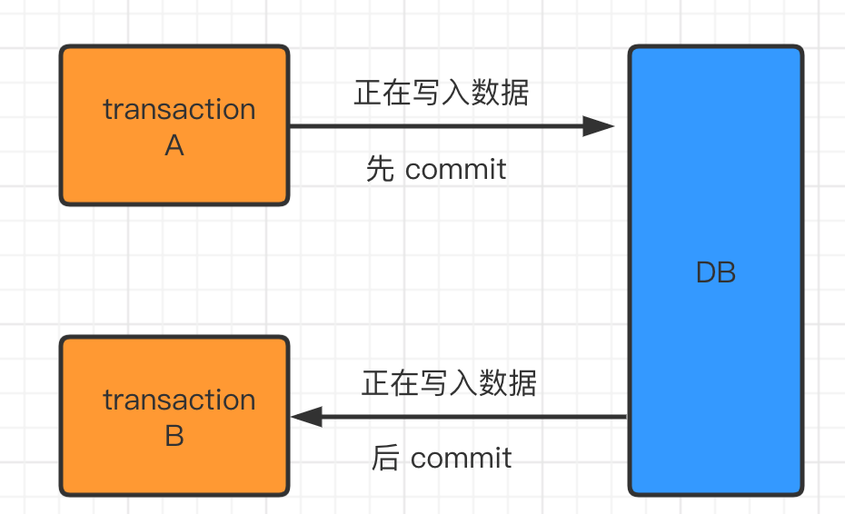
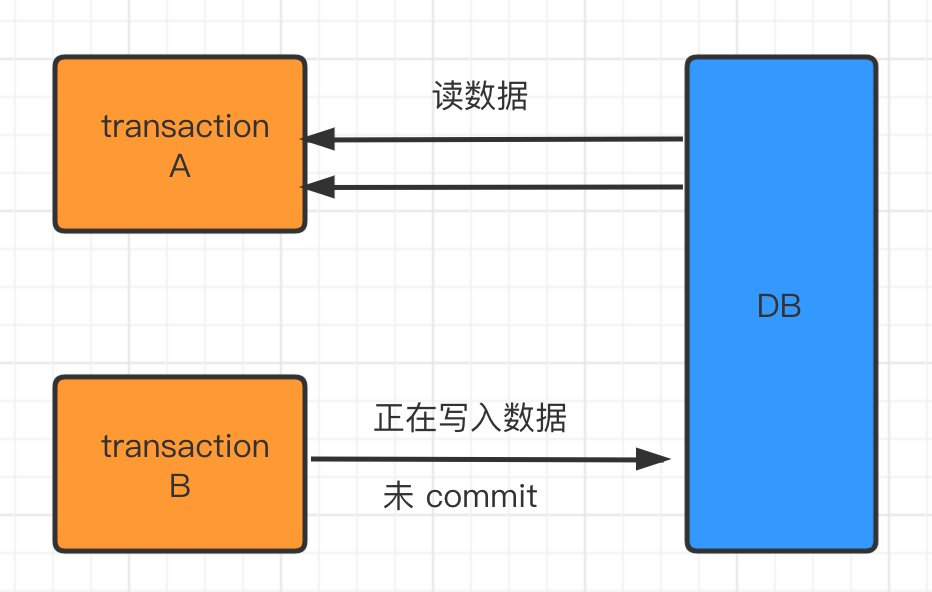
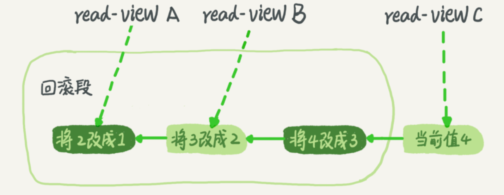
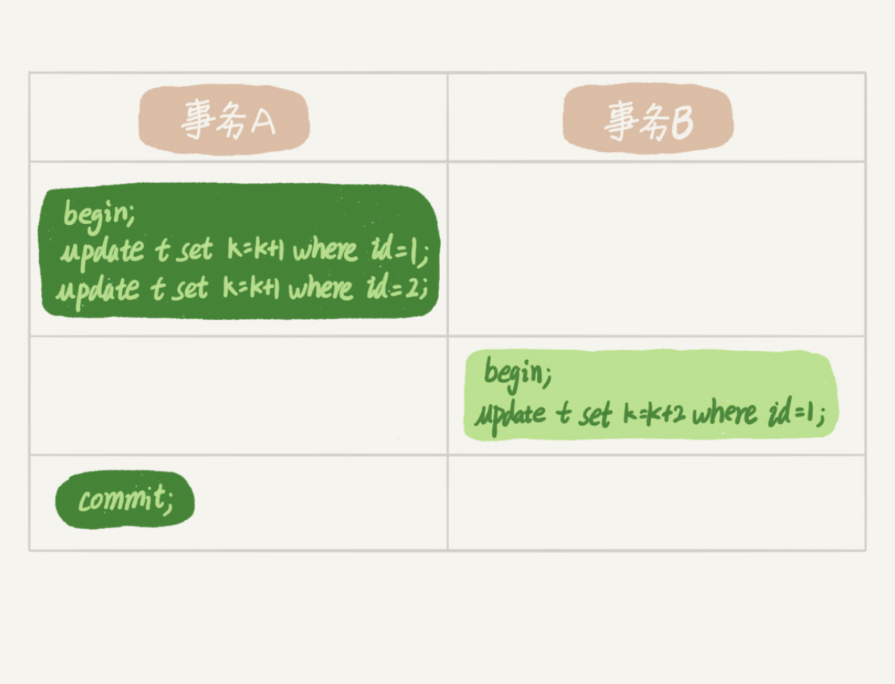

# MySQL

Table of Contents
-----------------

* [Brainstorming](#brainstorming)
* [1. 架构](#1-架构)
* [2. SQL 语句](#2-sql-语句)
   * [2.1 Join](#21-join)
   * [2.2 Sub Query](#22-sub-query)
   * [2.3 Union](#23-union)
* [3. 索引](#3-索引)
   * [3.1 回表](#31-回表)
   * [3.2 联合索引：最左匹配原则](#32-联合索引最左匹配原则)
   * [3.3 前缀索引（最左匹配原则应用）](#33-前缀索引最左匹配原则应用)
   * [3.4 Left Join &amp; Right Join索引优化](#34-left-join--right-join索引优化)
   * [3.5 覆盖索引](#35-覆盖索引)
   * [3.6 COUNT(*) 优化（待补充）](#36-count-优化待补充)
   * [3.7 小表驱动大表（待补充）](#37-小表驱动大表待补充)
* [4. 事务](#4-事务)
   * [4.1 并发事务带来什么问题？](#41-并发事务带来什么问题)
   * [4.2 事务隔离级别](#42-事务隔离级别)
   * [4.3 Demo](#43-demo)
   * [4.4 事务隔离的实现（待补充）](#44-事务隔离的实现待补充)
   * [4.5 两阶段锁](#45-两阶段锁)
* [References](#references)


## Brainstorming

  <div align="center">  </div><br>


## 1. 架构

  <div align="center">  </div><br>


## 2. SQL 语句

**P.S:**

以下 `SQL` 语句仅挑选了重点（非系统性）

### 2.1 Join

  <div align="center">  </div><br>


### 2.2 SubQuery

  <div align="center">  </div><br>


### 2.3 Union

`union` 用于连接两个以上的 `select` 语句的结果组合到一个结果集合中。多个 `select` 语句会删除重复的数据


  <div align="center">  </div><br>


```mysql
SELECT column_name(s) FROM table1
UNION
SELECT column_name(s) FROM table2;
```


## 3. 索引

**每一个索引在 InnoDB 里面对应一颗 B+ 树**


### 3.1 回表

举个例子，我们有一个主键列为 `ID` 的表，其中有个字段为 `k`，且 `k` 上有索引

我们称 `ID` 为主键索引，`k` 为非主键索引


<div align="center">  </div><br>


在执行下列语句时：

```mysql
SELECT * FROM table_name WHERE ID = 500;
```

只需要搜索 `ID` 这颗 `B+` 树

而当执行下列语句时：

```mysql
SELECT * FROM table_name WHERE K = 5;
```

则需要先搜索 `k` 索引树，获得 `ID` 为 500，再去搜 `ID` 索引树，这个称 "回表"


**执行流程（重要）：**

1. 在 `k` 索引树上找到 `k = 3` 的记录，取得 `ID = 300`
2. 再到 `ID`  索引树查到 `ID = 300` 对应的 `R3`
3. 在 `k` 索引树取下一个值 `k = 5`，取得 `ID = 500`
4. 再回到 `ID` 索引树查到 `ID = 500` 对应的 `R4`
5. 在 `k` 索引树取下一个值 `k = 6`，不满足条件，循环结束


在这个例子中，由于查询结果所需要的数据只在主键索引上有，所以不得不回表


### 3.2 联合索引：最左匹配原则

**表设计 & 初始化 **

  <div align="center">  </div><br>


<div align="center">  </div><br>


**踩坑记录**

- 插入数据时：

  `INSERT INTO TABLE_NAME (col1, col2, ...) VALUES (val1, val2, ...)` 若 `PK` 为自增，则不要写入 `(col1, col2, ...)` 的参数中（对表进行修改后记得手动保存）


**需求：查询 category_id 为 1 且 comments 大于 1 的情况下，views 最多的 id**

```mysql
SELECT
	id 
FROM
	article 
WHERE
	category_id = 1 
	AND comments > 1 
ORDER BY
	views DESC 
	LIMIT 1;
```

<div align="center">  </div><br>

**优化 1.0**

既然在 `WHERE` 和 `ORDER BY` 后跟了 `category_id`，`comments` 以及 `views` 这三列

那我们就建一个联合索引：

```mysql
CREATE INDEX idx_category_comments_views ON article ( category_id, comments, views );
```

<div align="center">  </div><br>

避免了全表扫，但出现了 `using filesort`


**联合索引在执行的时候，遵循 “最左匹配原则”**


假设一张表的 `a`，`b`，`c` 列上有一个联合索引 `idx_a_b_c`

相当于已经对 `(a)`，`(a, b)`，`(a, b, c)` 建立了索引


举个例子，联合索引的结构和电话簿相类似，

- 若知道姓，电话簿会很有用
- 除了姓，还知道名，电话薄更有用
- 若只知道名，不知道姓，电话簿还能发挥作用吗？


**优化 2.0**

```mysql
CREATE INDEX idx_category_views ON article ( category_id, views );
```

<div align="center">  </div><br>

### 3.3 前缀索引（最左匹配原则应用）

假设现在需要维护一个邮箱登录的系统，如何在邮箱这个字段高效地建立索引？

两种方案：

1. 记录整个字符串
2. 记录字符串的前 n 个字节


<div align="center">  </div><br>

<div align="center">  </div><br>

```mysql
SELECT 
	id,name,email 
FROM 
	SUser 
WHERE 
	email='zhangssxyz@xxx.com';
```


第一种方案的执行顺序：

1. 在 `email` 索引树上找到


第二种方案的执行顺序：

1. 在 `email` 索引树上找到


### 3.4 Left Join & Right Join索引优化

**表设计**

`class` 表：

<div align="center">  </div><br>


`book` 表：

<div align="center">  </div><br>

字段都相同，`card` 为主外键关系


下面以 `left join` 为例，探究两表的索引该如何建立

- 左表：`class`
- 右表：`book`

```mysql
EXPLAIN SELECT
	* 
FROM
	class
	LEFT JOIN book ON class.card = book.card;
```


没建索引之前：

<div align="center">  </div><br>


1. 只在左表 `card` 字段上建立索引：

```mysql
CREATE INDEX idx_class_card ON class(card);
```

使用 `explain` 分析结果：

<div align="center">  </div><br>


2. 只在右表的 `card` 字段建立索引：

```mysql
CREATE INDEX idx_book_card ON book ( card );
```

使用 `explain` 分析结果：

<div align="center">  </div><br>


**总结：**

- Left join, 索引加右表
- Right join, 索引加左表


### 3.5 覆盖索引

通过遍历索引树就可以满足查询的字段，不用回表，即索引被覆盖了

是一种高效的性能优化手段


**注意（重要）：**

当 ` SELECT *` 的时候，若是遍历整个索引树（比如 `LIKE %xxx%`），可以认为造成了全表扫描（因为在遍历索引树的过程每次都需要回表）


### 3.6 COUNT(*) 优化（待补充）


### 3.7 小表驱动大表（待补充）


## 4. 事务

### 4.1 并发事务带来什么问题？

**Dirty read**

读到了别的事务未 commit 的数据

<div align="center">  </div><br>

**Lost to modify**

多个事务同时修改一个数据，造成修改丢失

<div align="center">  </div><br>

**Non-repeatable read & Phantom read**

多次读的数据不一致（别的事务修改了）/ 多次读的数据条数不一致（别的事务新增/删减了数据）

<div align="center">  </div><br>


### 4.2 事务隔离级别

**Read uncommited**

一个事务仍未 commit 时，其更改能被其他事务所看见

**Read commited**

一个事务只有 commit 时，其更改才能被其他事务所见

**Repeatable read (InnoDB 默认)**

一个事务在执行过程中所见的数据，总是和该事务在启动时所见的一致

**Serializable**

顾名思义，串行，“写” 会加写锁，“读” 会加读锁

当读写冲突时，另一个事务必须等到前一个事务执行完成之后才能执行 


### 4.3 Demo

```mysql
mysql> create table T(c int) engine=InnoDB;
insert into T(c) values(1);
```


<div align="center">  </div><br>


**Q: 事务 A 在不同的隔离级别下，读到的 V1 V2 V3 的值分别是多少？**

| TRANSACTION ISOLATION | v1   | v2   | v3   |
| --------------------- | ---- | ---- | ---- |
| Read uncommited       | 2    | 2    | 2    |
| Read commited         | 1    | 2    | 2    |
| Repeatable read       | 1    | 1    | 2    |
| Serialization         | 1    | 1    | 2    |


### 4.4 事务隔离的实现（待补充）

在 `mysql` 中，每条记录在更新的时候都会同时记录一条 `rollback` 操作，即记录上最新的值通过回滚操作都可以得到前一个状态的值


举个例子，假设某个值的初始值为 1，现在按顺序改成了 2，3，4

在回滚日志就有以下记录：

<div align="center">  </div><br>

在查询这条记录的时候，不同时刻启动的事物就会有不同的 `read-view`，即同一条记录在系统中可以存在多个版本，这就是数据库的多版本并发控制，俗称 `MVCC`


### 4.5 两阶段锁

<div align="center">  </div><br>

如图，事务 A 同时持有两个记录的行锁

在 InnoDB 事务中，行锁是需要的时候才加上，但要等事务结束之后才释放


## References

- [MySQL实战45讲-极客时间](https://time.geekbang.org/column/intro/100020801)
- [SQLZOO](https://sqlzoo.net/)
- [MySQL 的 crash-safe 原理解析](https://juejin.im/post/6844904167782236167)
- [事务隔离级别(图文详解)](https://github.com/Snailclimb/JavaGuide/blob/master/docs/database/%E4%BA%8B%E5%8A%A1%E9%9A%94%E7%A6%BB%E7%BA%A7%E5%88%AB(%E5%9B%BE%E6%96%87%E8%AF%A6%E8%A7%A3).md)
- [尚硅谷MySQL数据库高级，mysql优化，数据库优化](https://www.bilibili.com/video/BV1KW411u7vy?from=search&seid=11888146484032851728)
- [8.8.2 EXPLAIN Output Format](https://dev.mysql.com/doc/refman/8.0/en/explain-output.html)
- [What does eq_ref and ref types mean in MySQL explain](https://stackoverflow.com/questions/4508055/what-does-eq-ref-and-ref-types-mean-in-mysql-explain)
- [mysql联合索引](https://www.cnblogs.com/softidea/p/5977860.html)
- [MySQL最左匹配原则，道儿上兄弟都得知道的原则](https://blog.csdn.net/qq_39390545/article/details/108540362)
- [mysql 联合索引详解](https://blog.csdn.net/lmh12506/article/details/8879916)
- [【原创】Mysql中select的正确姿势](https://www.cnblogs.com/rjzheng/p/9902911.html)
- [MySQL 覆盖索引详解](https://juejin.cn/post/6844903967365791752)
- [MySQL索引原理及慢查询优化](https://tech.meituan.com/2014/06/30/mysql-index.html)
- [一文读懂MySQL的索引结构及查询优化](https://www.cnblogs.com/itwild/p/13703259.html)
- [mysql怎么让左模糊查询也能走索引？](https://blog.csdn.net/weixin_38106322/article/details/106583450)
- [MySQL - exists与in及any的用法](https://blog.csdn.net/J080624/article/details/72910548)
