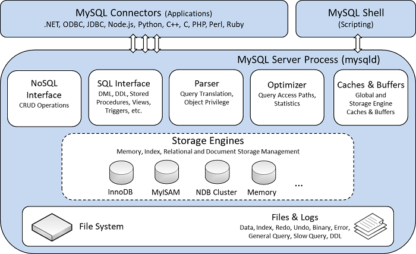
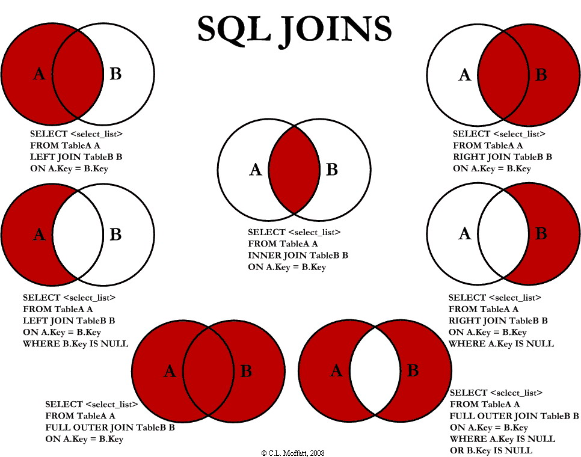
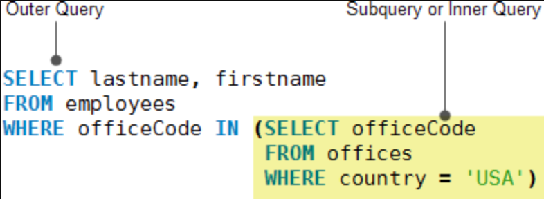
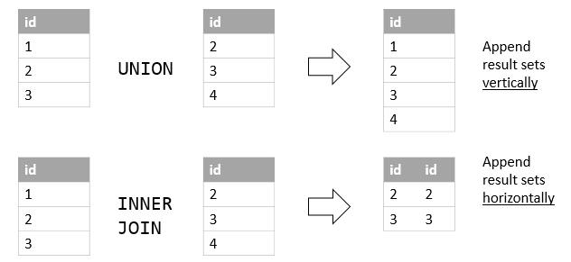
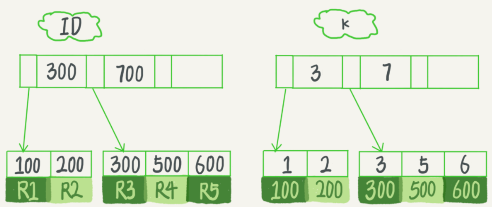
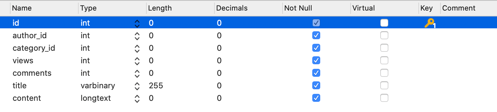
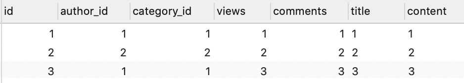
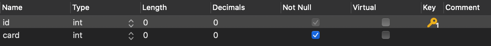
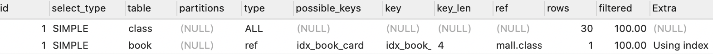

# MySQL 进阶

Table of Contents
-----------------

* [Brainstorming](#brainstorming)
* [1. 架构](#1-架构)
* [2. Joins](#2-joins)
* [3. 子查询](#3-子查询)
* [4. Union](#4-union)
* [5. 索引: B  树](#5-索引-b-树)
* [6. 单表索引优化](#6-单表索引优化)
   * [6.1 表设计 &amp; 初始化](#61-表设计--初始化)
   * [6.2 联合索引：最左匹配原则](#62-联合索引最左匹配原则)
* [7. 两表索引优化](#7-两表索引优化)
   * [7.1 表设计](#71-表设计)
   * [7.2 Demo](#72-demo)
   * [7.3 总结](#73-总结)
* [8. 索引优化技巧](#8-索引优化技巧)
* [References](#references)


## Brainstorming

  <div align="center">  </div><br>


## 1. 架构

  <div align="center">  </div><br>


## 2. Joins

  <div align="center">  </div><br>


## 3. 子查询

  <div align="center">  </div><br>


## 4. Union

`union` 用于连接两个以上的 `select` 语句的结果组合到一个结果集合中。多个 `select` 语句会删除重复的数据


  <div align="center">  </div><br>


```mysql
SELECT column_name(s) FROM table1
UNION
SELECT column_name(s) FROM table2;
```


## 5. 索引: B+ 树

**每一个索引在 InnoDB 里面对应一颗 B+ 树**


举个例子，我们有一个主键列为 `ID` 的表，其中有个字段为 `k`，且 `k` 上有索引

我们称 `ID` 为主键索引，`k` 为非主键索引


<div align="center">  </div><br>


在执行下列语句时：

```mysql
SELECT * FROM table_name WHERE ID = 500;
```

只需要搜索 `ID` 这颗 `B+` 树

而当执行下列语句时：

```mysql
SELECT * FROM table_name WHERE K = 5;
```

则需要先搜索 `k` 索引树，获得 `ID` 为 500，再去搜 `ID` 索引树，这个称 "回表"


## 6. 单表索引优化

### 6.1 表设计 & 初始化

  <div align="center">  </div><br>


<div align="center">  </div><br>


**踩坑记录**

- 插入数据时：

  `INSERT INTO TABLE_NAME (col1, col2, ...) VALUES (val1, val2, ...)` 若 `PK` 为自增，则不要写入 `(col1, col2, ...)` 的参数中（对表进行修改后记得手动保存）


### 6.2 联合索引：最左匹配原则

**查询 category_id 为 1 且 comments 大于 1 的情况下，views 最多的 id**

```mysql
SELECT
	id 
FROM
	article 
WHERE
	category_id = 1 
	AND comments > 1 
ORDER BY
	views DESC 
	LIMIT 1;
```

<div align="center">  </div><br>

**优化 1.0**

既然在 `WHERE` 和 `ORDER BY` 后跟了 `category_id`，`comments` 以及 `views` 这三列

那我们就建一个联合索引：

```mysql
CREATE INDEX idx_category_comments_views ON article ( category_id, comments, views );
```

<div align="center">  </div><br>

避免了全表扫，但出现了 `using filesort`


**联合索引在执行的时候，遵循 “最左匹配原则”**


假设一张表的 `a`，`b`，`c` 列上有一个联合索引 `idx_a_b_c`

相当于已经对 `(a)`，`(a, b)`，`(a, b, c)` 建立了索引


举个例子，联合索引的结构和电话簿相类似，

- 若知道姓，电话簿会很有用
- 除了姓，还知道名，电话薄更有用
- 若只知道名，不知道姓，电话簿还能发挥作用吗？


**优化 2.0**

```mysql
CREATE INDEX idx_category_views ON article ( category_id, views );
```

<div align="center">  </div><br>


## 7. 两表索引优化

### 7.1 表设计

`class` 表：

<div align="center">  </div><br>


`book` 表：

<div align="center">  </div><br>

字段都相同，`card` 为主外键关系


### 7.2 Demo

下面以 `left join` 为例，探究两表的索引该如何建立

- 左表：`class`
- 右表：`book`

```mysql
EXPLAIN SELECT
	* 
FROM
	class
	LEFT JOIN book ON class.card = book.card;
```


没建索引之前：

<div align="center">  </div><br>


1. 只在左表 `card` 字段上建立索引：

```mysql
CREATE INDEX idx_class_card ON class(card);
```

使用 `explain` 分析结果：

<div align="center">  </div><br>


2. 只在右表的 `card` 字段建立索引：

```mysql
CREATE INDEX idx_book_card ON book ( card );
```

使用 `explain` 分析结果：

<div align="center">  </div><br>


### 7.3 总结

**左连接，索引加右表（反之同理）**


## 8. 索引优化技巧


- 最左匹配原则
- 不在索引列上做操作（计算，函数，类型转换）
- 范围之后的索引会失效
- 尽量使用覆盖索引（禁止 SELECT *）
- 使用 `!=`, `<>`, `is null`, `is not null`，索引会失效
- `like` 以通配符开头，索引会失效
- 字符串不加单引号，索引会失效
- 少用 `or`，用它连接时索引会失效


## References

- [MySQL实战45讲-极客时间](https://time.geekbang.org/column/intro/100020801)
- [MySQL 的 crash-safe 原理解析](https://juejin.im/post/6844904167782236167)
- [事务隔离级别(图文详解)](https://github.com/Snailclimb/JavaGuide/blob/master/docs/database/%E4%BA%8B%E5%8A%A1%E9%9A%94%E7%A6%BB%E7%BA%A7%E5%88%AB(%E5%9B%BE%E6%96%87%E8%AF%A6%E8%A7%A3).md)
- [尚硅谷MySQL数据库高级，mysql优化，数据库优化](https://www.bilibili.com/video/BV1KW411u7vy?from=search&seid=11888146484032851728)
- [8.8.2 EXPLAIN Output Format](https://dev.mysql.com/doc/refman/8.0/en/explain-output.html)
- [What does eq_ref and ref types mean in MySQL explain](https://stackoverflow.com/questions/4508055/what-does-eq-ref-and-ref-types-mean-in-mysql-explain)
- [mysql联合索引](https://www.cnblogs.com/softidea/p/5977860.html)
- [MySQL最左匹配原则，道儿上兄弟都得知道的原则](https://blog.csdn.net/qq_39390545/article/details/108540362)
- [mysql 联合索引详解](https://blog.csdn.net/lmh12506/article/details/8879916)
- [【原创】Mysql中select的正确姿势](https://www.cnblogs.com/rjzheng/p/9902911.html)