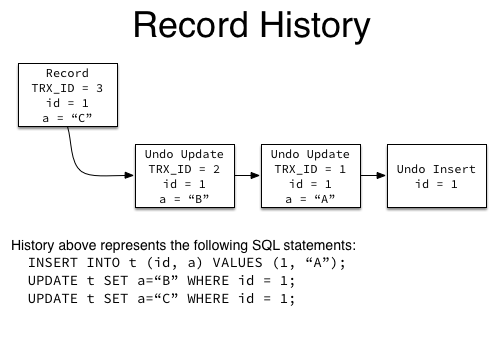

# MySQL

Table of Contents
-----------------

* [Brainstorming](#brainstorming)
* [1. 事务](#1-事务)
   * [1.1 Mysql 隔离级别](#11-mysql-隔离级别)
* [2. Mysql 架构](#2-mysql-架构)
* [3. 索引](#3-索引)
   * [3.1 回表](#31-回表)
   * [3.2 联合索引：最左匹配原则](#32-联合索引最左匹配原则)
   * [3.3 前缀索引（最左匹配原则应用）](#33-前缀索引最左匹配原则应用)
   * [3.4 Left Join &amp; Right Join 索引优化](#34-left-join--right-join-索引优化)
   * [3.5 覆盖索引](#35-覆盖索引)
* [4. InnoDB 锁机制](#4-innodb-锁机制)
   * [4.1 意向锁](#41-意向锁)
* [References](#references)

## Brainstorming

  <div align="center">  </div><br>


## 1. 事务

### 1.1 Mysql 隔离级别

| 隔离级别         | 脏读可能性 | 不可重复读可能性 | 幻读可能性 | 加锁读 |
| ---------------- | ---------- | ---------------- | ---------- | ------ |
| read uncommitted | yes        | yes              | yes        | no     |
| read committed   | no         | yes              | yes        | no     |
| repeatable read  | no         | no               | yes        | no     |
| serializable     | no         | no               | no         | yes    |


## 2. Mysql 架构

  <div align="center">  </div><br>

## 3. 索引

**每一个索引在 InnoDB 里面对应一颗 B+ 树**


### 3.1 回表

举个例子，我们有一个主键列为 `ID` 的表，其中有个字段为 `k`，且 `k` 上有索引

我们称 `ID` 为主键索引，`k` 为非主键索引


<div align="center">  </div><br>


在执行下列语句时：

```mysql
SELECT * FROM table_name WHERE ID = 500;
```

只需要搜索 `ID` 这颗 `B+` 树

而当执行下列语句时：

```mysql
SELECT * FROM table_name WHERE K = 5;
```

则需要先搜索 `k` 索引树，获得 `ID` 为 500，再去搜 `ID` 索引树，这个称 "回表"


**执行流程（重要）：**

1. 在 `k` 索引树上找到 `k = 3` 的记录，取得 `ID = 300`
2. 再到 `ID`  索引树查到 `ID = 300` 对应的 `R3`
3. 在 `k` 索引树取下一个值 `k = 5`，取得 `ID = 500`
4. 再回到 `ID` 索引树查到 `ID = 500` 对应的 `R4`
5. 在 `k` 索引树取下一个值 `k = 6`，不满足条件，循环结束


在这个例子中，由于查询结果所需要的数据只在主键索引上有，所以不得不回表


### 3.2 联合索引：最左匹配原则

**表设计 & 初始化 **

  <div align="center">  </div><br>


<div align="center">  </div><br>


**踩坑记录**

- 插入数据时：

  `INSERT INTO TABLE_NAME (col1, col2, ...) VALUES (val1, val2, ...)` 若 `PK` 为自增，则不要写入 `(col1, col2, ...)` 的参数中（对表进行修改后记得手动保存）


**需求：查询 category_id 为 1 且 comments 大于 1 的情况下，views 最多的 id**

```mysql
SELECT
	id 
FROM
	article 
WHERE
	category_id = 1 
	AND comments > 1 
ORDER BY
	views DESC 
	LIMIT 1;
```

<div align="center">  </div><br>

**优化 1.0**

既然在 `WHERE` 和 `ORDER BY` 后跟了 `category_id`，`comments` 以及 `views` 这三列

那我们就建一个联合索引：

```mysql
CREATE INDEX idx_category_comments_views ON article ( category_id, comments, views );
```

<div align="center">  </div><br>

避免了全表扫，但出现了 `using filesort`


**联合索引在执行的时候，遵循 “最左匹配原则”**


假设一张表的 `a`，`b`，`c` 列上有一个联合索引 `idx_a_b_c`

相当于已经对 `(a)`，`(a, b)`，`(a, b, c)` 建立了索引


举个例子，联合索引的结构和电话簿相类似，

- 若知道姓，电话簿会很有用
- 除了姓，还知道名，电话薄更有用
- 若只知道名，不知道姓，电话簿还能发挥作用吗？


**优化 2.0**

```mysql
CREATE INDEX idx_category_views ON article ( category_id, views );
```

<div align="center">  </div><br>

### 3.3 前缀索引（最左匹配原则应用）

假设现在需要维护一个邮箱登录的系统，如何在邮箱这个字段高效地建立索引？

两种方案：

1. 记录整个字符串
2. 记录字符串的前 n 个字节


<div align="center">  </div><br>

<div align="center">  </div><br>

```mysql
SELECT 
	id,name,email 
FROM 
	SUser 
WHERE 
	email='zhangssxyz@xxx.com';
```


第一种方案的执行顺序：

1. 在 `email` 索引树上找到


第二种方案的执行顺序：

1. 在 `email` 索引树上找到


### 3.4 Left Join & Right Join 索引优化

**表设计**

`class` 表：

<div align="center">  </div><br>


`book` 表：

<div align="center">  </div><br>

字段都相同，`card` 为主外键关系


下面以 `left join` 为例，探究两表的索引该如何建立

- 左表：`class`
- 右表：`book`

```mysql
EXPLAIN SELECT
	* 
FROM
	class
	LEFT JOIN book ON class.card = book.card;
```


没建索引之前：

<div align="center">  </div><br>


1. 只在左表 `card` 字段上建立索引：

```mysql
CREATE INDEX idx_class_card ON class(card);
```

使用 `explain` 分析结果：

<div align="center">  </div><br>


2. 只在右表的 `card` 字段建立索引：

```mysql
CREATE INDEX idx_book_card ON book ( card );
```

使用 `explain` 分析结果：

<div align="center">  </div><br>


**总结：**

- Left join, 索引加右表
- Right join, 索引加左表


### 3.5 覆盖索引

通过遍历索引树就可以满足查询的字段，不用回表，即索引被覆盖了

是一种高效的性能优化手段


**注意（重要）：**

当 ` SELECT *` 的时候，若是遍历整个索引树（比如 `LIKE %xxx%`），可以认为造成了全表扫描（因为在遍历索引树的过程每次都需要回表）


## 4. InnoDB 锁机制

### 4.1 意向锁

<div align="center">  </div><br>

在存在行锁和表锁的情况下，事务 T 想要对表 A 加 X 锁，就需要检测是否有其他事务对表 A 或者表 A 中任一一行加了锁，即需要对表 A 每一行都检测一次，无疑是非常耗时的


**意向锁有两个规定：**

- 一个事务在获得某个数据行对象的  S 锁之前，必须先获得表的 IS 锁或者更强的锁
- 一个事务在获得某个数据行对象的  X 锁之前，必须先获得表的 IX 锁


### 4.2 MVCC

#### 4.2.1 Undo log（重做日志）

```mysql
INSERT INTO t(id, a) VALUES (1, "A");
UPDATE t SET a="B" WHERE id = 1;
UPDATE t SET a="C" WHERE id = 1;
```


<div align="center">  </div><br>

**注意⚠️**

- 根据 `mysql` 的 `AUTOCOMMIT` 机制，每个语句都当作一个事务执行
- 写操作（`INSERT`, `UPDATE`, `DELETE`）都会创建一个日志，并将当前的事务号 `TRX_ID` 写入


## References

- 施瓦茨. 高性能 MYSQL(第3版)[M]. 电子工业出版社, 2013.
- 姜承尧. MySQL技术内幕：InnoDB存储引擎(第2版)[M]. 机械工业出版社, 2018.
- [15.7.1 InnoDB Locking](https://dev.mysql.com/doc/refman/8.0/en/innodb-locking.html)
- [MySQL实战45讲-极客时间](https://time.geekbang.org/column/intro/100020801)
- [尚硅谷MySQL数据库高级，mysql优化，数据库优化](https://www.bilibili.com/video/BV1KW411u7vy?from=search&seid=11888146484032851728)
- [What does eq_ref and ref types mean in MySQL explain](https://stackoverflow.com/questions/4508055/what-does-eq-ref-and-ref-types-mean-in-mysql-explain)

