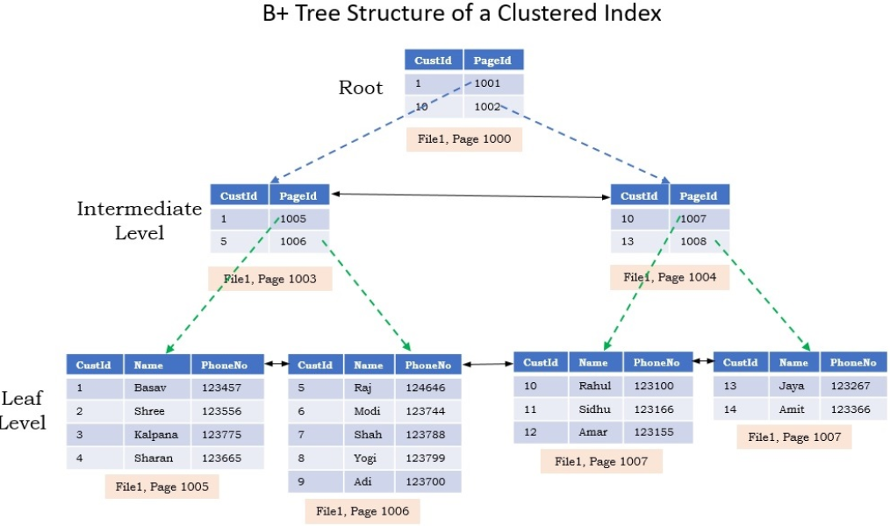
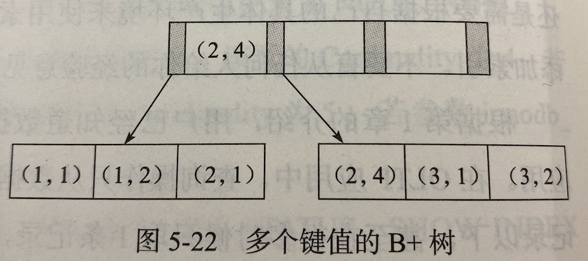
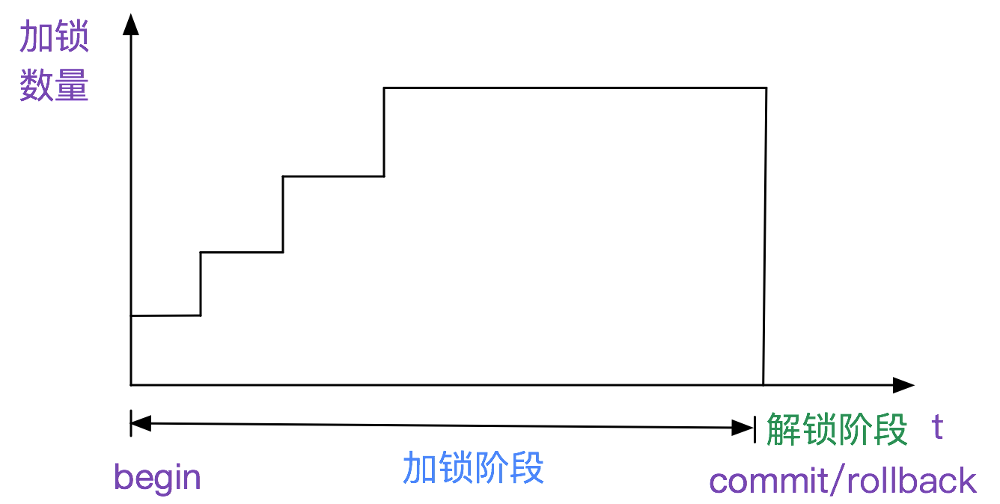

# MySQL

Table of Contents
-----------------

* [Brainstorming](#brainstorming)
* [1. 基本架构](#1-基本架构)
* [2. 索引](#2-索引)
   * [2.1 B  tree](#21-b-tree)
   * [2.2 类型](#22-类型)
      * [2.2.1 Clustered index](#221-clustered-index)
      * [2.2.2 Secondary index](#222-secondary-index)
   * [2.3 应用](#23-应用)
      * [2.3.1 联合索引](#231-联合索引)
      * [2.3.2 覆盖索引](#232-覆盖索引)
* [3. 事务](#3-事务)
   * [3.1 redo log](#31-redo-log)
      * [3.1.1 实现 crash-safe](#311-实现-crash-safe)
      * [3.1.2 两阶段提交](#312-两阶段提交)
   * [3.2 undo log](#32-undo-log)
   * [3.3 redo log 和 undo log 实现 ACID](#33-redo-log-和-undo-log-实现-acid)
* [4. 锁](#4-锁)
   * [4.1 S Lock &amp; X Lock](#41-s-lock--x-lock)
   * [4.2 Intention Lock](#42-intention-lock)
   * [4.3 两阶段锁协议](#43-两阶段锁协议)
   * [4.4 一致性非锁定读](#44-一致性非锁定读)
      * [4.4.1 ReadView](#441-readview)
   * [4.5 锁算法](#45-锁算法)
      * [4.5.1 Next-Key Lock](#451-next-key-lock)
* [References](#references)

## Brainstorming

  <div align="center">  </div><br>


## 1. 基本架构

  <div align="center">  </div><br>

## 2. 索引

> B+ 树在数据库中的实现

### 2.1 B+ tree

<div align="center">  </div><br>

**insertion**

| leaf page 满 | index page 满 | 操作                                                         |
| ------------ | ------------- | ------------------------------------------------------------ |
| No           | No            | 将记录插到叶子结点                                           |
| Yes          | No            | 1. 拆分 leaf page<br />2. 将中间节点放到 index page<br />3. 小于中间节点数据放左，大于或等于中间节点放右 |
| Yes          | Yes           | 1. 拆分 leaf page<br />2. 小于中间节点数据放左，大于或等于中间节点放右<br /><br />3. 拆分 index page<br />4. 小于中间节点数据放左，大于中间节点放右<br />5. 中间节点放上一层 index page |


**deletion**

// TODO

### 2.2 类型

#### 2.2.1 Clustered index

> 以 (id, row) 方式存储数据

<div align="center">  </div><br>

#### 2.2.2 Secondary index

> 以 (key, id) 方式存储数据

<div align="center">  </div><br>

### 2.3 应用

#### 2.3.1 联合索引

<div align="center">  </div><br>

**Explained**

- 按照 (key1, key2, ..., keyn) 顺序排序
- 遵循 “最左匹配原则”
- 假设一张表字段 `a`，`b`，`c` 有联合索引 `idx_a_b_c` -> 对 `(a)`，`(a, b)`，`(a, b, c)` 建立了索引


**Example**

通过电话簿查找某人电话的时候，若只知道名而不知道姓，还能快速查找吗？


#### 2.3.2 覆盖索引

> 通过遍历索引树就可以满足查询的字段，不用回表，即索引被覆盖了

当 ` SELECT *` 的时候，若遍历整个索引树（比如 `LIKE %xxx%`），可以认为造成了全表扫描（因为在遍历索引树的过程每次都需要回表）


## 3. 事务

### 3.1 redo log

> redo log 用来保证事务的持久性

当有一条记录需要更新的时候，`InnoDB` 会将该记录写到 `redo log` 中，并更新内存。在系统较空闲的时候，再将此条记录更新到磁盘中


<div align="center">  </div><br>

#### 3.1.1 实现 crash-safe

<div align="center">  </div><br>


#### 3.1.2 两阶段提交

<div align="center">  </div><br>

### 3.2 undo log

> 事务的 rollback 通过 undo log 实现

`undo log` 是逻辑日志

举个例子，用户执行了一个 `INSERT 10w` 条数据的事务，这个事务会导致表空间增大。在用户 `rollback` 的时候，实际上做的是与之前（逻辑）相反的操作，即表空间并没有因此收缩：

- 对于每个 `INSERT`，`InnoDB` 会完成一个 `DELETE`（反之亦然）
- 对于每个 `UPDATE`，`InnoDB` 会完成一个相反的 `UPDATE`


### 3.3 redo log 和 undo log 实现 ACID

> redo log: 记录事务的行为以实现持久化 | undo log: 支撑事务的 rollback 操作
>

举个例子，现在需要将 a 字段的值由 1 改为 3，b 字段的值由 2 改为 4

| column | value |
| ------ | ----- |
| a      | 1     |
| b      | 2     |

**执行流程**

1. start transaction
2. a = 1 -> 写入 `undo log`
3. 写入/更新 a = 3
4. a = 3 -> 写入 `redo log`
5. b = 2 -> 写入 `undo log`
6. 写入/更新 b = 4
7. b = 4 -> 写入 `redo log`
8. 将 `redo log` 刷入磁盘实现持久化
9. commit


## 4. 锁

### 4.1 S Lock & X Lock

S Lock 和 X Lock 兼容性矩阵

| Lock held | Lock wanted | Granted? |
| --------- | ----------- | -------- |
| S         | S           | Yes      |
| S         | X           | No       |
| X         | S           | No       |
| X         | X           | No       |

### 4.2 Intention Lock

> 1. Before a transaction can acquire an S lock on a row in table t, it must first acquire an IS or stronger lock on table t.
> 2. Before a transaction can acquire an X lock on a row, it must first acquire an IX lock on table t.

<div align="center">  </div><br>

不同**表锁**的兼容性矩阵

| Lock held | Lock wanted | Granted? |
| --------- | ----------- | -------- |
| S         | S           | Yes      |
| S         | X           | No       |
| S         | IS          | Yes      |
| S         | IX          | No       |
| X         | S           | No       |
| X         | X           | No       |
| X         | IS          | No       |
| X         | IX          | No       |
| IS        | S           | Yes      |
| IS        | X           | No       |
| IS        | IS          | Yes      |
| IS        | IX          | Yes      |
| IX        | S           | No       |
| IX        | X           | No       |
| IX        | IS          | Yes      |
| IX        | IX          | Yes      |

**P.S**

- `IS` 锁与 `IX` 锁两两并不互斥，因为锁的不一定是同一行记录
- 该兼容矩阵针对表锁


**Example**

**事务 t1**

```mysql
SELECT * FROM mytable WHERE id = 6 FOR UPDATE;
```

1. t1 申请 `mytable` 表的 `IX` 锁，申请成功
2. t1 获得 `mytable` 表 id 为 6 一行的 `X` 锁（仍未 commit）

**事务 t2**

```mysql
LOCK TABLES mytable READ;
```

1. t2 想申请 `mytable` 表的 `S` 锁（表锁），但 `mytable` 表上已有 `IX` 锁，请求阻塞

**事务 t3**

```mysql
SELECT * FROM mytable WHERE id = 5 FOR UPDATE;
```

1. t3 申请 `mytable` 表的 `IX` 锁
2. 此时 `mytable` 表已有 t1 的  `IX` 锁，但由于 `IX` 锁互相兼容，故 t3 申请 `IX` 锁成功
3. t3 获得 `mytable` 表 id 为 5 一行的 `X` 锁


### 4.3 两阶段锁协议

<div align="center">  </div><br>

### 4.4 一致性非锁定读

> 写：新增 snapshot 数据；读：旧 snapshot 数据

#### 4.4.1 ReadView

> MVCC 维护了一个 ReadView 结构，主要包含了当前系统活跃的事务列表 TRX_IDs

<div align="center">  </div><br>

**Explained**

对于事务 t1 启动的瞬间，`ReadView` 保存了当前活跃事务集合（begin 但仍未 commit 的事务）

- 若在绿色部分：**可见**
- 若在黄色部分：**不可见**
- 若在红色部分：**不可见**


**Example**

```mysql
# Session A
BEGIN;
	SELECT age 
	FROM staff 
	WHERE
	id = 3;
COMMIT;
```

```mysql
# Session B
BEGIN;
	UPDATE staff 
	SET age = 7 
	WHERE
	id = 3;
COMMIT;
```

**执行流程（模拟并发操作）**

| Timeline | Session A                                          | Session B                              |
| -------- | -------------------------------------------------- | -------------------------------------- |
| 1        | BEGIN;                                             |                                        |
| 2        | SELECT age FROM staff WHERE id = 3;<br />result: 3 |                                        |
| 3        |                                                    | BEGIN;                                 |
| 4        |                                                    | UPDATE staff SET age = 7 WHERE id = 3; |
| 5        | SELECT age FROM staff WHERE id = 3;<br />result: 3 |                                        |
| 6        |                                                    | COMMIT:                                |
| 7        | SELECT age FROM staff WHERE id = 3;<br />result: 3 |                                        |
| 8        | COMMIT;                                            |                                        |


### 4.5 锁算法

#### 4.5.1 Next-Key Lock

> 行锁的一种算法，对于 SELECT，锁定的是一个范围而非一个值


`mysql` 版本（不同版本的优化原则可能不同）

<div align="center">  </div><br>

表 `t`

```mysql
CREATE TABLE t ( id INT PRIMARY KEY NOT NULL, c INT DEFAULT NULL, d INT DEFAULT NULL, KEY idx_c ( c ) ) ENGINE = INNODB;
INSERT INTO t
VALUES
	( 0, 0, 0 ),
	( 5, 5, 5 ),
	( 10, 10, 10 ),
	( 15, 15, 15 ),
	( 20, 20, 20 ),
	( 25, 25, 25 );
```


**Example 1**

| Timeline | Session A                                                    | Session B                                                    | Session C                                                    |
| -------- | ------------------------------------------------------------ | ------------------------------------------------------------ | ------------------------------------------------------------ |
| 1        | BEGIN;<br/>	UPDATE t <br/>	SET d = d + 1 <br/>	WHERE<br/>	id = 7; |                                                              |                                                              |
| 2        |                                                              | INSERT INTO t<br/>VALUES<br/>	( 8, 8, 8 );<br /># Blocked |                                                              |
| 3        |                                                              |                                                              | UPDATE t <br/>SET d = d + 1 <br/>WHERE<br/>	id = 10;<br /># Affected rows: 1 |

1. `next-key lock` (5, 10]
2. 退化成 `gap lock` (5, 10)


**Example 2**

| Timeline | Session A                                                    | Session B                                                    | Session C                                                    |
| -------- | ------------------------------------------------------------ | ------------------------------------------------------------ | ------------------------------------------------------------ |
| 1        | BEGIN;<br/>	SELECT<br/>		id <br/>	FROM<br/>		t <br/>	WHERE<br/>	c = 5 LOCK IN SHARE MODE; |                                                              |                                                              |
| 2        |                                                              | UPDATE t <br/>SET d = d + 1 <br/>WHERE<br/>	id = 5;<br /># Affected rows: 1 |                                                              |
| 3        |                                                              |                                                              | INSERT INTO t<br/>VALUES<br/>	( 7, 7, 7 );<br /># Blocked |


1. `next-key lock` (0, 5]
2. `gap lock` (0, 5], (5, 10)
3. Session B 的更新只查找了 `PK` 索引树，**不阻塞**（因为 `LOCK IN SHARE MODE` 不会回表访问）


## References

- 施瓦茨. 高性能 MYSQL(第3版)[M]. 电子工业出版社, 2013.
- 姜承尧. MySQL技术内幕：InnoDB存储引擎(第2版)[M]. 机械工业出版社, 2018.
- [MySQL实战45讲-极客时间](https://time.geekbang.org/column/intro/100020801)
- [尚硅谷MySQL数据库高级，mysql优化，数据库优化](https://www.bilibili.com/video/BV1KW411u7vy?from=search&seid=11888146484032851728)
- [B+ Trees Visualization](https://www.cs.usfca.edu/~galles/visualization/BPlusTree.html)
- [CyC2018/CS-Notes](https://github.com/CyC2018/CS-Notes/blob/master/notes/%E6%95%B0%E6%8D%AE%E5%BA%93%E7%B3%BB%E7%BB%9F%E5%8E%9F%E7%90%86.md)
- [说说MySQL中的Redo log Undo log都在干啥](https://www.cnblogs.com/xinysu/p/6555082.html)
- [Innodb中的事务隔离级别和锁的关系](https://tech.meituan.com/2014/08/20/innodb-lock.html)
- [Mysql锁：灵魂七拷问](https://tech.youzan.com/seven-questions-about-the-lock-of-mysql/)
- [How is a query executed in MySQL](https://qxf2.com/blog/mysql-query-execution/)
- [octachrome/innodb-locks](https://github.com/octachrome/innodb-locks)
- [为什么 MySQL 使用 B+ 树](https://draveness.me/whys-the-design-mysql-b-plus-tree/)
