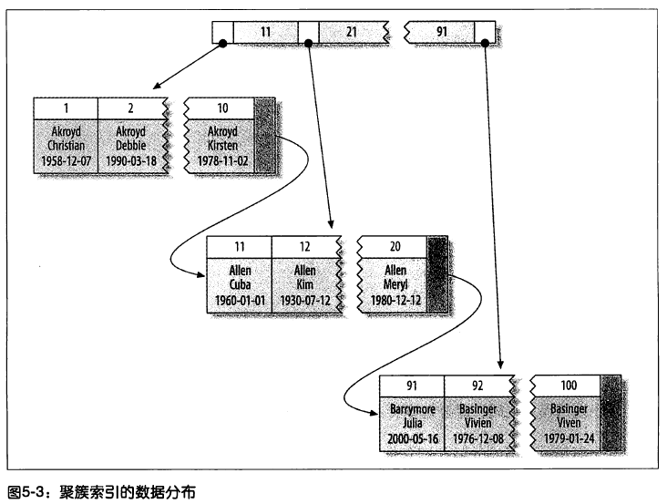
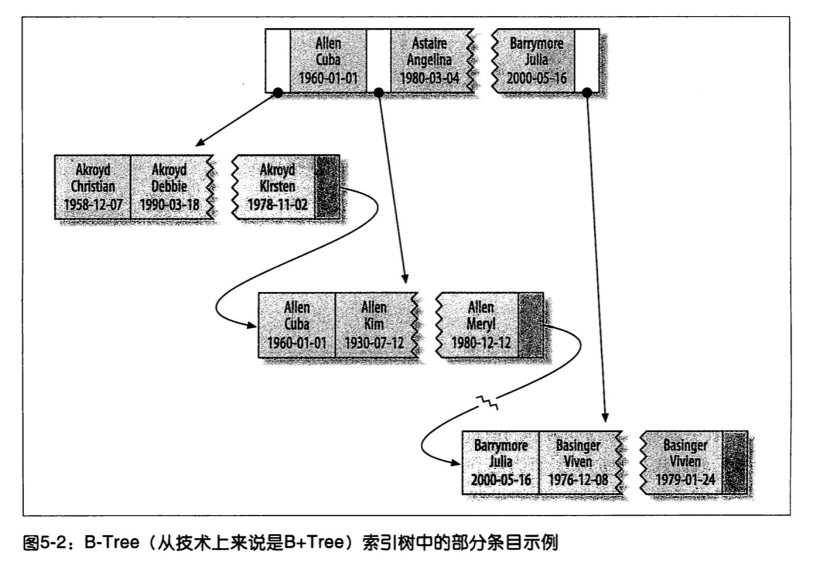

# MySQL

Table of Contents
-----------------

* [Brainstorming](#brainstorming)
* [1. 基本架构](#1-基本架构)
* [2. 索引](#2-索引)
   * [2.1 底层数据结构](#21-底层数据结构)
      * [2.1.1 B Tree](#211-b-tree)
      * [2.1.2 B  Tree](#212-b-tree)
   * [2.2 复合索引](#22-复合索引)
* [3. 事务](#3-事务)
* [4. 锁](#4-锁)
   * [4.1 快照读](#41-快照读)
* [5. 其他](#5-其他)
   * [5.1 切分](#51-切分)
   * [5.2 主从复制](#52-主从复制)
   * [5.3 读写分离](#53-读写分离)
* [References](#references)

## Brainstorming

  
  
 

## 1. 基本架构

  
  
 

## 2. 索引

### 2.1 底层数据结构

#### 2.1.1 B Tree

  
 

#### 2.1.2 B+ Tree

  
 

**Clustered index (聚簇索引)**

叶子结点也称为数据页，InnoDB 大小为 16 KB

**术语**

- 页中的值
- 指向子页的指针
- 指向下一个叶子页的指针

  
 

**Secondary index (辅助索引)**

> 以 (key, id) 方式存储数据

  
 

### 2.2 复合索引

  
 

## 3. 事务

**Example**

现在需要将 a 字段的值由 1 改为 3，b 字段的值由 2 改为 4

| column | value |
| ------ | ----- |
| a      | 1     |
| b      | 2     |

**执行流程** 

1. start transaction
2. a = 1 -> 写入 undo log
3. 更新 a = 3, a = 3 -> 写入 redo log
5. b = 2 -> 写入 undo log
6. 更新 b = 4, b = 4 -> 写入 redo log
8. 将所有日志 (undo log, redo log, ...) 刷入磁盘实现持久化
9. commit

## 4. 锁

### 4.1 快照读

**ReadView**

  
 

**Explained**

对于事务 t1 启动的瞬间，`ReadView` 保存了当前活跃事务集合（begin 但仍未 commit 的事务）

- 若在绿色部分：**可见**
- 若在黄色部分：**不可见**
- 若在红色部分：**不可见**

## 5. 其他

### 5.1 切分

**水平切分**

  
 

**垂直切分**

  
 

### 5.2 主从复制

- binlog 线程：将 master 的数据更改写入 binary log 中
- I/O 线程：从 master 读 binary log，写到 slave 的 relay log 中 (relay 有接力的意思)
- SQL 线程：读取 relay log，将其重放到 slave 上

  
 

### 5.3 读写分离

  
 

## References

- 施瓦茨. 高性能 MYSQL(第3版)[M]. 电子工业出版社, 2013.
- 姜承尧. MySQL技术内幕：InnoDB存储引擎(第2版)[M]. 机械工业出版社, 2018.
- [MySQL实战45讲-极客时间](https://time.geekbang.org/column/intro/100020801)
- [为什么 MySQL 使用 B+ 树](https://draveness.me/whys-the-design-mysql-b-plus-tree/)

