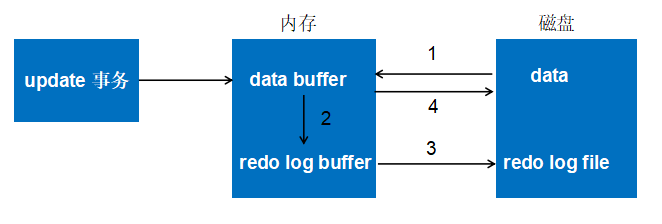
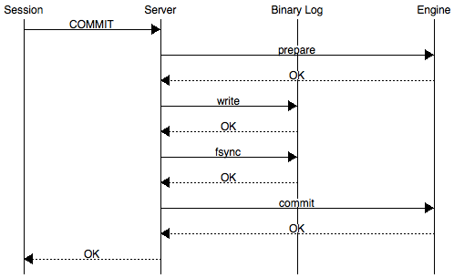
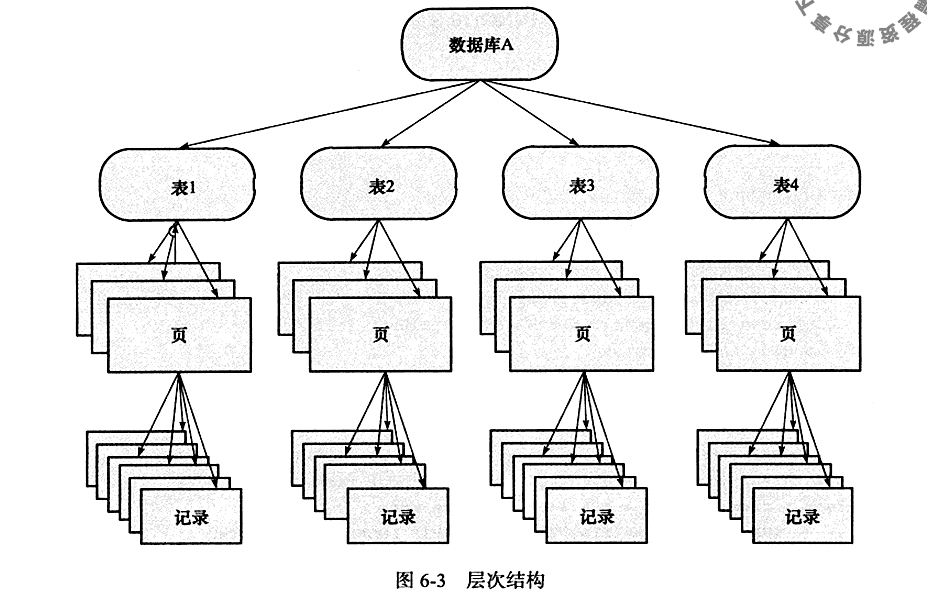
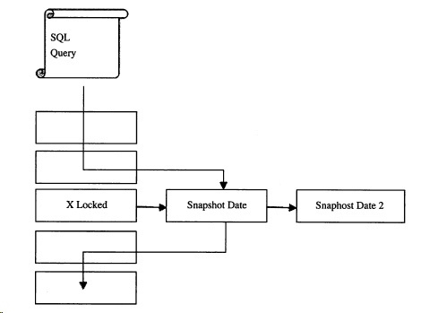

# MySQL

Table of Contents
-----------------

* [Brainstorming](#brainstorming)
* [1. Mysql 基本架构](#1-mysql-基本架构)
* [2. 索引](#2-索引)
   * [2.1 回表](#21-回表)
   * [2.2 联合索引](#22-联合索引)
   * [2.3 前缀索引](#23-前缀索引)
   * [2.4 Left Join &amp; Right Join 索引优化](#24-left-join--right-join-索引优化)
   * [2.5 覆盖索引](#25-覆盖索引)
* [3. 事务](#3-事务)
   * [3.1 redo log](#31-redo-log)
      * [3.1.1 实现 crash-safe](#311-实现-crash-safe)
      * [3.1.2 两阶段提交](#312-两阶段提交)
   * [3.2 undo log](#32-undo-log)
   * [3.3 redo log 和 undo log 实现 ACID](#33-redo-log-和-undo-log-实现-acid)
* [4. 锁](#4-锁)
   * [4.1 S Lock &amp; X Lock](#41-s-lock--x-lock)
   * [4.2 Intention Lock](#42-intention-lock)
   * [4.2 一致性非锁定读](#42-一致性非锁定读)
      * [4.2.1 ReadView](#421-readview)
* [References](#references)

## Brainstorming

  <div align="center">  </div><br>


## 1. Mysql 基本架构

  <div align="center">  </div><br>

## 2. 索引

**每一个索引在 InnoDB 里面对应一颗 B+ 树**


### 2.1 回表

举个例子，我们有一个主键列为 `ID` 的表，其中有个字段为 `k`，且 `k` 上有索引

我们称 `ID` 为主键索引，`k` 为非主键索引


<div align="center">  </div><br>


在执行下列语句时：

```mysql
SELECT * FROM table_name WHERE ID = 500;
```

只需要搜索 `ID` 这颗 `B+` 树

而当执行下列语句时：

```mysql
SELECT * FROM table_name WHERE K = 5;
```

则需要先搜索 `k` 索引树，获得 `ID` 为 500，再去搜 `ID` 索引树，这个称 "回表"


**执行流程（重要）：**

1. 在 `k` 索引树上找到 `k = 3` 的记录，取得 `ID = 300`
2. 再到 `ID`  索引树查到 `ID = 300` 对应的 `R3`
3. 在 `k` 索引树取下一个值 `k = 5`，取得 `ID = 500`
4. 再回到 `ID` 索引树查到 `ID = 500` 对应的 `R4`
5. 在 `k` 索引树取下一个值 `k = 6`，不满足条件，循环结束


在这个例子中，由于查询结果所需要的数据只在主键索引上有，所以不得不回表


### 2.2 联合索引

**表设计 & 初始化 **

  <div align="center">  </div><br>


<div align="center">  </div><br>


**踩坑记录**

- 插入数据时：

  `INSERT INTO TABLE_NAME (col1, col2, ...) VALUES (val1, val2, ...)` 若 `PK` 为自增，则不要写入 `(col1, col2, ...)` 的参数中（对表进行修改后记得手动保存）


**需求：查询 category_id 为 1 且 comments 大于 1 的情况下，views 最多的 id**

```mysql
SELECT
	id 
FROM
	article 
WHERE
	category_id = 1 
	AND comments > 1 
ORDER BY
	views DESC 
	LIMIT 1;
```

<div align="center">  </div><br>

**优化 1.0**

既然在 `WHERE` 和 `ORDER BY` 后跟了 `category_id`，`comments` 以及 `views` 这三列

那我们就建一个联合索引：

```mysql
CREATE INDEX idx_category_comments_views ON article ( category_id, comments, views );
```

<div align="center">  </div><br>

避免了全表扫，但出现了 `using filesort`


**联合索引在执行的时候，遵循 “最左匹配原则”**


假设一张表的 `a`，`b`，`c` 列上有一个联合索引 `idx_a_b_c`

相当于已经对 `(a)`，`(a, b)`，`(a, b, c)` 建立了索引


举个例子，联合索引的结构和电话簿相类似，

- 若知道姓，电话簿会很有用
- 除了姓，还知道名，电话薄更有用
- 若只知道名，不知道姓，电话簿还能发挥作用吗？


**优化 2.0**

```mysql
CREATE INDEX idx_category_views ON article ( category_id, views );
```

<div align="center">  </div><br>

### 2.3 前缀索引

假设现在需要维护一个邮箱登录的系统，如何在邮箱这个字段高效地建立索引？

两种方案：

1. 记录整个字符串
2. 记录字符串的前 n 个字节


<div align="center">  </div><br>

<div align="center">  </div><br>

```mysql
SELECT 
	id,name,email 
FROM 
	SUser 
WHERE 
	email='zhangssxyz@xxx.com';
```


第一种方案的执行顺序：

1. 在 `email` 索引树上找到


第二种方案的执行顺序：

1. 在 `email` 索引树上找到


### 2.4 Left Join & Right Join 索引优化

**表设计**

`class` 表：

<div align="center">  </div><br>


`book` 表：

<div align="center">  </div><br>

字段都相同，`card` 为主外键关系


下面以 `left join` 为例，探究两表的索引该如何建立

- 左表：`class`
- 右表：`book`

```mysql
EXPLAIN SELECT
	* 
FROM
	class
	LEFT JOIN book ON class.card = book.card;
```


没建索引之前：

<div align="center">  </div><br>


1. 只在左表 `card` 字段上建立索引：

```mysql
CREATE INDEX idx_class_card ON class(card);
```

使用 `explain` 分析结果：

<div align="center">  </div><br>


2. 只在右表的 `card` 字段建立索引：

```mysql
CREATE INDEX idx_book_card ON book ( card );
```

使用 `explain` 分析结果：

<div align="center">  </div><br>


**总结：**

- Left join, 索引加右表
- Right join, 索引加左表


### 2.5 覆盖索引

通过遍历索引树就可以满足查询的字段，不用回表，即索引被覆盖了

是一种高效的性能优化手段


**注意（重要）：**

当 ` SELECT *` 的时候，若是遍历整个索引树（比如 `LIKE %xxx%`），可以认为造成了全表扫描（因为在遍历索引树的过程每次都需要回表）

## 3. 事务

### 3.1 redo log

> redo log 用来保证事务的持久性

当有一条记录需要更新的时候，`InnoDB` 会将该记录写到 `redo log` 中，并更新内存。在系统较空闲的时候，再将此条记录更新到磁盘中


<div align="center">  </div><br>

#### 3.1.1 实现 crash-safe

<div align="center">  </div><br>


#### 3.1.2 两阶段提交

<div align="center">  </div><br>

### 3.2 undo log

> 事务的 rollback 通过 undo log 实现

`undo log` 是逻辑日志

举个例子，用户执行了一个 `INSERT 10w` 条数据的事务，这个事务会导致表空间增大。在用户 `rollback` 的时候，实际上做的是与之前（逻辑）相反的操作，即表空间并没有因此收缩：

- 对于每个 `INSERT`，`InnoDB` 会完成一个 `DELETE`（反之亦然）
- 对于每个 `UPDATE`，`InnoDB` 会完成一个相反的 `UPDATE`


### 3.3 redo log 和 undo log 实现 ACID

> redo log: 记录事务的行为以实现持久化 | undo log: 支撑事务的 rollback 操作
>

举个例子，现在需要将 a 字段的值由 1 改为 3，b 字段的值由 2 改为 4

| column | value |
| ------ | ----- |
| a      | 1     |
| b      | 2     |

**执行流程**

1. start transaction
2. a = 1 -> 写入 `undo log`
3. 写入/更新 a = 3
4. a = 3 -> 写入 `redo log`
5. b = 2 -> 写入 `undo log`
6. 写入/更新 b = 4
7. b = 4 -> 写入 `redo log`
8. 将 `redo log` 刷入磁盘实现持久化
9. commit


## 4. 锁

### 4.1 S Lock & X Lock

S Lock 和 X Lock 兼容性矩阵

| Lock held | Lock wanted | Granted? |
| --------- | ----------- | -------- |
| S         | S           | Yes      |
| S         | X           | No       |
| X         | S           | No       |
| X         | X           | No       |

### 4.2 Intention Lock

> 1. Before a transaction can acquire an S lock on a row in table t, it must first acquire an IS or stronger lock on table t.
> 2. Before a transaction can acquire an X lock on a row, it must first acquire an IX lock on table t.

<div align="center">  </div><br>

不同**表锁**的兼容性矩阵

| Lock held | Lock wanted | Granted? |
| --------- | ----------- | -------- |
| S         | S           | Yes      |
| S         | X           | No       |
| S         | IS          | Yes      |
| S         | IX          | No       |
| X         | S           | No       |
| X         | X           | No       |
| X         | IS          | No       |
| X         | IX          | No       |
| IS        | S           | Yes      |
| IS        | X           | No       |
| IS        | IS          | Yes      |
| IS        | IX          | Yes      |
| IX        | S           | No       |
| IX        | X           | No       |
| IX        | IS          | Yes      |
| IX        | IX          | Yes      |

**P.S**

- `IS` 锁与 `IX` 锁两两并不互斥，因为锁的不一定是同一行记录
- 该兼容矩阵针对表锁


**Example**

**事务 t1**

```mysql
SELECT * FROM mytable WHERE id = 6 FOR UPDATE;
```

1. t1 申请 `mytable` 表的 `IX` 锁，申请成功
2. t1 获得 `mytable` 表 id 为 6 一行的 `X` 锁（仍未 commit）

**事务 t2**

```mysql
LOCK TABLES mytable READ;
```

1. t2 想申请 `mytable` 表的 `S` 锁（表锁），但 `mytable` 表上已有 `IX` 锁，请求阻塞

**事务 t3**

```mysql
SELECT * FROM mytable WHERE id = 5 FOR UPDATE;
```

1. t3 申请 `mytable` 表的 `IX` 锁
2. 此时 `mytable` 表已有 t1 的  `IX` 锁，但由于 `IX` 锁互相兼容，故 t3 申请 `IX` 锁成功
3. t3 获得 `mytable` 表 id 为 5 一行的 `X` 锁


### 4.2 一致性非锁定读

> 写：更新最新版本数据；读：读旧版本的 snapshot


<div align="center">  </div><br>

#### 4.2.1 ReadView

> MVCC 维护了一个 ReadView 结构，主要包含了当前系统活跃的事务列表 TRX_IDs

<div align="center">  </div><br>

**Explained**

对于事务 t1 启动的瞬间，`ReadView` 保存了当前活跃事务集合（begin 但仍未 commit 的事务）

- 若在绿色部分：**可见**
- 若在黄色部分：**不可见**
- 若在红色部分：**不可见**


**Example**

```mysql
# Session A
BEGIN;
	SELECT age 
	FROM staff 
	WHERE
	id = 3;
COMMIT;
```

```mysql
# Session B
BEGIN;
	UPDATE staff 
	SET age = 7 
	WHERE
	id = 3;
COMMIT;
```

**执行流程（模拟并发操作）**

| Timeline | Session A                                       | Session B                              |
| -------- | ----------------------------------------------- | -------------------------------------- |
| 1        | BEGIN;                                          |                                        |
| 2        | SELECT age FROM staff WHERE id = 3;（age 为 3） |                                        |
| 3        |                                                 | BEGIN;                                 |
| 4        |                                                 | UPDATE staff SET age = 7 WHERE id = 3; |
| 5        | SELECT age FROM staff WHERE id = 3;（age 为 3） |                                        |
| 6        |                                                 | COMMIT:                                |
| 7        | SELECT age FROM staff WHERE id = 3;（age 为 3） |                                        |
| 8        | COMMIT;                                         |                                        |


## References

- 施瓦茨. 高性能 MYSQL(第3版)[M]. 电子工业出版社, 2013.
- 姜承尧. MySQL技术内幕：InnoDB存储引擎(第2版)[M]. 机械工业出版社, 2018.
- [MySQL实战45讲-极客时间](https://time.geekbang.org/column/intro/100020801)
- [尚硅谷MySQL数据库高级，mysql优化，数据库优化](https://www.bilibili.com/video/BV1KW411u7vy?from=search&seid=11888146484032851728)
- [What does eq_ref and ref types mean in MySQL explain](https://stackoverflow.com/questions/4508055/what-does-eq-ref-and-ref-types-mean-in-mysql-explain)
- [CyC2018/CS-Notes](https://github.com/CyC2018/CS-Notes/blob/master/notes/%E6%95%B0%E6%8D%AE%E5%BA%93%E7%B3%BB%E7%BB%9F%E5%8E%9F%E7%90%86.md)
- [说说MySQL中的Redo log Undo log都在干啥](https://www.cnblogs.com/xinysu/p/6555082.html)
- [Innodb中的事务隔离级别和锁的关系](https://tech.meituan.com/2014/08/20/innodb-lock.html)
- [Mysql锁：灵魂七拷问](https://tech.youzan.com/seven-questions-about-the-lock-of-mysql/)
- [How is a query executed in MySQL](https://qxf2.com/blog/mysql-query-execution/)
- [octachrome/innodb-locks](https://github.com/octachrome/innodb-locks)
- [15.7.1 InnoDB Locking](https://dev.mysql.com/doc/refman/8.0/en/innodb-locking.html)
