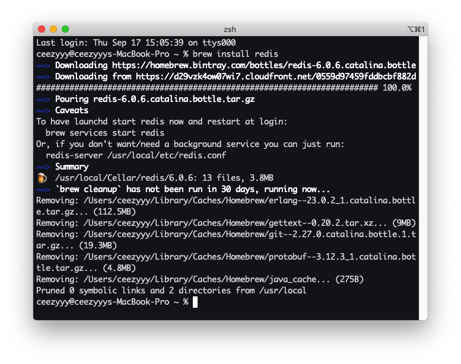

# Redis 

<div align="center">  </div><br>


Table of Contents
-----------------


## 1. 了解 NoSQL

### 1.1 什么是 NoSQL?

泛指非关系型数据库

**特点：**

- 易扩展：此类型数据存储不需要固定的模式，无需多余操作就可以横向扩展
- 


<div align="center">  </div><br>

启动 `redis`

```bash
brew services start redis
```


## 参考资料

- [尚硅谷超经典Redis教程,redis实战,阳哥版从入门到精通](https://www.bilibili.com/video/BV1oW411u75R?from=search&seid=10969912493121588561)