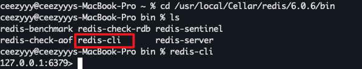
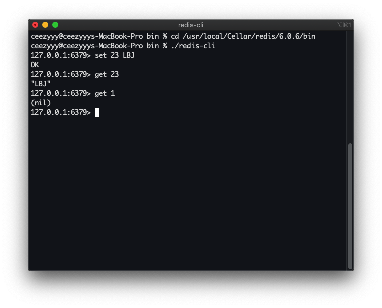

# Redis 

<div align="center">  </div><br>


Table of Contents
=================

* [1. NoSQL](#1-nosql)
* [2. 什么是 Redis?](#2-什么是-redis)
* [3. 为什么要用 Redis?](#3-为什么要用-redis)
* [4. 基本操作](#4-基本操作)
* [5. 数据类型](#5-数据类型)
   * [5.1 数据类型设计理念](#51-数据类型设计理念)
   * [5.2 string](#52-string)
   * [5.3 hash](#53-hash)
   * [5.4 list](#54-list)
   * [5.5 set](#55-set)
   * [5.6 sorted set](#56-sorted-set)
* [6. 通用命令](#6-通用命令)
* [7. 持久化](#7-持久化)
* [8. redis.conf](#8-redisconf)
* [9. 事务](#9-事务)
* [10. 集群](#10-集群)
* [11. 企业级解决方案](#11-企业级解决方案)
* [参考资料](#参考资料)


## 1. NoSQL

泛指非关系型数据库


**特点：**

- 易扩展：此类型数据存储不需要固定的模式，无需多余操作就可以横向扩展
- 高性能：非常高的读写性能
- 灵活的数据模型：无需事先为存储的数据建立字段（关系型数据库增删字段会对先前影响较大）

 

**目的：**

- 应对基于海量用户和海量数据前提下的数据处理问题


## 2. 什么是 Redis?

使用 `C` 语言开发的高性能 `KV` 数据库

**特征：**

- 数据间没有必然的关联关系
- 单线程机制
- 高性能
- 多数据类型支持
- 持久化支持

## 3. 为什么要用 Redis?

- 为热点数据加速查询（主要场景）：如热点商品 / 新闻等高访问量信息 
- 任务队列
- 即时信息查询
- 时效性信息


## 4. 基本操作

**命令行模式工具使用思考**

- 功能性命令
- 清屏
- 帮助信息
- 如何退出

 


启动 `redis-server`

<div align="center">  </div><br>

启动 `redis-cli`


<div align="center">  </div><br>


`Redis` 是基于 `KV` 存储的

先来接触一个最基础的命令：存入 `key-value`

```bash
set key value
```

根据 `key` 获取 `value`

```bash
get key 
```

若获取不到则返回 `nil`

<div align="center">  </div><br>

清屏：

```bash
clear
```

获取帮助：

```bash
help
```


<div align="center">  </div><br>


退出：

```bash
exit
```


## 5. 数据类型

### 5.1 数据类型设计理念


### 5.2 string


### 5.3 hash


### 5.4 list


### 5.5 set


### 5.6 sorted set


## 6. 通用命令


## 7. 持久化


## 8. redis.conf


## 9. 事务


## 10. 集群


## 11. 企业级解决方案


## 参考资料

- [尚硅谷超经典Redis教程,redis实战,阳哥版从入门到精通](https://www.bilibili.com/video/BV1oW411u75R?from=search&seid=10969912493121588561)
- [黑马112节Redis入门到精通](https://www.bilibili.com/video/BV1CJ411m7Gc?from=search&seid=17692164217584292457)
- [NoSQL 简介](https://www.runoob.com/mongodb/nosql.html)
- [快速上手Spring Boot整合Redis](https://www.bilibili.com/video/BV18E411e7WJ)
- [使用brew services管理服务](https://www.jianshu.com/p/6c3b26490861)