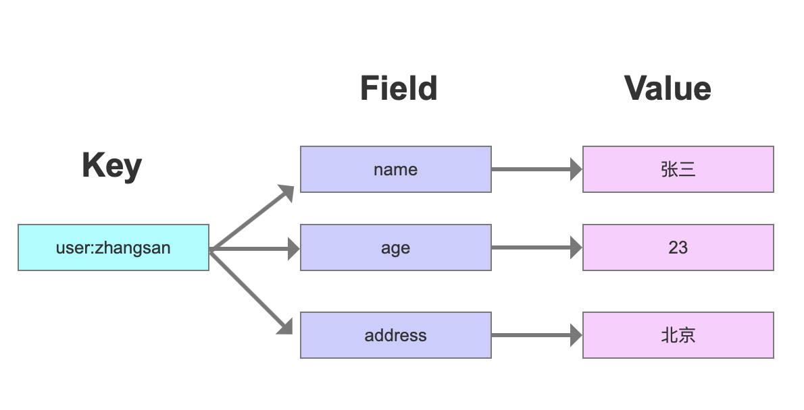
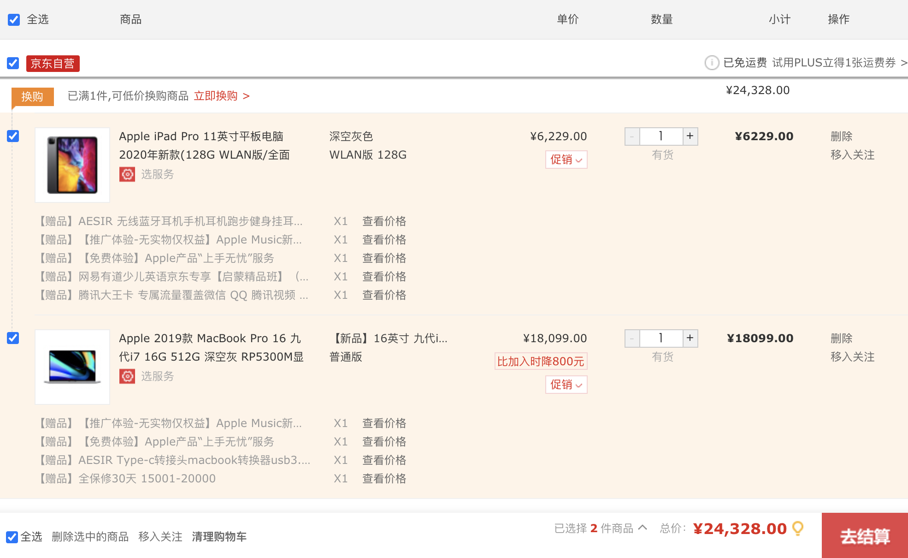
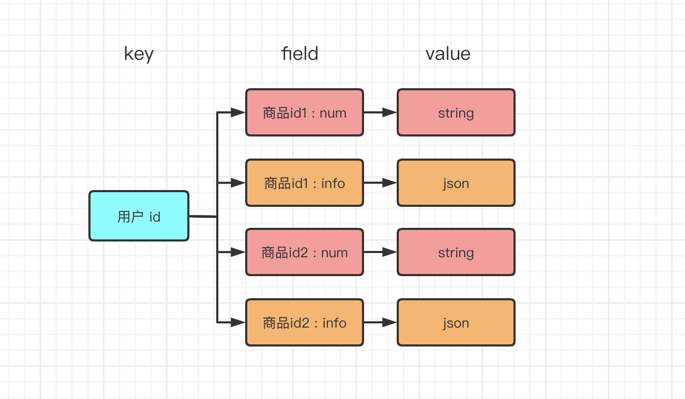

# Redis 

<div align="center">  </div><br>


Table of Contents
-----------------

* [1. NoSQL](#1-nosql)
* [2. 缓存](#2-缓存)
   * [2.1 什么是缓存?](#21-什么是缓存)
   * [2.2 为什么要使用缓存?](#22-为什么要使用缓存)
   * [2.3 缓存使用不当有什么后果?](#23-缓存使用不当有什么后果)
* [3. 什么是 Redis?](#3-什么是-redis)
* [4. 为什么要用 Redis?](#4-为什么要用-redis)
* [5. 基本操作](#5-基本操作)
* [6. 数据类型（针对 Value）](#6-数据类型针对-value)
   * [6.1 Strings](#61-strings)
   * [6.2 Hashes](#62-hashes)
   * [6.3 Lists](#63-lists)
   * [6.4 Sets](#64-sets)
   * [6.5 Sorted sets](#65-sorted-sets)
* [7. 通用命令](#7-通用命令)
* [8. Springboot 整合 Redis](#8-springboot-整合-redis)
* [9. 持久化](#9-持久化)
* [10. redis.conf](#10-redisconf)
* [11. 事务](#11-事务)
* [12. 集群](#12-集群)
* [13. 企业级解决方案](#13-企业级解决方案)
* [参考资料](#参考资料)


## 1. NoSQL

泛指非关系型数据库


**特点：**

- 易扩展：此类型数据存储不需要固定的模式，无需多余操作就可以横向扩展
- 高性能：非常高的读写性能
- 灵活的数据模型：无需事先为存储的数据建立字段（关系型数据库增删字段会对先前影响较大）

 

**目的：**

- 应对基于海量用户和海量数据前提下的数据处理问题


## 2. 缓存

### 2.1 什么是缓存?

缓存的基本思想：用空间换时间

回归到业务系统来说：缓存层的出现是为了避免用户在请求数据的时候获取速度过于缓慢

### 2.2 为什么要使用缓存?

两方面考虑：

- 高性能
- 高并发


**高性能**

对于以下场景：

- 数据需复杂查询提取（耗时）

- 冷数据（但有很多读请求）

  

可以直接查缓存，而避开了与 `mysql` 打交道


**高并发**

缓存是走内存的，内存天然就支撑高并发


### 2.3 缓存使用不当有什么后果?


## 3. 什么是 Redis?

使用 `C` 语言开发的高性能 `KV` 数据库

**特征：**

- 数据间没有必然的关联关系
- 单线程机制
- 高性能
- 多数据类型支持
- 持久化支持

## 4. 为什么要用 Redis?

- 为热点数据加速查询（主要场景）：如热点商品 / 新闻等高访问量信息 
- 任务队列
- 即时信息查询
- 时效性信息


## 5. 基本操作

**命令行模式工具使用思考**

- 功能性命令
- 清屏
- 帮助信息
- 如何退出

 


启动 `redis-server`

<div align="center">  </div><br>

启动 `redis-cli`


<div align="center">  </div><br>


清屏：

```bash
clear
```

获取帮助：

```bash
help
```

退出：

```bash
exit
```


## 6. 数据类型（针对 Value）

### 6.1 Strings

> Strings are the most basic kind of Redis value. Redis Strings are binary safe, this means that a Redis string can contain any kind of data, for instance a JPEG image or a serialized Ruby object.

最简单的类型，做 `KV` 缓存

`m` 代表 `multiply`

```bash
127.0.0.1:6379> set 23 KingJames
OK
127.0.0.1:6379> MSET 6 AD 9 Rondo 12 DW
OK
127.0.0.1:6379> APPEND 23 LBJ
(integer) 12
127.0.0.1:6379> get 23
"KingJamesLBJ"
127.0.0.1:6379> MGET 6 9 12
1) "AD"
2) "Rondo"
3) "DW"
127.0.0.1:6379> del 12
(integer) 1
127.0.0.1:6379> STRLEN 6
(integer) 2
```


**热点数据**

关注微博大 V 后粉丝数的增加如何立即反馈给用户？ `string` 提供原子计数器功能

<div align="center">  </div><br>

```bash
127.0.0.1:6379> set user:id:001:fans 25890
OK
127.0.0.1:6379> get user:id:001:fans
"25890"
127.0.0.1:6379> INCR user:id:001:fans
(integer) 25891
```


该场景下，`K` 的命名规则一般为：

表名 : 主键 : 主键值 : 字段  


**验证码**

验证码如何实现 60s 自动过期？ `string` 提供键过期策略

```bash
127.0.0.1:6379> help setex

  SETEX key seconds value
  summary: Set the value and expiration of a key
  since: 2.0.0
  group: string

127.0.0.1:6379> SETEX vertification_code 60 8888
OK
127.0.0.1:6379> GET vertification_code
"8888"
127.0.0.1:6379> GET vertification_code
(nil)
```


### 6.2 Hashes

> Redis Hashes are maps between string fields and string values, so they are the perfect data type to represent objects (e.g. A User with a number of fields like name, surname, age, and so forth)

一个存储空间保存多个 `KV` 数据

<div align="center">  </div><br>


```bash
127.0.0.1:6379> HSET user:mac_ova_seas following 167
(integer) 1
127.0.0.1:6379> HSET user:mac_ova_seas followers 25890
(integer) 1
127.0.0.1:6379> HSET user:mac_ova_seas weibos 393
(integer) 1
127.0.0.1:6379> HGET user:mac_ova_seas weibos
"393"
127.0.0.1:6379> HLEN user:mac_ova_seas
(integer) 3
127.0.0.1:6379> HEXISTS user:mac_ova_seas nums
(integer) 0
127.0.0.1:6379> HKEYS user:mac_ova_seas
1) "following"
2) "followers"
3) "weibos"
127.0.0.1:6379> HVALS user:mac_ova_seas
1) "167"
2) "25890"
3) "393"
```

注意⚠️：

- `value` 只能存储 `string`


**电商购物车场景**


<div align="center">  </div><br>


<div align="center">  </div><br>

### 6.3 Lists

> Redis Lists are simply lists of strings, sorted by insertion order. It is possible to add elements to a Redis List pushing new elements on the head (on the left) or on the tail (on the right) of the list.

底层基于双向列表：增删快，按索引读慢

<div align="center">  </div><br>


```bash
127.0.0.1:6379> LPUSH user:mac_ova_seas:msg a b c
(integer) 3
127.0.0.1:6379> RPUSH user:mac_ova_seas:msg d e f
(integer) 6
127.0.0.1:6379> LRANGE user:mac_ova_seas:msg 0 -1
1) "c"
2) "b"
3) "a"
4) "d"
5) "e"
6) "f"
127.0.0.1:6379> LPOP user:mac_ova_seas:msg
"c"
127.0.0.1:6379> RPOP user:mac_ova_seas:msg
"f"
```


### 6.4 Sets

> Redis Sets are an unordered collection of Strings. It is possible to add, remove, and test for existence of members in O(1) (constant time regardless of the number of elements contained inside the Set).
>
> Redis Sets have the desirable property of not allowing repeated members. Adding the same element multiple times will result in a set having a single copy of this element. Practically speaking this means that adding a member does not require a *check if exists then add* operation.
>
> A very interesting thing about Redis Sets is that they support a number of server side commands to compute sets starting from existing sets, so you can do unions, intersections, differences of sets in very short time.

无序集合，自动去重

```bash
127.0.0.1:6379> SADD lakers LBJ AD KCP Rondo
(integer) 4
127.0.0.1:6379> SMEMBERS lakers
1) "Rondo"
2) "KCP"
3) "LBJ"
4) "AD"
127.0.0.1:6379> SREM lakers Rondo
(integer) 1
127.0.0.1:6379> SMEMBERS lakers
1) "KCP"
2) "LBJ"
3) "AD"
127.0.0.1:6379> SCARD lakers
(integer) 3
127.0.0.1:6379> SISMEMBER lakers LBJ
(integer) 1
127.0.0.1:6379> SISMEMBER lakers Rondo
(integer) 0
```


**热点推荐**

网站中的热点推荐是如何实现的？

```bash
127.0.0.1:6379> SADD news n1 n2 n3 n4 n5 n6 n7 n8 n9
(integer) 9
127.0.0.1:6379> SCARD news
(integer) 9
127.0.0.1:6379> SRANDMEMBER news 3
1) "n7"
2) "n2"
3) "n1"
127.0.0.1:6379> SCARD news
(integer) 9
127.0.0.1:6379> SPOP news 2
1) "n8"
2) "n2"
127.0.0.1:6379> SCARD news
(integer) 7
```


**关联操作**

本质上是 **交, 并, 差**

不同用户的兴趣点有哪些？不同用户有哪些共同好友？可能认识的人？

```bash
127.0.0.1:6379> SADD user:1 local business arts sports tech politics
(integer) 6
127.0.0.1:6379> SADD user:2 business sports international
(integer) 3
127.0.0.1:6379> SINTER user:1 user:2
1) "sports"
2) "business"
127.0.0.1:6379> SUNION user:1 user:2
1) "arts"
2) "politics"
3) "international"
4) "local"
5) "tech"
6) "sports"
7) "business"
127.0.0.1:6379> SDIFF user:1 user:2
1) "tech"
2) "local"
3) "arts"
4) "politics"
127.0.0.1:6379> SDIFF user:2 user:1
1) "international"
```


**网站访问量**

`PV`：访问量（通过刷新页面提高访问量）

`UV`：不同用户访问次数（通过 `cookie`）

`IP`：不同 `IP` 访问总次数

利用 `set` 作数据去重


### 6.5 Sorted sets

> Redis Sorted Sets are, similarly to Redis Sets, non repeating collections of Strings. The difference is that every member of a Sorted Set is associated with score, that is used in order to take the sorted set ordered, from the smallest to the greatest score. While members are unique, scores may be repeated.
>
> With sorted sets you can add, remove, or update elements in a very fast way (in a time proportional to the logarithm of the number of elements). Since elements are *taken in order* and not ordered afterwards, you can also get ranges by score or by rank (position) in a very fast way. Accessing the middle of a sorted set is also very fast, so you can use Sorted Sets as a smart list of non repeating elements where you can quickly access everything you need: elements in order, fast existence test, fast access to elements in the middle!


## 7. 通用命令


## 8. Springboot 整合 Redis


## 9. 持久化


## 10. redis.conf


## 11. 事务


## 12. 集群


## 13. 企业级解决方案


## 参考资料

- [尚硅谷超经典Redis教程,redis实战,阳哥版从入门到精通](https://www.bilibili.com/video/BV1oW411u75R?from=search&seid=10969912493121588561)
- [黑马112节Redis入门到精通](https://www.bilibili.com/video/BV1CJ411m7Gc?from=search&seid=17692164217584292457)
- [NoSQL 简介](https://www.runoob.com/mongodb/nosql.html)
- [快速上手Spring Boot整合Redis](https://www.bilibili.com/video/BV18E411e7WJ)
- [使用brew services管理服务](https://www.jianshu.com/p/6c3b26490861)
- [关于缓存的一些重要概念(Redis前置菜)](https://github.com/Snailclimb/JavaGuide/blob/master/docs/database/Redis/some-concepts-of-caching.md)
- [Redis 常见问题总结](https://github.com/Snailclimb/JavaGuide/blob/master/docs/database/Redis/redis-all.md)
- [在项目中缓存是如何使用的？缓存如果使用不当会造成什么后果？](https://github.com/doocs/advanced-java/blob/master/docs/high-concurrency/why-cache.md)
- [Redis 都有哪些数据类型？分别在哪些场景下使用比较合适？](https://github.com/doocs/advanced-java/blob/master/docs/high-concurrency/redis-data-types.md)
- [Redis - Data types](https://redis.io/topics/data-types#:~:text=Redis%20Sorted%20Sets%20are%2C%20similarly,smallest%20to%20the%20greatest%20score.)
