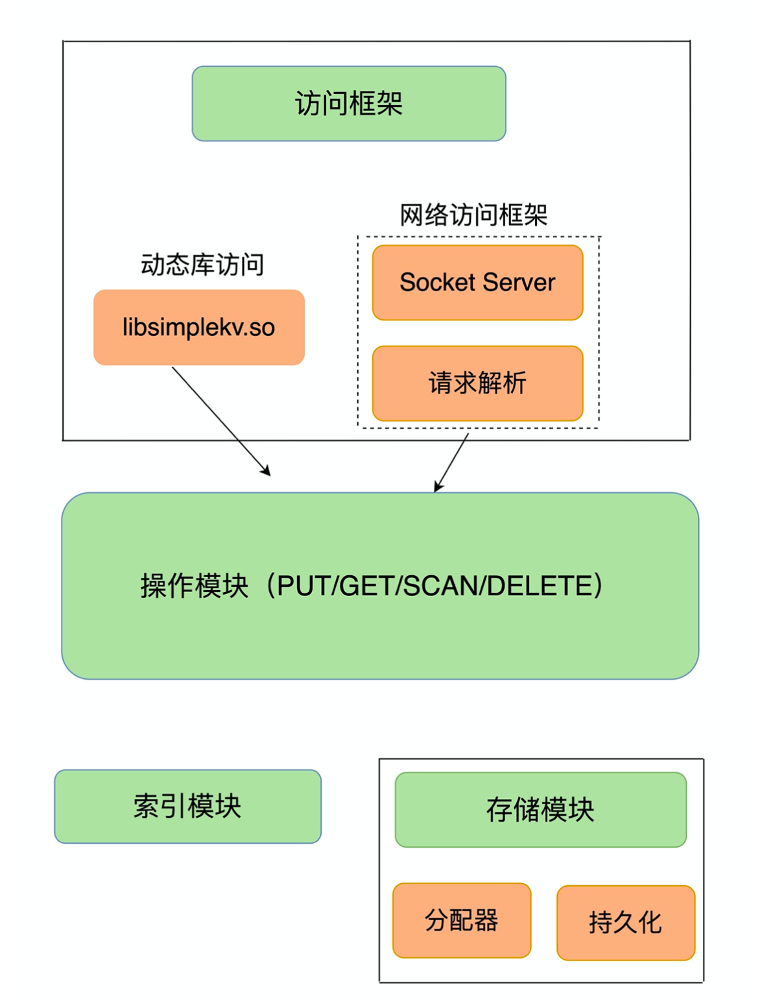
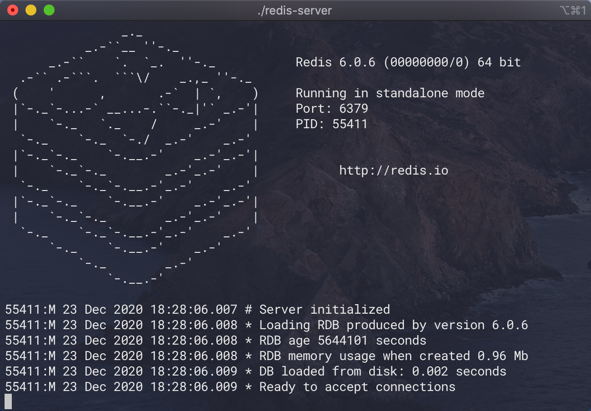

# Redis 

<div align="center">  </div><br>


Table of Contents
-----------------


* [Brainstorming](#brainstorming)
* [1. CAP Theorem](#1-cap-theorem)
* [2. Key-value Database](#2-key-value-database)
* [3. 基本命令](#3-基本命令)
   * [String](#string)
   * [TTL (Time to Live)](#ttl-time-to-live)
   * [List](#list)
* [References](#references)


## Brainstorming

<div align="center">  </div><br>

## 1. CAP Theorem

<div align="center">  </div><br>


## 2. Key-value Database


<div align="center">  </div><br>

## 3. 基本命令

通用操作无非就是 CRUD，在 Redis 中有（不同数据类型具体命令不同）：

- PUT（新增，修改）
- GET（读，包括 SCAN）
- DELETE（删除）


启动 Redis 服务器，版本 6.0.6

<div align="center">  </div><br>


### String

`String` 是二进制安全，可以存储图片或是 `Java` 对象（前提是实现序列化接口）

```shell
127.0.0.1:6379> SET hello world
OK
127.0.0.1:6379> GET hello
"world"
127.0.0.1:6379> EXISTS hello
(integer) 1
127.0.0.1:6379> DEL hello
(integer) 1
127.0.0.1:6379> EXISTS hello
(integer) 0
```

**String 之原子计数器**

```shell
127.0.0.1:6379> SET connections 10
OK
127.0.0.1:6379> INCR connections
(integer) 11
127.0.0.1:6379> INCR connections
(integer) 12
127.0.0.1:6379> DEL connections
(integer) 1
127.0.0.1:6379> INCR connections
(integer) 1
127.0.0.1:6379> INCRBY connections 88
(integer) 89
```

### TTL (Time to Live)

可以为 `key` 设置过期时间

- -2：`key` 不存在
- -1：永久存活
- 其他：返回剩余存活秒数

```shell
127.0.0.1:6379> SET resources xxx
OK
127.0.0.1:6379> EXPIRE resources 20
(integer) 1
127.0.0.1:6379> TTL resources
(integer) 17
127.0.0.1:6379> TTL resources
(integer) 14
127.0.0.1:6379> TTL resources
(integer) -2
127.0.0.1:6379> SET persist_resources xxx
OK
127.0.0.1:6379> PERSIST persist_resources
(integer) 0
127.0.0.1:6379> TTL persist_resources
(integer) -1
```


### List


## References

- [Redis核心技术与实战](https://time.geekbang.org/column/intro/100056701)
- [CAP 定理的含义](https://www.ruanyifeng.com/blog/2018/07/cap.html)
- [Data types - Redis](https://redis.io/topics/data-types)
