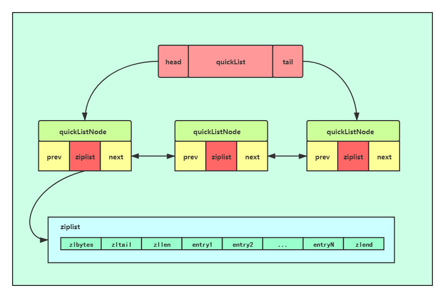

# Redis

## Table of Contents

- [1. 概览](#1-概览)
- [2. 数据结构](#2-数据结构)
	- [2.1 String](#21-string)
	- [2.2 List](#22-list)
		- [2.2.1 Ziplist](#221-ziplist)
		- [2.2.2 Quicklist](#222-quicklist)
	- [2.3 Hash](#23-hash)
- [References](#references)

## 1. 概览

**三条主线**

<div align="center">  </div><br>

## 2. 数据结构

### 2.1 RedisObject

```c
// server.h 文件
typedef struct redisObject {
  	// 数据类型
    unsigned type:4;
  	// 内部编码
    unsigned encoding:4;
  	// 最后一次被访问的时间
    unsigned lru:LRU_BITS; /* lru time (relative to server.lruclock) */
  	// 被引用的次数（等于0时, 可以安全回收当前对象空间）
    int refcount;
  	// 数据内容
    void *ptr;
} robj;
```


### 2.2 String

> 所有的 *key* 都是字符串类型，*value* 对象除了整数，都使用字符串类型

**底层：SDS**

*SDS* 为 *simple dynamic string* 缩写

**sds.h**

```c
// redis 3.0
struct sdshdr {
    int len;
    int free;
    char buf[];
};
```

**设计意义**

- 杜绝缓冲区溢出
  - 扩容
- 减少修改字符串导致的频繁内存重分配
  - 空间预分配
  - 惰性空间释放
- 二进制安全

### 2.3 List

> 从 3.2 开始，*list* 的内部编码为 *quicklist*

#### 2.3.1 Ziplist

> 为了更好地理解 *quicklist*，先看看 *ziplist*

**ziplist**

<div align="center">  </div><br>

- *zlbytes:* 压缩列表占用的内存字节数
- *zltail:* 尾节点的偏移量
- *zllen:* 压缩列表包含的节点数量
- *entry:* 列表节点
- *zlend:* 标记压缩列表的末端


**entry**

- *previous_entry_length:* 前一个节点的长度（用于反向遍历）
- *encoding:* 记录了 *content* 属性所保存数据的类型和长度
- *content*
  - 字节数组
  - 整数


**连锁更新**

连续多次空间扩展的操作称为“连锁更新”，最坏为 *O(n<sup>2</sup>)*


#### 2.3.2 Quicklist

> 每个节点为 ziplist 的双向链表

3.2 版本之前，采用 *ziplist* + *linkedlist* 作为列表对象的底层实现，但为了减少**内存碎片**，从 3.2 开始采用 *quicklist* 作为其底层实现

*P.S:* *redis* 进程内消耗主要包括：对象内存 + 缓冲内存 + 内存碎片

**quicklist**

<div align="center">  </div><br>

**quicklist.h**

```c
// quicklist.h - A generic doubly linked quicklist implementation
typedef struct quicklist {
    quicklistNode *head;
    quicklistNode *tail;
    unsigned long count;        /* total count of all entries in all ziplists */
    unsigned int len;           /* number of quicklistNodes */
  	// ziplist 大小设置
    int fill : 16;              /* fill factor for individual nodes */
    unsigned int compress : 16; /* depth of end nodes not to compress;0=off */
} quicklist;


typedef struct quicklistNode {
    struct quicklistNode *prev;
    struct quicklistNode *next;
  	// 数据指针, 若没被压缩 -> ziplist, 否则 -> quicklistLZF
    unsigned char *zl;
    unsigned int sz;             /* ziplist size in bytes */
    unsigned int count : 16;     /* count of items in ziplist */
  	// 是否被压缩
    unsigned int encoding : 2;   /* RAW==1 or LZF==2 */
    unsigned int container : 2;  /* NONE==1 or ZIPLIST==2 */
    unsigned int recompress : 1; /* was this node previous compressed? */
    unsigned int attempted_compress : 1; /* node can't compress; too small */
    unsigned int extra : 10; /* more bits to steal for future usage */
} quicklistNode;


typedef struct quicklistLZF {
    unsigned int sz; /* LZF size in bytes*/
    char compressed[];
} quicklistLZF;
```


### 2.4 Hash

**dict.h**

```c
typedef struct dict {
    dictType *type;
    void *privdata;
  	// 2 个哈希表
    dictht ht[2];
  	// rehash 进度
    long rehashidx; /* rehashing not in progress if rehashidx == -1 */
    int16_t pauserehash; /* If >0 rehashing is paused (<0 indicates coding error) */
} dict;


typedef struct dictht {
  	// bucket
    dictEntry **table;
    unsigned long size;
    unsigned long sizemask;
    unsigned long used;
} dictht;


typedef struct dictEntry {
  	// 键
    void *key;
  	// 值
    union {
        void *val;
        uint64_t u64;
        int64_t s64;
        double d;
    } v;
  	// 拉链法, 头插
    struct dictEntry *next;
} dictEntry;
```

<div align="center">  </div><br>

**Rehash**

```c
int dictRehash(dict *d, int n) {
    int empty_visits = n*10; /* Max number of empty buckets to visit. */
    if (!dictIsRehashing(d)) return 0;

    while(n-- && d->ht[0].used != 0) {
        dictEntry *de, *nextde;

        assert(d->ht[0].size > (unsigned long)d->rehashidx);
        while(d->ht[0].table[d->rehashidx] == NULL) {
            d->rehashidx++;
            if (--empty_visits == 0) return 1;
        }
        de = d->ht[0].table[d->rehashidx];
        // 处理ht[0]的每个bucket: 渐进式
        while(de) {
            uint64_t h;
						
          	// 1）遍历链表
            nextde = de->next;
          
          	// 计算新的 hash 值
            h = dictHashKey(d, de->key) & d->ht[1].sizemask;
          	// 头插法
            de->next = d->ht[1].table[h];
            d->ht[1].table[h] = de;
          
          	// 更新计数器
            d->ht[0].used--;
            d->ht[1].used++;
          
          	// 2）遍历链表
            de = nextde;
        }
      	
      	// 更新
        d->ht[0].table[d->rehashidx] = NULL;
        d->rehashidx++;
    }

    // 是否 rehash 完成
    if (d->ht[0].used == 0) {
        zfree(d->ht[0].table);
        d->ht[0] = d->ht[1];
        _dictReset(&d->ht[1]);
        d->rehashidx = -1;
      	// rehash 成功
        return 0;
    }

    /* More to rehash... */
    return 1;
}
```


## References

- [Redis Documentation](https://redis.io/)
- *Redis In Action*
- *Redis 核心技术与实战*
- *Redis 设计与实现*
- [Skip Lists: A Probabilistic Alternative to Balanced Trees](https://15721.courses.cs.cmu.edu/spring2018/papers/08-oltpindexes1/pugh-skiplists-cacm1990.pdf)
- [Alg-2C: Skip List](https://www.youtube.com/watch?v=UGaOXaXAM5M)
- [Redis内部数据结构详解(4)——ziplist](http://zhangtielei.com/posts/blog-redis-ziplist.html)
- [Redis内部数据结构详解(5)——quicklist](http://zhangtielei.com/posts/blog-redis-quicklist.html)
