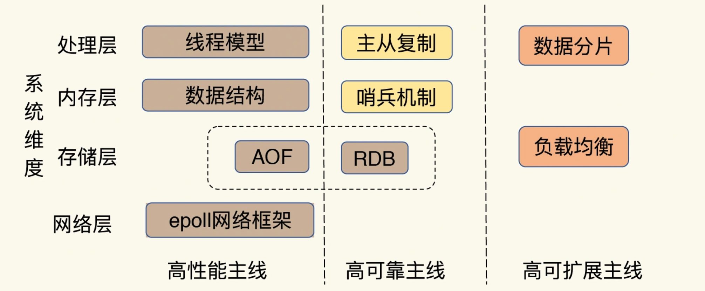
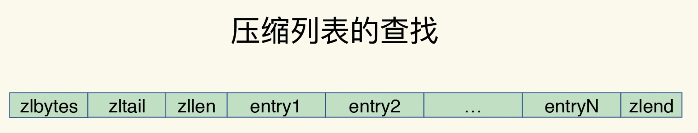
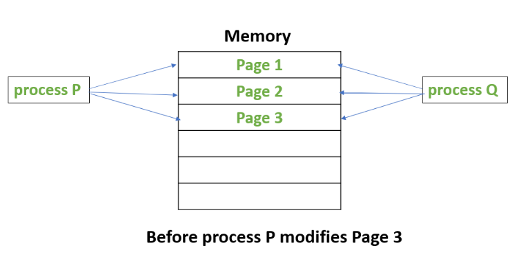
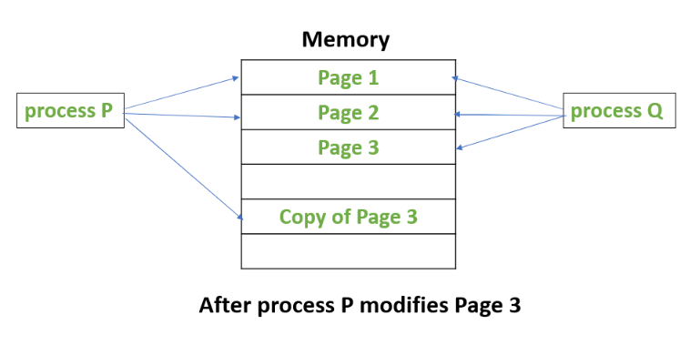

# Redis

## Table of Contents

- [1. 概览](#1-概览)
- [2. 高性能](#2-高性能)
	- [2.1 数据结构](#21-数据结构)
	- [2.2 Unix I/O 模型](#22-unix-io-模型)
- [3. 高可用](#3-高可用)
	- [3.1 持久化](#31-持久化)
		- [3.1.1 AOF 日志](#311-aof-日志)
		- [3.1.2 RDB 快照](#312-rdb-快照)
- [References](#references)

## 1. 概览

**Overview**

- 访问框架
  - 动态库
  - 网络访问框架
- 操作模块 (PUT/GET/SCAN/DELETE)
- 索引模块
- 存储模块
  - 分配器
  - 持久化

**三条主线**

  
 

## 2. 高性能

### 2.1 数据结构

- String
  - 动态字符串/整数/浮点数
- List
  - 双向链表
  - 压缩列表
- Hash
  - 哈希表
  - 压缩列表
- Zset
  - 压缩列表
  - 跳表
- Set
  - 哈希表
  - 整数数组

**压缩列表**

  
 

- *zlbytes*
  - 占用的内存字节数
  - 可用于计算末端
- *zltail*
  - 到达表尾节点的偏移量
- *zllen*
  - 节点的数量

**跳表**

  
 

**全局哈希表**

  
 

- 如何解决 *hash* 冲突？
  - 链式哈希
- 如何 *rehash*？
  - 给 *hashtable 2* 分配更大的空间
  - 将 *hashtable 1* 的数据重新映射并**拷贝**到 *hashmap 2* （**渐进式**）
  - 释放 *hashtable 1* 
- 什么是**渐进式** *rehash*？
  - 在**拷贝**数据时，*redis* 仍处理客户端请求
  - 每处理一个请求，从 *hashtable 1* 中第一个索引开始，将此位置的**所有** *entries* 拷贝

### 2.2 单线程 I/O 模型

// TODO

## 3. 高可用

### 3.1 持久化

#### 3.1.1 AOF 日志

> Append Only File

**如何实现？**

- 写内存
  - 若此时宕机，存在丢失数据风险
- 记日志
  - 避免记录错误命令
  - 不会阻塞**当前**写操作，但有可能阻塞**下一个**写操作

**缓冲区的日志如何写入磁盘？**

- 同步写回
  - 命令执行后，文件**同步**到磁盘，会**阻塞**
  - 可靠性高
- 每秒写回（**推荐**）
  - 先写入**内存缓冲区**，每秒将缓冲区内容写入磁盘
- 操作系统控制写回（**不推荐**）
  - 丢失不定数量的数据
  - 硬盘写入操作过慢会导致缓冲区填满 -> 阻塞

**文件过大怎么解决？**

// TODO

  
 

#### 3.1.2 RDB 快照

> Redis Database

**给哪些数据做快照？**

- 全量快照
- 子进程进行快照，不会阻塞主进程

**快照时数据能修改吗？**

**Copy-On-Write**

  
 

  
 

## References

- [Redis Documentation](https://redis.io/)
- *Redis In Action*
- [为什么 Redis 快照使用子进程](https://draveness.me/whys-the-design-redis-bgsave-fork/)
- *Redis 核心技术与实战*
- [跳表──没听过但很犀利的数据结构](https://lotabout.me/2018/skip-list/)
- [Copy on Write](https://www.geeksforgeeks.org/copy-on-write/)
