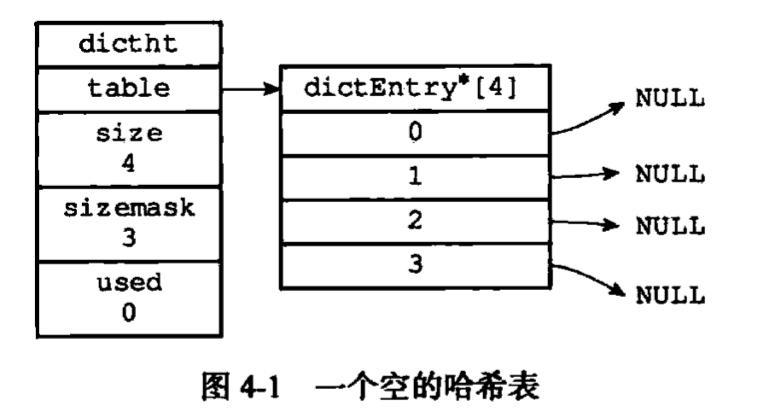
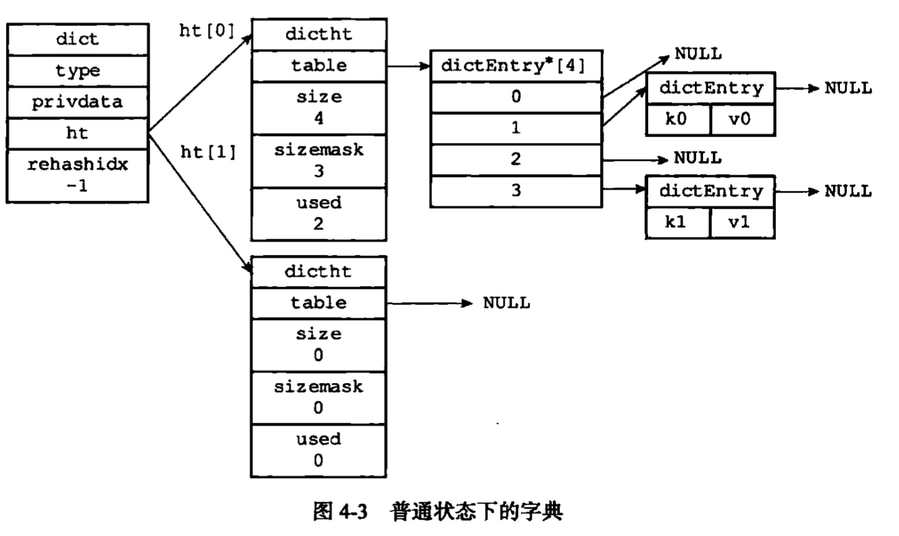
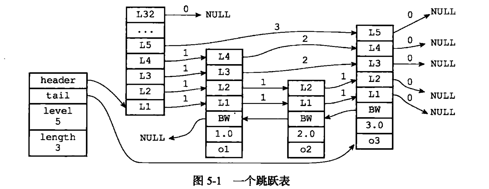

# Redis

## Table of Contents

- [1. 概览](#1-概览)
- [2. 高性能](#2-高性能)
	- [2.1 数据结构](#21-数据结构)
		- [2.1.1 SDS](#211-sds)
		- [2.1.2 链表](#212-链表)
		- [2.1.3 字典](#213-字典)
		- [2.1.4 跳跃表](#214-跳跃表)
		- [2.1.5 整数集合](#215-整数集合)
		- [2.1.6 压缩列表](#216-压缩列表)
		- [2.1.7 对象](#217-对象)
	- [2.2 单线程 I/O 模型](#22-单线程-io-模型)
- [3. 高可用](#3-高可用)
	- [3.1 持久化](#31-持久化)
		- [3.1.1 AOF 日志](#311-aof-日志)
		- [3.1.2 RDB 快照](#312-rdb-快照)
- [References](#references)

## 1. 概览

**Overview**

- 访问框架
  - 动态库
  - 网络访问框架
- 操作模块 (PUT/GET/SCAN/DELETE)
- 索引模块
- 存储模块
  - 分配器
  - 持久化

**三条主线**

<div align="center">  </div><br>


## 2. 高性能

### 2.1 数据结构

#### 2.1.1 SDS

> Simple Dynamic String 简单动态字符串

**sdshdr.h**

```c
/*
 * 简单动态字符串
 */
struct sdshdr {
  // buf 中已占用的空间
  int len;
  // buf 中剩余可用空间
  int free;
  // 保存字符串
  char buf[];
};
```

**为什么要这样设计?**

- 获取字符串长度 *O(1)*
- 杜绝缓冲区溢出
  - 扩容
- 减少修改字符串导致的频繁内存重分配
  - 空间预分配
  - 惰性空间释放
- 二进制安全

#### 2.1.2 链表

**adlist.h**

```c
/*
 * 链表
 */
typedef struct list {
  // 表头
  listNode *head;
  // 表尾
  listNode *tail;
  // 节点值复制函数
  void *(*dup)(void *ptr);
  // 节点值释放函数
  void (*free)(void *ptr);
  // 节点值对比函数
  int (*match)(void *ptr, void *key);
  // 节点数量
  unsigned long len;
} list;


/*
 * 链表节点
 */
typedef struct listNode {
  // 前置节点
  struct listNode *prev;
  // 后置节点
  struct listNode *next;
  // 节点的值
  void *value;
} listNode;
```


<div align="center">  </div><br>

#### 2.1.3 字典

**dict.h**

```c
/*
 * 哈希表
 */
typedef struct dictht {
  // 哈希表数组
  dictEntry **table;
  // 哈希表大小
  unsigned long size;
  // 哈希表大小掩码, 等于 size-1
  unsigned long sizemask;
  // 哈希表已有节点数量
  unsigned long used;
} dictht;


/*
 * 哈希表节点
 */
typedef struct dictEntry {
  void *key;
  // 相同内存位置存储不同类型数据
  union {
    void *val;
    uint64_t u64;
    int64_t s64;
    double d;
  } v;
  // 拉链法, 头插
  struct dictEntry *next;
} dictEntry;
```

<div align="center">  </div><br>

**dict.h**

```c
/*
 * 字典
 */
typedef struct dict {
  dictType *type;
  void *privdata;
  // 字典使用 ht[0] 哈希表
  // ht[1] 进行 rehash 时使用
  dictht ht[2];
  long rehashidx; /* rehashing not in progress if rehashidx == -1 */
  int16_t pauserehash; /* If >0 rehashing is paused (<0 indicates coding error) */
} dict;


typedef struct dictType {
  uint64_t (*hashFunction)(const void *key);
  void *(*keyDup)(void *privdata, const void *key);
  void *(*valDup)(void *privdata, const void *obj);
  int (*keyCompare)(void *privdata, const void *key1, const void *key2);
  void (*keyDestructor)(void *privdata, void *key);
  void (*valDestructor)(void *privdata, void *obj);
  int (*expandAllowed)(size_t moreMem, double usedRatio);
} dictType;
```

<div align="center">  </div><br>

**字典是如何 rehash 的?**

- 为 *ht[1]* 分配空间
  - 扩容
    - *ht[1]* 的大小为第一个大于等于 *ht[0].used x 2* 的 2<sup>n</sup> 
  - 收缩
    - *ht[1]* 的大小为第一个大于等于 *ht[0].used* 的 2<sup>n</sup>
- 将 *ht[0]* 的键值对 rehash 到 *ht[1]*
- 释放 *ht[0]*，将 *ht[1]* 置为 *ht[0]*，并在 *ht[1]* 新创建一个空白哈希表

**什么是渐进式 rehash?**

- 维持一个变量 *rehashidx*，初始值为 0
- 每次对字典进行操作时，会顺带将 *ht[0]* 索引为 *rehashidx* 的键值对 *rehash* 到 *ht[1]*（**分而治之**）

#### 2.1.4 跳跃表

**redis.h**

```c
/*
 * 跳跃表
 */
typedef struct zskiplist {
  // 头节点与尾节点
  struct zskiplistNode *header, *tail;
  // 节点数量 (不包括header)
  unsigned long length;
  // 最大层数 (不包括header)
  int level;
} zskiplist;


/*
 * 跳跃表节点
 */
typedef struct zskiplistNode {
  // SDS 对象的地址, 唯一
  robj *obj;
  // 分值, double, 有序, 可以相同
  double score;
  // 后退指针
  struct zskiplistNode *backward;
  // 层 (1-32)
  struct zskiplistLevel {
    // 前进指针
    struct zskiplistNode *forward;
    // 跨度
    unsigned int span;
  } level[];

} zskiplistNode;
```


<div align="center">  </div><br>


#### 2.1.5 整数集合

**intset.h**

```c
typedef struct intset {
  // 编码方式
  uint32_t encoding;
  // 元素数量
  uint32_t length;
  // 底层数组, 有序, 不重复
  int8_t contents[];
} intset;
```

**什么是升级?**

当新元素的类型要大于 *intset* 所有元素的类型时 -> 升级

- 扩展底层数组大小，为新元素分配空间
- 统一元素类型，重新放置元素（保持**有序**）
- 放置新元素
  - 队头
  - 队尾

**升级好处?**

- 灵活
- 节约内存空间

#### 2.1.6 压缩列表


#### 2.1.7 对象


### 2.2 单线程 I/O 模型

// TODO


## 3. 高可用

### 3.1 持久化

#### 3.1.1 AOF 日志

> Append Only File

**如何实现？**

- 写内存
  - 若此时宕机，存在丢失数据风险
- 记日志
  - 避免记录错误命令
  - 不会阻塞**当前**写操作，但有可能阻塞**下一个**写操作

**缓冲区的日志如何写入磁盘？**

- 同步写回
  - 命令执行后，文件**同步**到磁盘，会**阻塞**
  - 可靠性高
- 每秒写回（**推荐**）
  - 先写入**内存缓冲区**，每秒将缓冲区内容写入磁盘
- 操作系统控制写回（**不推荐**）
  - 丢失不定数量的数据
  - 硬盘写入操作过慢会导致缓冲区填满 -> 阻塞

**文件过大怎么解决？**

// TODO

<div align="center">  </div><br>


#### 3.1.2 RDB 快照

> Redis Database

**给哪些数据做快照？**

- 全量快照
- 子进程进行快照，不会阻塞主进程

**快照时数据能修改吗？**

**Copy-On-Write**

<div align="center">  </div><br>

<div align="center">  </div><br>


## References

- [Redis Documentation](https://redis.io/)
- *Redis In Action*
- *Redis 核心技术与实战*
- *Redis 设计与实现*
- [为什么 Redis 快照使用子进程](https://draveness.me/whys-the-design-redis-bgsave-fork/)
- [Copy on Write](https://www.geeksforgeeks.org/copy-on-write/)
- [Double Pointer (Pointer to Pointer) in C](https://www.geeksforgeeks.org/double-pointer-pointer-pointer-c/)
- [C 函数指针与回调函数](https://www.runoob.com/cprogramming/c-fun-pointer-callback.html)
- [C 语言中 void* 详解及应用](https://www.runoob.com/w3cnote/c-void-intro.html)
