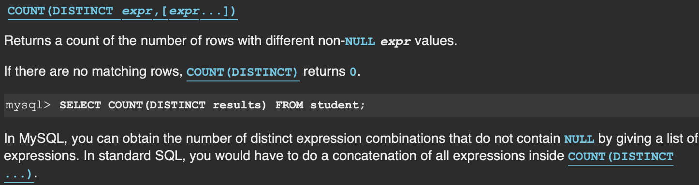

# SQL Practice

Table of Contents
-----------------

* [175. Combine Two Tables](#175-combine-two-tables)
* [181. Employees Earning More Than Their Managers](#181-employees-earning-more-than-their-managers)
* [182. Duplicate Emails](#182-duplicate-emails)
* [183. Customers Who Never Order](#183-customers-who-never-order)
* [595. Big Countries](#595-big-countries)
* [596. Classes More Than 5 Students](#596-classes-more-than-5-students)
* [620. Not Boring Movies](#620-not-boring-movies)
* [627. Swap Salary](#627-swap-salary)


## 175. Combine Two Tables

**Description**

Table: `Person`

```
+-------------+---------+
| Column Name | Type    |
+-------------+---------+
| PersonId    | int     |
| FirstName   | varchar |
| LastName    | varchar |
+-------------+---------+
PersonId is the primary key column for this table.
```

Table: `Address`

```
+-------------+---------+
| Column Name | Type    |
+-------------+---------+
| AddressId   | int     |
| PersonId    | int     |
| City        | varchar |
| State       | varchar |
+-------------+---------+
AddressId is the primary key column for this table.
```

 

Write a SQL query for a report that provides the following information for each person in the Person table, regardless if there is an address for each of those people:

```
FirstName, LastName, City, State
```


**Solution**

```mysql
SELECT 
    FirstName, 
    LastName, 
    City, 
    State
FROM 
    Person P
    LEFT JOIN Address A
    ON P.PersonId = A.PersonId;
```

## 176. Second Highest Salary

**Description**

Write a SQL query to get the second highest salary from the `Employee` table.

```
+----+--------+
| Id | Salary |
+----+--------+
| 1  | 100    |
| 2  | 200    |
| 3  | 300    |
+----+--------+
```

For example, given the above Employee table, the query should return `200` as the second highest salary. If there is no second highest salary, then the query should return `null`.

```
+---------------------+
| SecondHighestSalary |
+---------------------+
| 200                 |
+---------------------+
```


## 181. Employees Earning More Than Their Managers

**Description**

The `Employee` table holds all employees including their managers. Every employee has an Id, and there is also a column for the manager Id.

```
+----+-------+--------+-----------+
| Id | Name  | Salary | ManagerId |
+----+-------+--------+-----------+
| 1  | Joe   | 70000  | 3         |
| 2  | Henry | 80000  | 4         |
| 3  | Sam   | 60000  | NULL      |
| 4  | Max   | 90000  | NULL      |
+----+-------+--------+-----------+
```

Given the `Employee` table, write a SQL query that finds out employees who earn more than their managers. For the above table, Joe is the only employee who earns more than his manager.


**Solution**

```mysql
SELECT
    E1.Name AS Employee
FROM
    Employee E1
    INNER JOIN Employee E2
    ON E1.ManagerId = E2.Id
WHERE
    E1.Salary > E2.Salary;
```


## 182. Duplicate Emails

**Description**

Write a SQL query to find all duplicate emails in a table named `Person`.

```
+----+---------+
| Id | Email   |
+----+---------+
| 1  | a@b.com |
| 2  | c@d.com |
| 3  | a@b.com |
+----+---------+
```

For example, your query should return the following for the above table:

```
+---------+
| Email   |
+---------+
| a@b.com |
+---------+
```

**Note**: All emails are in lowercase.


**Solution**

```mysql
SELECT
    Email
FROM
    Person
GROUP BY
    Email
HAVING 
    COUNT(Email) > 1;
```


## 183. Customers Who Never Order

**Description**

Suppose that a website contains two tables, the `Customers` table and the `Orders` table. Write a SQL query to find all customers who never order anything.

Table: `Customers`.

```
+----+-------+
| Id | Name  |
+----+-------+
| 1  | Joe   |
| 2  | Henry |
| 3  | Sam   |
| 4  | Max   |
+----+-------+
```

Table: `Orders`.

```
+----+------------+
| Id | CustomerId |
+----+------------+
| 1  | 3          |
| 2  | 1          |
+----+------------+
```

Using the above tables as example, return the following:

```
+-----------+
| Customers |
+-----------+
| Henry     |
| Max       |
+-----------+
```

**Explained**

<div align="center">  </div><br>

**Solution**

```mysql
SELECT
    Name AS Customers
FROM
    Customers C
    LEFT JOIN Orders O
    ON C.Id = O.CustomerId
WHERE
    O.CustomerId IS NULL;
```

## 184. Department Highest Salary

**Description**

The `Employee` table holds all employees. Every employee has an Id, a salary, and there is also a column for the department Id.

```
+----+-------+--------+--------------+
| Id | Name  | Salary | DepartmentId |
+----+-------+--------+--------------+
| 1  | Joe   | 70000  | 1            |
| 2  | Jim   | 90000  | 1            |
| 3  | Henry | 80000  | 2            |
| 4  | Sam   | 60000  | 2            |
| 5  | Max   | 90000  | 1            |
+----+-------+--------+--------------+
```

The `Department` table holds all departments of the company.

```
+----+----------+
| Id | Name     |
+----+----------+
| 1  | IT       |
| 2  | Sales    |
+----+----------+
```

Write a SQL query to find employees who have the highest salary in each of the departments. For the above tables, your SQL query should return the following rows (order of rows does not matter).

```
+------------+----------+--------+
| Department | Employee | Salary |
+------------+----------+--------+
| IT         | Max      | 90000  |
| IT         | Jim      | 90000  |
| Sales      | Henry    | 80000  |
+------------+----------+--------+
```

Max and Jim both have the highest salary in the IT department and Henry has the highest salary in the Sales department.


**Solution**


## 197. Rising Temperature

**Description**

Table: `Weather`

```
+---------------+---------+
| Column Name   | Type    |
+---------------+---------+
| id            | int     |
| recordDate    | date    |
| temperature   | int     |
+---------------+---------+
id is the primary key for this table.
This table contains information about the temperature in a certain day.
```

 

Write an SQL query to find all dates' `id` with higher temperature compared to its previous dates (yesterday).

Return the result table in **any order**.

The query result format is in the following example:

```
Weather
+----+------------+-------------+
| id | recordDate | Temperature |
+----+------------+-------------+
| 1  | 2015-01-01 | 10          |
| 2  | 2015-01-02 | 25          |
| 3  | 2015-01-03 | 20          |
| 4  | 2015-01-04 | 30          |
+----+------------+-------------+

Result table:
+----+
| id |
+----+
| 2  |
| 4  |
+----+
In 2015-01-02, temperature was higher than the previous day (10 -> 25).
In 2015-01-04, temperature was higher than the previous day (20 -> 30).
```


**Solution**


## 595. Big Countries

**Description**

There is a table `World`

```
+-----------------+------------+------------+--------------+---------------+
| name            | continent  | area       | population   | gdp           |
+-----------------+------------+------------+--------------+---------------+
| Afghanistan     | Asia       | 652230     | 25500100     | 20343000      |
| Albania         | Europe     | 28748      | 2831741      | 12960000      |
| Algeria         | Africa     | 2381741    | 37100000     | 188681000     |
| Andorra         | Europe     | 468        | 78115        | 3712000       |
| Angola          | Africa     | 1246700    | 20609294     | 100990000     |
+-----------------+------------+------------+--------------+---------------+
```

A country is big if it has an area of bigger than 3 million square km or a population of more than 25 million.

Write a SQL solution to output big countries' name, population and area.

For example, according to the above table, we should output:

```
+--------------+-------------+--------------+
| name         | population  | area         |
+--------------+-------------+--------------+
| Afghanistan  | 25500100    | 652230       |
| Algeria      | 37100000    | 2381741      |
+--------------+-------------+--------------+
```

**Solution**

```mysql
SELECT 
    name, population, area
FROM 
    World
WHERE
     area > 3000000
     OR population > 25000000;
```


## 596. Classes More Than 5 Students

**Description**

There is a table `courses` with columns: **student** and **class**

Please list out all classes which have more than or equal to 5 students.

For example, the table:

```
+---------+------------+
| student | class      |
+---------+------------+
| A       | Math       |
| B       | English    |
| C       | Math       |
| D       | Biology    |
| E       | Math       |
| F       | Computer   |
| G       | Math       |
| H       | Math       |
| I       | Math       |
+---------+------------+
```

Should output:

```
+---------+
| class   |
+---------+
| Math    |
+---------+
```


The students should not be counted duplicate in each course.


**Explained**

<div align="center">  </div><br>


**Solution**

```mysql
SELECT 
    class
FROM
    courses
GROUP BY
    class
HAVING
    COUNT(DISTINCT student) >= 5;
```


## 620. Not Boring Movies

**Description**

X city opened a new cinema, many people would like to go to this cinema. The cinema also gives out a poster indicating the movies’ ratings and descriptions.

Please write a SQL query to output movies with an odd numbered ID and a description that is not 'boring'. Order the result by rating. 

For example, table `cinema`:

```
+---------+-----------+--------------+-----------+
|   id    | movie     |  description |  rating   |
+---------+-----------+--------------+-----------+
|   1     | War       |   great 3D   |   8.9     |
|   2     | Science   |   fiction    |   8.5     |
|   3     | irish     |   boring     |   6.2     |
|   4     | Ice song  |   Fantacy    |   8.6     |
|   5     | House card|   Interesting|   9.1     |
+---------+-----------+--------------+-----------+
```

For the example above, the output should be:

```
+---------+-----------+--------------+-----------+
|   id    | movie     |  description |  rating   |
+---------+-----------+--------------+-----------+
|   5     | House card|   Interesting|   9.1     |
|   1     | War       |   great 3D   |   8.9     |
+---------+-----------+--------------+-----------+
```

**Solution**

```mysql
SELECT
    *
FROM
    cinema
WHERE
    id % 2 = 1
    AND description <> 'boring'
ORDER BY
    rating DESC;
```


## 627. Swap Salary

Given a table `salary`, such as the one below, that has m=male and f=female values. Swap all f and m values (i.e., change all f values to m and vice versa) with a **single update statement** and no intermediate temp table.

Note that you must write a single update statement, **DO NOT** write any select statement for this problem.

**Example:**

```
| id | name | sex | salary |
|----|------|-----|--------|
| 1  | A    | m   | 2500   |
| 2  | B    | f   | 1500   |
| 3  | C    | m   | 5500   |
| 4  | D    | f   | 500    |
```

After running your **update** statement, the above salary table should have the following rows:

```
| id | name | sex | salary |
|----|------|-----|--------|
| 1  | A    | f   | 2500   |
| 2  | B    | m   | 1500   |
| 3  | C    | f   | 5500   |
| 4  | D    | m   | 500    |
```

