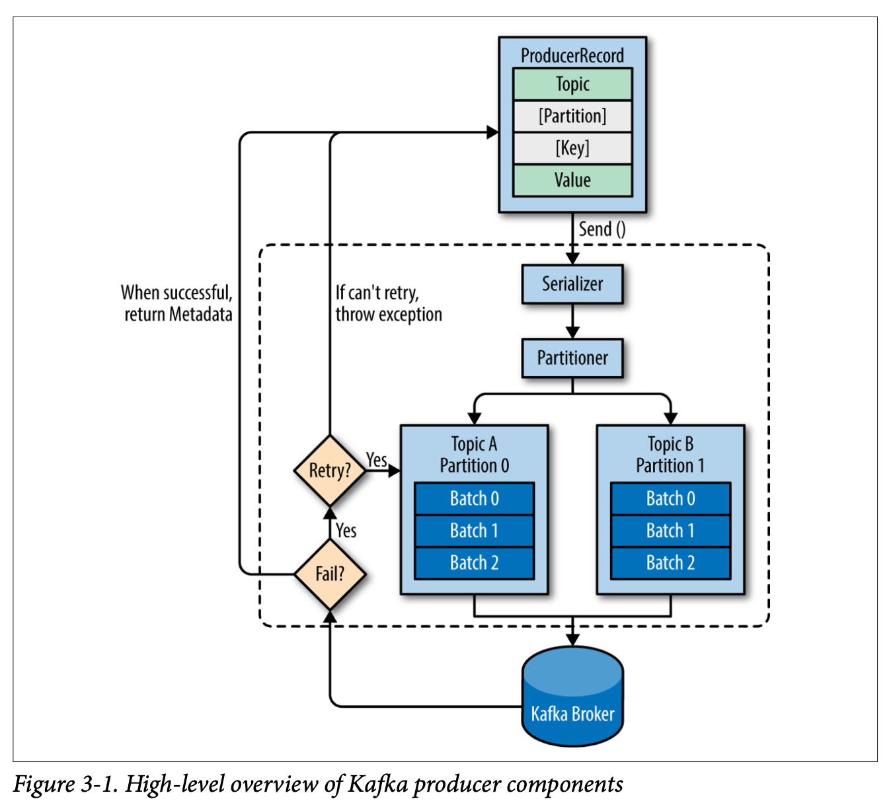

# Kafka

## Table of Contents

- [1. Brainstorming](#1-brainstorming)
- [2. 基础](#2-基础)
	- [2.1 架构](#21-架构)
	- [2.2 生产者](#22-生产者)
	- [2.3 消费者](#23-消费者)
- [3. 多副本机制](#3-多副本机制)
	- [3.1 生产者](#31-生产者)
	- [3.2 消费者](#32-消费者)
- [References](#references)

## 1. Brainstorming

  
 

## 2. 基础

### 2.1 架构

**Outline**

  
 

- 由多个 *broker* 组成（多个节点）
- *topic* 逻辑上的概念, *partition* 是物理上的概念

### 2.2 生产者

**发送消息主要步骤**

  
 

- 同一个记录批次的消息会发送到相同的主题和分区上

### 2.3 消费者

> 消费者是实际的应用实例，可以是一个线程/进程

**消费组与消费者模型**

  
 

- 如果所有 *consumer* 都隶属于同一个 *consumer group* -> 每条消息只会被**一个** *consumer* 处理 (**P2P**)
- 如果所有 *consumer* 都隶属于不同 *consumer group* -> 每条消息会被**所有**的 *consumer* 处理 (**Pub/Sub**)

## 3. 多副本机制

### 3.1 生产者

**ack 模式**

- *ack = 0*
  - 一定丢失消息
  - 吞吐量最高
- *ack = 1*
  - 消息成功发送，但在 *follower* 同步成功之前，*leader* 发生崩溃，则会**丢失消息**
- *ack = all*
  - 吞吐量低
  - 可通过异步/加大批次来加快速度

### 3.2 消费者

## References

- [Kafka](https://kafka.apache.org/)
- [Apache Kafka 101](https://www.youtube.com/watch?v=j4bqyAMMb7o&list=PLa7VYi0yPIH0KbnJQcMv5N9iW8HkZHztH)
- *Kafka: The Definitive Guide*
- *深入理解 Kafka 核心设计与实践原理*
- [Kafka简明教程](https://zhuanlan.zhihu.com/p/37405836)
- [Kafka in a Nutshell](https://sookocheff.com/post/kafka/kafka-in-a-nutshell/)
