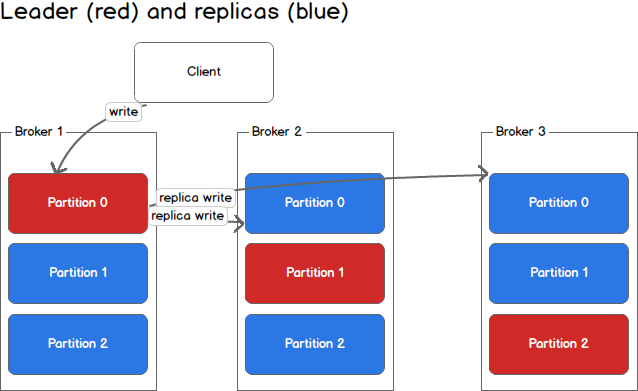

# Kafka

## Table of Contents

- [1. Concepts](#1-concepts)
- [2. Producers](#2-producers)
- [3. Consumers](#3-consumers)
- [References](#references)

## 1. Concepts

**Overview**

  
 

**Topic & Partition**

> 发布者以某种方式对消息分类, 接收者订阅他们，以便接收特定类型的消息 (e.g: 数据库表, 文件夹)

  
 

- 发布者以某种方式对消息分类, 接收者订阅他们，以便接收特定类型的消息
  
  - 例如, 数据库中的表, 文件系统的文件夹
  
- 一个 *topic* 可以横跨多个服务器

- 消息可由 (*topic*, *partition*, *offset*) 识别

  

**Broker**

  
 

- 独立的 *kafka* 服务器称为 *broker*
- 接收来自生产者的消息，设置 *offset*，写入磁盘
- 对消费者读取分区的请求作出响应，返回已经提交到磁盘的消息

## 2. Producers

> 一个消息会被发布到一个特定的 *topic* 上

**场景**

- 是否每个消息都很重要？
- 是否允许丢失一小部分消息？
- 偶尔出现重复消息是否可接受？
- 是有有严格的延迟和吞吐量要求？

  
 

## 3. Consumers

> 消费者订阅一个/多个 *topic*，并按消息生产的顺序读区（通过 *offset* 区分）

## References

- [Kafka](https://kafka.apache.org/)
- [Apache Kafka 101](https://www.youtube.com/watch?v=j4bqyAMMb7o&list=PLa7VYi0yPIH0KbnJQcMv5N9iW8HkZHztH)
- *Kafka: The Definitive Guide*
- [Kafka简明教程](https://zhuanlan.zhihu.com/p/37405836)
- [Kafka in a Nutshell](https://sookocheff.com/post/kafka/kafka-in-a-nutshell/)
