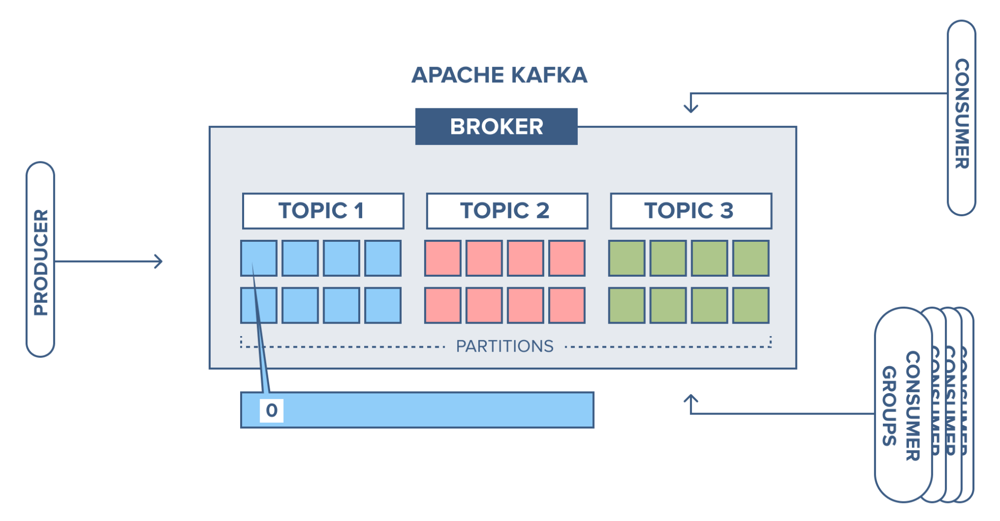

# Kafka

## Table of Contents

- [1. Concepts](#1-concepts)
	- [1.1 MQ](#11-mq)
	- [1.2 Architecture](#12-architecture)
	- [1.3 Topic & Partition](#13-topic--partition)
	- [1.4 Broker](#14-broker)
- [2. Quickstart](#2-quickstart)
- [3. 复制](#3-复制)
- [4. 处理请求](#4-处理请求)
- [5. 可靠性](#5-可靠性)
- [References](#references)


## 1. Concepts

### 1.1 MQ

- 解耦
- 异步
- 削峰

### 1.2 Architecture

**Outline**

<div align="center">  </div><br>

- 由多个 *broker* 组成（多个节点）
- **每个 *topic*，可以划分为多个 *partition*，每个 *partition* 有多个副本，保存在不同的 *broker* 上**

### 1.3 Topic & Partition

<div align="center">  </div><br>

**Topic**

- 发布者以某种方式对消息分类，接收者订阅他们，以便接收特定类型的消息
  - e.g: 数据库中的表，文件系统的文件夹


**Partition**

- 作为 *kafka* 基本存储单元
- 消息可由 (*topic*, *partition*, *offset*) 识别

### 1.4 Broker

- 独立的 *kafka* 服务器称为 *broker*，其中负责分区首领选举的称为 *controller*
- 接收来自生产者的消息，设置 *offset*，写入磁盘
- 对消费者读取分区的请求作出响应，返回已经提交到磁盘的消息


## 2. Quickstart

**CLI**

```shell
# 启动 
brew services start zookeeper
brew services start kafka

# 创建
./bin/kafka-topics --create --topic helloworld --bootstrap-server localhost:9092

# 查看
/bin/kafka-topics --describe --topic helloworld --bootstrap-server localhost:9092

# 生产
./bin/kafka-console-producer --topic helloworld --bootstrap-server localhost:9092

# 消费	
./bin/kafka-console-consumer --topic helloworld --from-beginning --bootstrap-server localhost:9092

# 停止
brew services stop kafka
brew services stop zookeeper
```


## 3. 复制

**replication.factor**

<div align="center">  </div><br>

- 每个 *partition* 有多个副本，存放在不同的 *broker*（节点） 上
  - leader
    - 所有事件直接发送给 *leader*
    - 直接从 *leader* 读取事件
  - follower
    - 与 *leader* 保持同步，及时复制新的事件
    - 当 *leader* 不可用时，重新选举


## 4. 处理请求

**Handler**

<div align="center">  </div><br>

- 生产请求
  - 生产者
  - *ack* 参数：需要多少个 *broker* 确认才可以认为一个消息写入是成功的
- 获取请求
  - 消费者
  - follower
- 元数据请求


## 5. 可靠性

**不完全的选举**

- 允许不同步的副本成为 *leader*


**生产者**

- 根据可靠性需求配置恰当的 *acks* 值
  - *acks* = 0
  - *acks* = 1
  - *acks* = all
- 在参数配置和代码里正确处理错误


**消费者**


## References

- [Kafka](https://kafka.apache.org/)
- [Apache Kafka 101](https://www.youtube.com/watch?v=j4bqyAMMb7o&list=PLa7VYi0yPIH0KbnJQcMv5N9iW8HkZHztH)
- *Kafka: The Definitive Guide*
- [Kafka简明教程](https://zhuanlan.zhihu.com/p/37405836)
- [Kafka in a Nutshell](https://sookocheff.com/post/kafka/kafka-in-a-nutshell/)
