# Kafka

## Table of Contents

- [1. 基础](#1-基础)
	- [1.1 概念](#11-概念)
	- [1.2 Why Kafka?](#12-why-kafka)
	- [1.3 使用场景](#13-使用场景)
	- [1.4 生产者](#14-生产者)
	- [1.5 消费者](#15-消费者)
- [2. 复制](#2-复制)
- [References](#references)

## 1. 基础

> Distributed commit log 

### 1.1 概念

**Topics**

 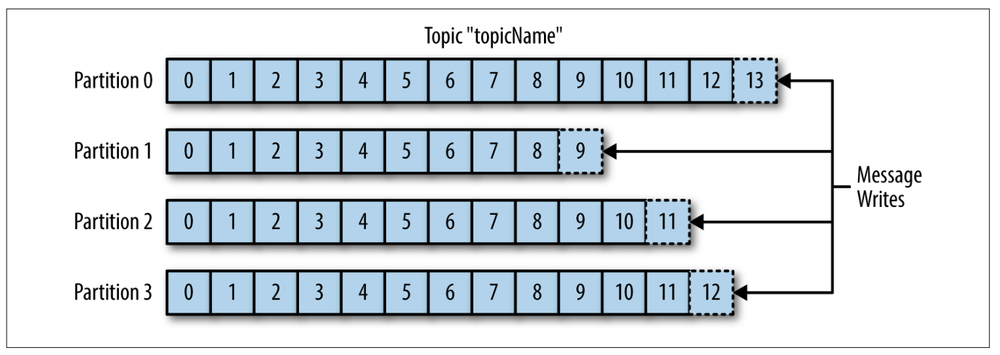 
 

- 分区：*append-only* log
- **一个 *topic* 有多个分区，每个分区又有多个副本**
- 只保证**单个分区**的消息有序性

**Consumer Group**

 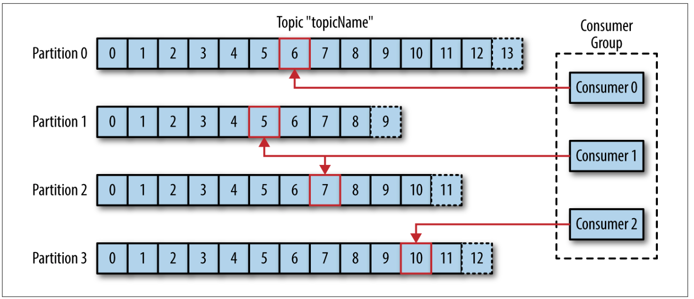 
 

- 一个 *consumer group* 有多个 *consumers*，协力消费同一个 *topic*
- *consumer group* 保证**每个分区**只被组内的**一个** *consumer* 消费

**Broker**

 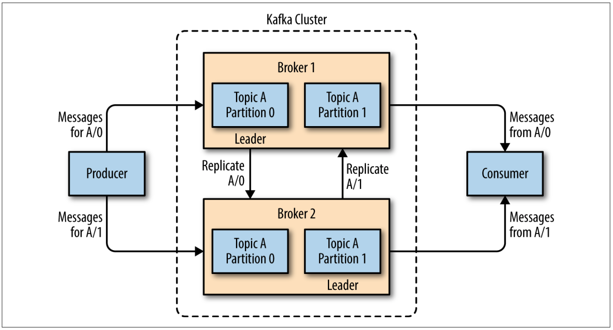 
 

- 一个 *kafka server* 称作 *broker*
- *broker* 收到来自生产者的消息，赋予 *offset* 给每条消息，然后 *commit* 到磁盘持久化
- 消费者从 *broker* 拉取消息

### 1.2 Why Kafka?

- 多生产者/消费者
  - 多个 *producer* 向同一个 *topic* 投递消息
  - 多个 *consumer group* 互不干扰地消费同一个 *topic*
- 消息持久化
  - *consumer* 不需要实时消费
  - *consumer* 宕机不会有数据丢失的风险
- 可扩展

### 1.3 使用场景

- 用户活动追踪
- 服务之间消息传递
- 埋点上报

### 1.4 生产者

**Producers**

 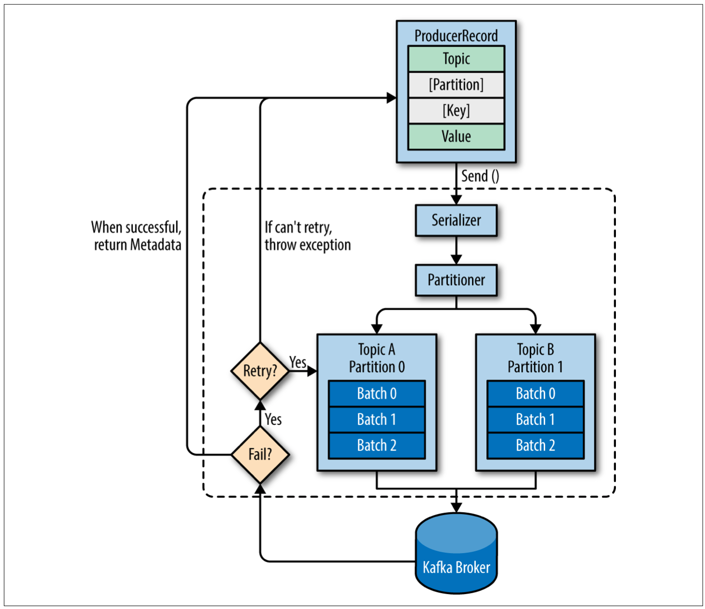 
 

**消息发送方式**

- 发后即忘
- 同步
- 异步

**Key**

- *key* 不为空：特定分区写入
- *key* 为空：不指定分区，*RR*

### 1.5 消费者

**Consumer Group**

 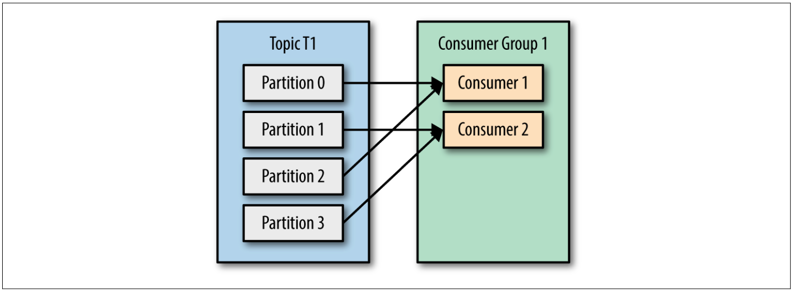 
 

- 每个 *consumer* 都隶属于一个 *consumer group*，订阅一个/多个 *topics*
- 向 *consumer group* 增加 *consumers* 可以提高系统的消费速率（分担流量）

**Different Consumer Groups**

 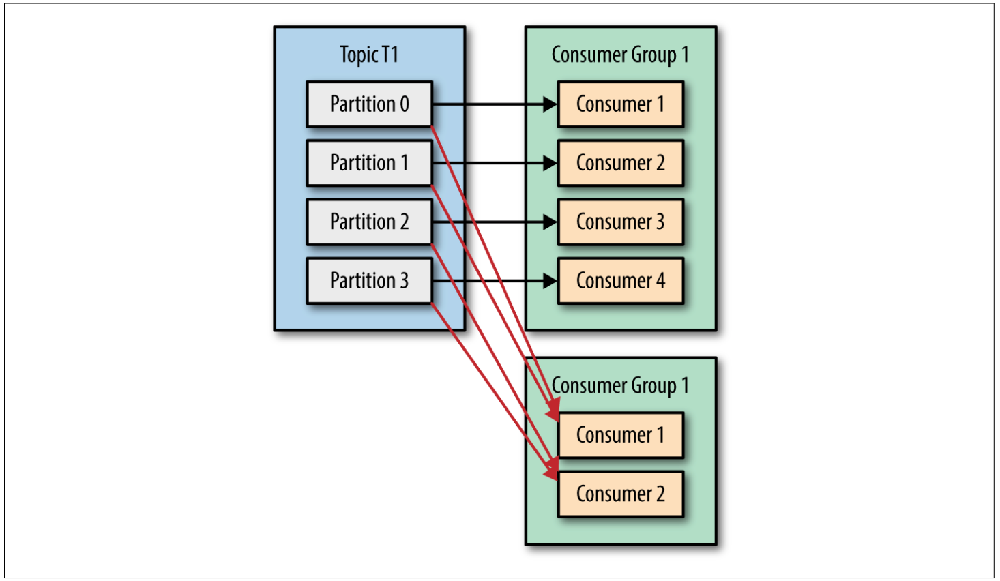 
 

- 每个 *consumer group* 拉取的是 *topic* 下所有数据，不同的 *consumer groups* 之间互不影响

**Re-processed Messages**

 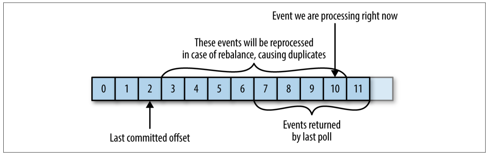 
 

**Missed Messages**

 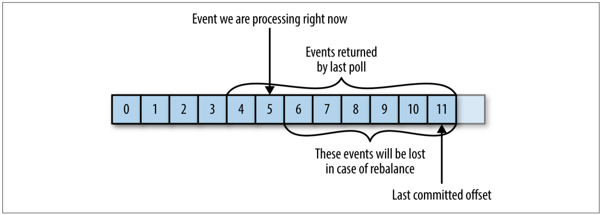 
 

- *consumer* 通过向 *__consumer_offsets* 这个分区 *topic* 投递消息来提交 *offset*
- 启用 *auto-commit* 会带来 "空窗期" 重复消息的问题
- 异步提交 + *retry* 无法保证消费顺序

**Request Processing**

 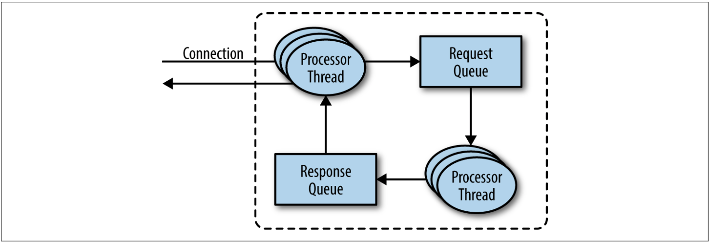 
 

- *produce request* : 由生产者发送，向 *leader* 请求
- *fetch request* : 由消费者和 *follower* 发送，向 *leader* 请求

// todo

**HW**

 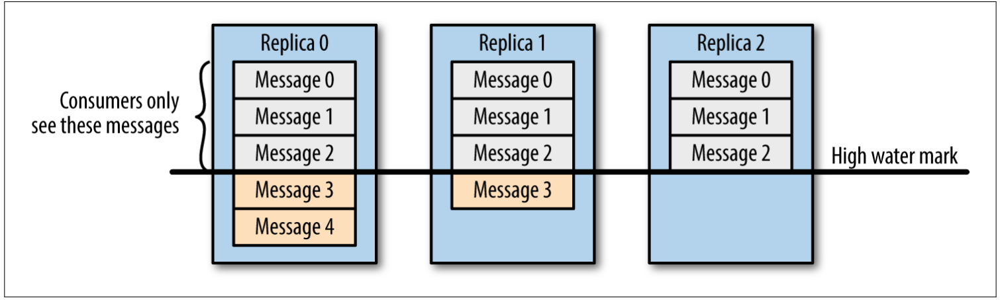 
 

**Partition Allocation**

 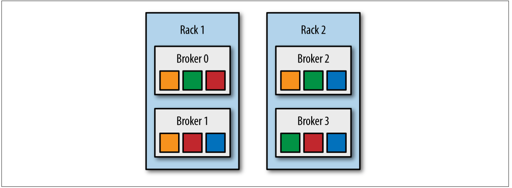 
 

- 对于每个分片，副本需要在不同的 *broker*（高可靠）

## References

- *Kafka: The Definitive Guide*
- *深入理解 Kafka 核心设计与实践原理*
- [Kafka in a Nutshell](https://sookocheff.com/post/kafka/kafka-in-a-nutshell/)
