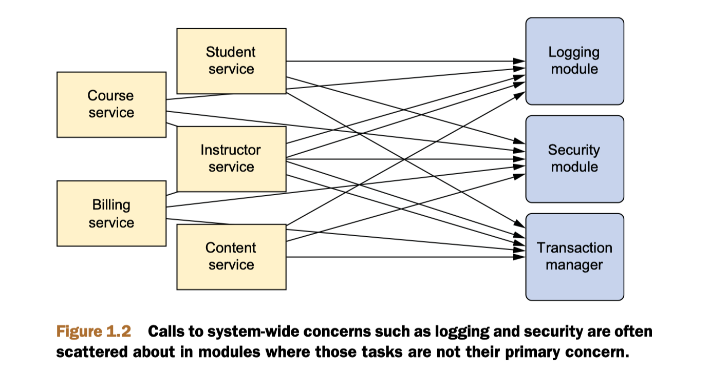
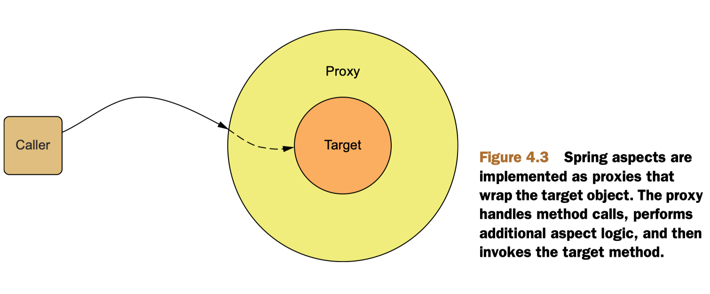
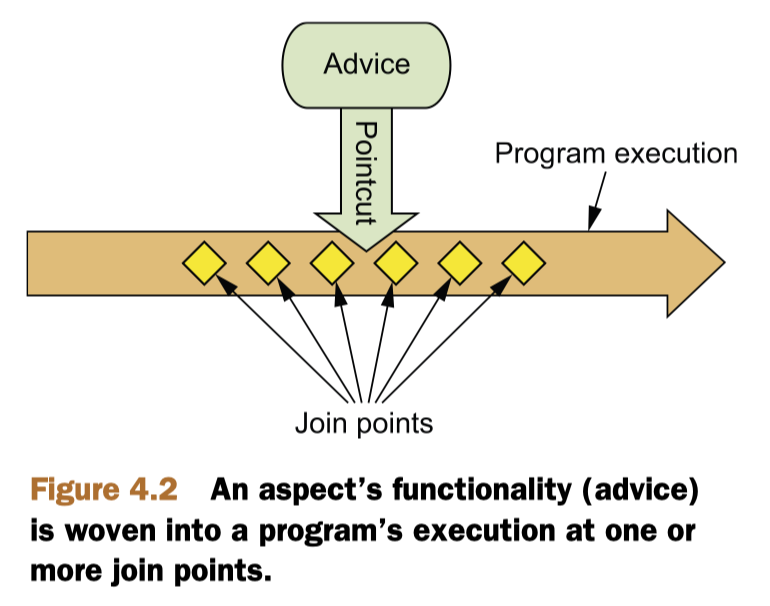
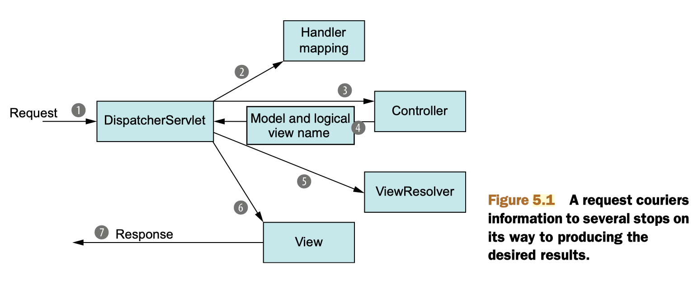

# Spring

Table of Contents
-----------------

* [1. IoC](#1-ioc)
   * [1.1 Autowiring](#11-autowiring)
   * [1.2 Config in Java](#12-config-in-java)
   * [1.3 Config in XML](#13-config-in-xml)
* [2. AOP](#2-aop)
   * [2.1 Aspect](#21-aspect)
   * [2.2 Advice](#22-advice)
   * [2.3 Join point](#23-join-point)
   * [2.4 Pointcut](#24-pointcut)
* [3. Spring MVC](#3-spring-mvc)
* [References](#references)

## 1. IoC

> Inversion of Control: helps you decouple application objects from each other

**Container**

- *BeanFactory*
- *ApplicationContext* (recommended)

  
 

### 1.1 Autowiring

**Component Scanning**

- All `@Component`-annotated classes will be created as beans whose ID is uncapitalized class name
- `@ComponentScan` -> discovery beans

**Autowired & Qualifier**

- The para given to `@Qualifier` is the ID of the bean that you want to inject

### 1.2 Config in Java

**Scoping beans**

- *Singleton*
- *Prototype*
- *Session*
- *Request*

### 1.3 Config in XML

- When *Spring* sees this `<bean>` element, it will create bean by calling its **default constructor**
- Constructor injection
- Setting properties

## 2. AOP

> Aspect Oriented Programming: helps you decouple *cross-cutting concerns* from the objects they affect

**Why AOP?**

The functions need to be applied at multiple points within the application, but it's undesirable to explicitly call them at every point -> service modules only contain code for their primary concern, and secondary concerns have been moved to aspects

  
 

**How AOP?**

  
 

### 2.1 Aspect

> The merger of advice and pointcut

**Aspect**

  
 

### 2.2 Advice

> Advice defines both the *what* and the *when* of an aspect

- *Before*
- *After*
- *After-returning*
- *After-throwing*
- *Around*

### 2.3 Join point

> The opportunities which your application may have for advice to be applied

This point could be a method being called, an exception being thrown, or even a field being modified

### 2.4 Pointcut

> Pointcuts define the *when*

## 3. Spring MVC

**Model-View-Controller**

  
 

- *Model* : the information carried back to the user and displayed in the browser
- *ViewResolver* :  logical name -> actual view

## References

- *Spring in Action, Fourth Edition*