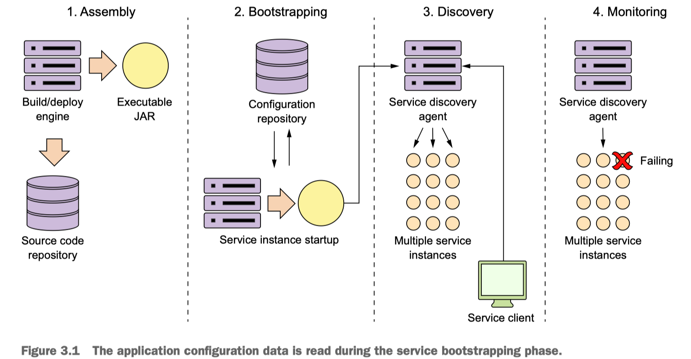
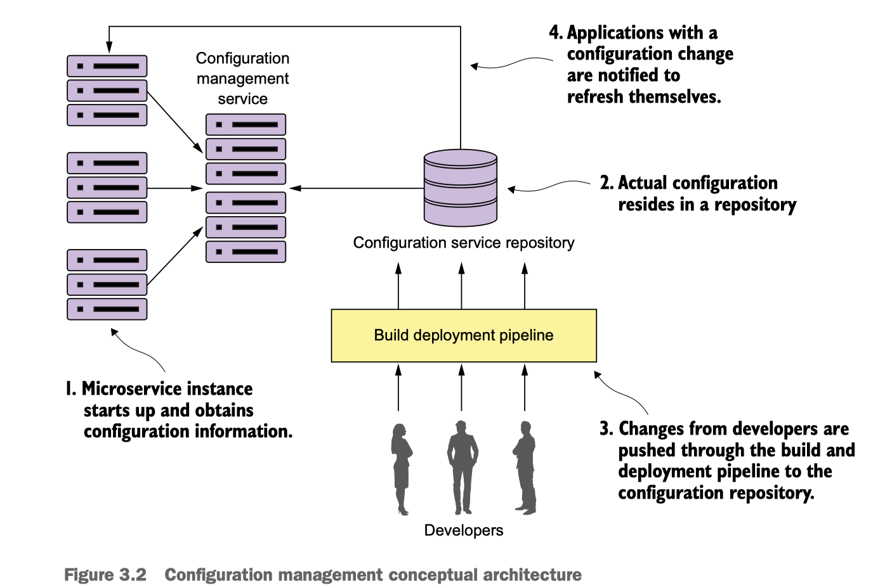
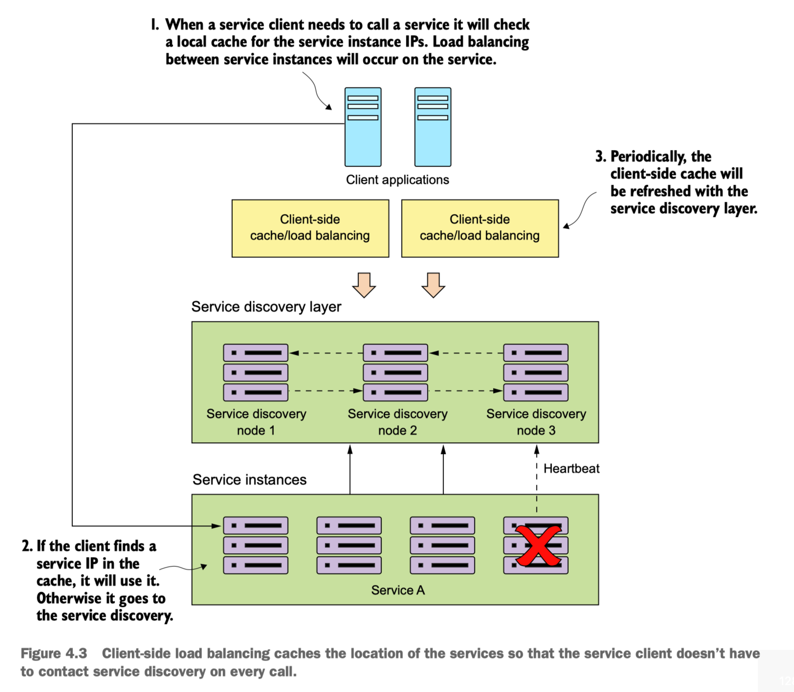
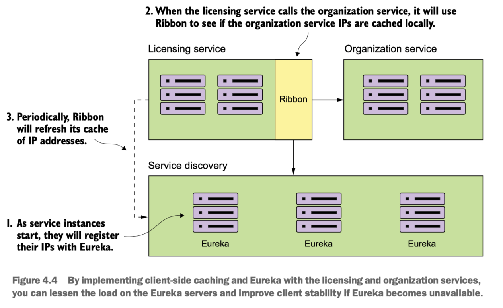
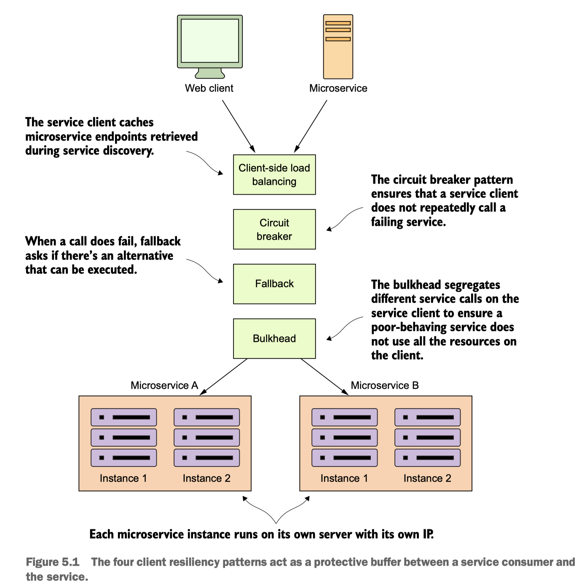

# Spring Cloud

Table of Contents
-----------------

* [1. Microservice](#1-microservice)
* [2. Components](#2-components)
* [3. Configuration Server](#3-configuration-server)
* [4. Service Discovery](#4-service-discovery)
* [5. Client Resilience Patterns](#5-client-resilience-patterns)
   * [5.1 Client-side load balancing](#51-client-side-load-balancing)
   * [5.2 Circuit breaker](#52-circuit-breaker)
* [References](#references)

## 1. Microservice

> A microservice is a small, loosely coupled, distributed service

**Microservice**

  
 

## 2. Components

**Spring Cloud**

  
 

- *Development*
- *Routing*
- *Client Resilience*
- *Security*
- *Logging and tracing*
- *Build and deployment*

## 3. Configuration Server

**Bootstrap**

  
 

**Configuration management**

  
 

## 4. Service Discovery

> In any distributed architecture, we need to find the physical address of where a machine is located

**Why Service Discovery?**

- Horizontally scale up and down the number of service instances running in an environment
- Increase the application resilience

**How Service Discovery?**

  
 

When a consuming actor needs to invoke a service:

1. Contact *Service Discovery* for all the service instances is asking for -> cache data **locally**
2. Each time a client wants to call the service -> use algo (e.g: *RR* ) to ensure that service calls are **spread across** multiple service instances
3. The client will then **periodically** contact the *Service Discovery* and refresh its cache of service instances

**Ribbon**

  
 

## 5. Client Resilience Patterns

> Act as a protective buffer between a service consumer and the service

**Protective Buffer**

  
 

### 5.1 Client-side load balancing

See -> *4. Service Discovery*

### 5.2 Circuit breaker

If the calls take too long -> kill the call

If enough calls fail -> fail fast

### 5.3 Fallback processing

If a remote service call fails, rather than generating an exception, the service consumer will execute an alternative code path and try to carry out an action through another means

### 5.4 Bulkheads

Each remote resource is segregated and assigned to the thread pool. If one service is reponding slowly, the thread pool for that one type of service call will become saturated and stop processing requests

## 6. Service Routing

> *Service gateway*, AKA cross-cutting concerns, which acts as a filter and router

## References

- *Spring Microservices in Action*