# Data-Intensive Application

## Table of Contents

- [Brainstorming](#brainstorming)
- [1. Overview](#1-overview)
	- [1.1 Big Ideas](#11-big-ideas)
	- [1.2 Problems](#12-problems)
		- [1.2.1 Unreliable Networks](#121-unreliable-networks)
		- [1.2.2 Unreliable Clocks](#122-unreliable-clocks)
		- [1.2.3 Process Pauses](#123-process-pauses)
- [2. Data Models](#2-data-models)
- [3. Storage and Retrieval](#3-storage-and-retrieval)
	- [3.1 Hash Index (log)](#31-hash-index-log)
	- [3.2 LSM-Trees Index (log)](#32-lsm-trees-index-log)
	- [3.3 B Trees Index (page)](#33-b-trees-index-page)
- [4. Replication](#4-replication)
	- [4.1 Single-leader](#41-single-leader)
		- [4.1.1 Replication Lag](#411-replication-lag)
	- [4.2 Multi-leader](#42-multi-leader)
	- [4.3 Leaderless](#43-leaderless)
		- [4.3.1 Quorums](#431-quorums)
		- [4.3.2 Write Conflicts](#432-write-conflicts)
- [5. Partitioning](#5-partitioning)
	- [5.1 Strategies](#51-strategies)
		- [5.1.1 Key-Range](#511-key-range)
		- [5.1.2 Hash](#512-hash)
		- [5.1.3 Secondary Indexes](#513-secondary-indexes)
	- [5.2 Rebalancing](#52-rebalancing)
	- [5.3 Request Routing](#53-request-routing)
- [6. Transactions](#6-transactions)
	- [6.1 ACID](#61-acid)
	- [6.2 Isolation Levels](#62-isolation-levels)
		- [6.2.1 Read Committed](#621-read-committed)
		- [6.2.2 Snapshot Isolation](#622-snapshot-isolation)
		- [6.2.3 Serializable](#623-serializable)
	- [6.3 Problems](#63-problems)
		- [6.3.1 Read Skew](#631-read-skew)
		- [6.3.2 Write Skew](#632-write-skew)
- [7. Consistency & Consensus](#7-consistency--consensus)
	- [7.1 Strong Consistency](#71-strong-consistency)
- [References](#references)

## Brainstorming

  
 

## 1. Overview

### 1.1 Big Ideas

**Reliable**

- Making system work correctly, even when the faults occur

**Scalable**

- Having strategies for keeping performance good, even when load increases

**Maintainable**

- Making life better for the engineering and operations teams who need to work with the system

**Data system**

  
 

**Why distributed data?**

- *Scalability*
  - data volume
  - read/write load
- *High availability*
  - redundancy
- *Latency*
  - geographic location

### 1.2 Problems

> Building a reliable system from unreliable components

#### 1.2.1 Unreliable Networks

 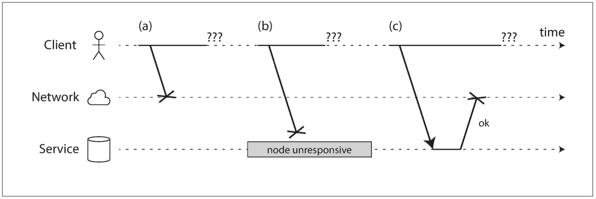 
 

- The request was lost
- The remote node was down
- The response was lost

**Network Congestion**

 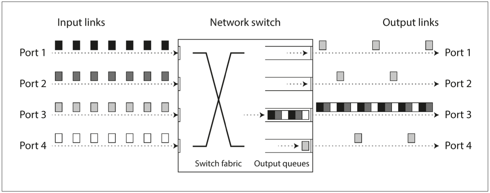 
 

#### 1.2.2 Unreliable Clocks

**Timestamp for ordering events**

 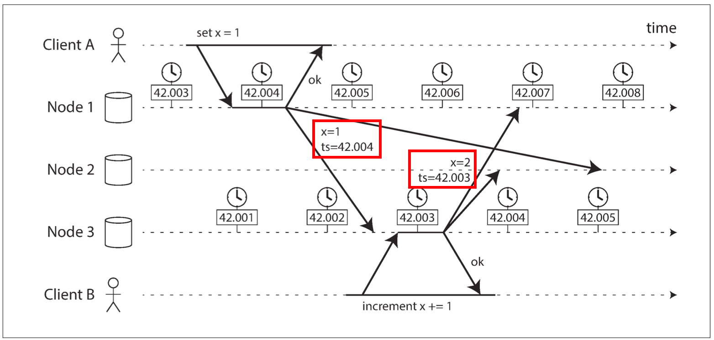 
 

- Database writes can disappear
  - a lagging clock is unable to overwrite values previously written by a node with a fast clock

#### 1.2.3 Process Pauses

**Process Pauses**

 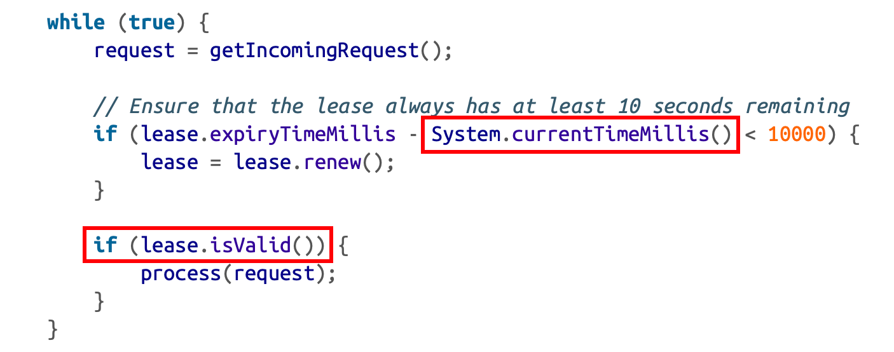 
 

- If the clocks are out of sync by more than a few seconds? (*time-of-day clocks*)
- What if there is an unexpected pause in the execution of the program?
  - *GC STW* 
  - Waiting for a slow disk I/O
  - *Paging*

**Incorrect implementation of a distributed lock**

 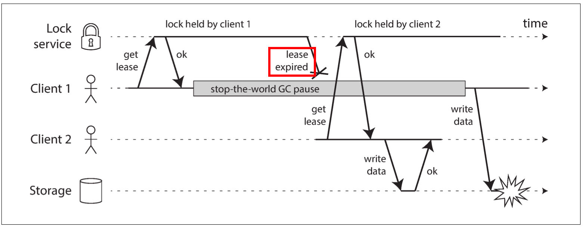 
 

**Fencing Token**

 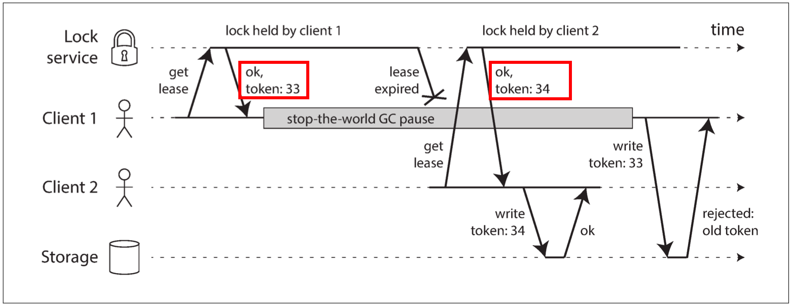 
 

## 2. Data Models

> Relational model, document model, graph model

**Relational model**

  
 

**Document model**

  
 

**Graph model**

  
 

## 3. Storage and Retrieval

> How we can store the data that we're given, and how we can find it again when we're asked for

### 3.1 Hash Index (log)

**Hash index**

  
 

**Compaction**

  
 

**Pros**

- *Sequential write* operations, which are much faster than *random writes*
- Concurrency and crash recovery are much simpler if segment files are *append-only*

**Cons**

- The *hash table* must fit in memory, so it's not suitable for a very large number of keys
- *Range queries* are not efficient

### 3.2 LSM-Trees Index (log)

> Log-structured merge-tree

**Sorted String Table**

  
 

- Merging segments, like ***mergesort***
- Keep the value from the **most recent** segment and discard the values in older segments, ***log-structed***
- *O(logn)* search, less *I/O* bandwidth

**Bloom filters**

- TODO

### 3.3 B Trees Index (page)

> B-tree with n keys always has a depth of O(logn)

**B-tree**

  
 

- *K-V* pairs sorted by key, which allows efficient lookups and queries
- *B-trees* breaks the database down into *pages* (fixed size block)

**Growing on disk**

  
 

*P.S* : A four-level tree for 4KB pages with a branching factor of 500 can store up to 256TB

**WAL**

> *Write-ahead log*, also known as *redo log*

- An *append-only* file
- Every *B-tree* modifications must be written before it can be applied to the *pages*

**Why WAL?**

Because some operations require **several different** pages to be overwritten, it's a dangerous operation if the database **crashes** after only some of the pages have been written

## 4. Replication

> All of the difficulty in replication lies in handling *changes* to replicated data

**Why Replica?**

- Increase availability 
- Increase read throughput
- Reduce latency

**Partition vs Replica**

  
 

### 4.1 Single-leader

**Single-leader**

  
 

**Sync VS Asyns**

  
 

#### 4.1.1 Replication Lag

**Reading your own writes**

  
 

**Monotonic reads**

  
 

**Consistent prefix reads**

  
 

### 4.2 Multi-leader

**Multi-leader across datacenters**

  
 

**Write conflicts**

  
 

**Topologies**

  
 

### 4.3 Leaderless

**Leaderless replication**

  
 

#### 4.3.1 Quorums

**Quorum reads & writes**

  
 

#### 4.3.2 Write Conflicts

**Concurrent writes**

  
 

**Merging concurrently written values**

  
 

- *version1* : [*milk*]
- *version2* : [*eggs*]
- *version3* : [*milk*, *flour*]
- *version4* : [*eggs*, *milk*, *ham*]
- *version5* : [*milk*, *flour*, *eggs*, *bacon*]

**Happens-before**

  
 

## 5. Partitioning

**Partition w/ replication**

  
 

### 5.1 Strategies

#### 5.1.1 Key-Range

**Partitioning by Key Range**

  
 

#### 5.1.2 Hash

**Partitioning by Hash**

  
 

#### 5.1.3 Secondary Indexes

**Document-based**

  
 

**Term-based**

  
 

### 5.2 Rebalancing

**Fixed Number of Partitions**

  
 

### 5.3 Request Routing

**Differeny Ways of Request Routing**

  
 

**Coordination Service**

  
 

## 6. Transactions

### 6.1 ACID

**Race Condition**

  
 

**Dirty Read**

  
 

**Atomicity avoids inconsistent state**

  
 

### 6.2 Isolation Levels

#### 6.2.1 Read Committed

**Read Committed**

  
 

#### 6.2.2 Snapshot Isolation

**MVCC**

  
 

- An *update* is internally translated into a *delete* and a *create*
- At some later time, *GC* process in the database removes any rows marked for deletion and frees their space

#### 6.2.3 Serializable

**2PL**

 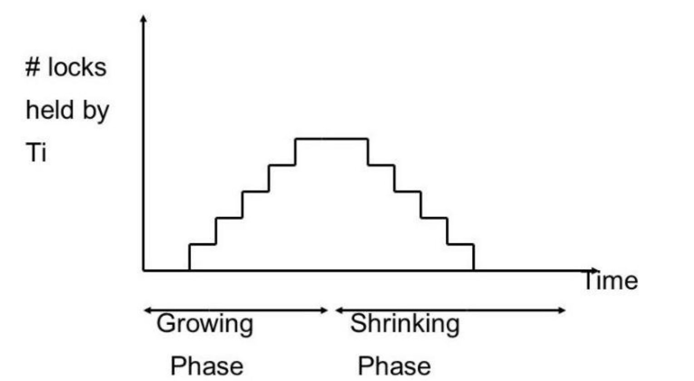 
 

- After a transaction has acquired the lock, **it must continue to hold the lock until the end of the transaction (commit or abort)**

**Index-Range Locks Example**

  
 

- **Approach 1:** Database attach a *shared lock* to **index** *room_id* for room 123
- **Approach 2:** Database attach a *shared lock* to a **range** of values in **index** *start_time* and *end_time* with the time period of noon to 1pm

**SSI: Detecting stale *MVCC* reads**

 
 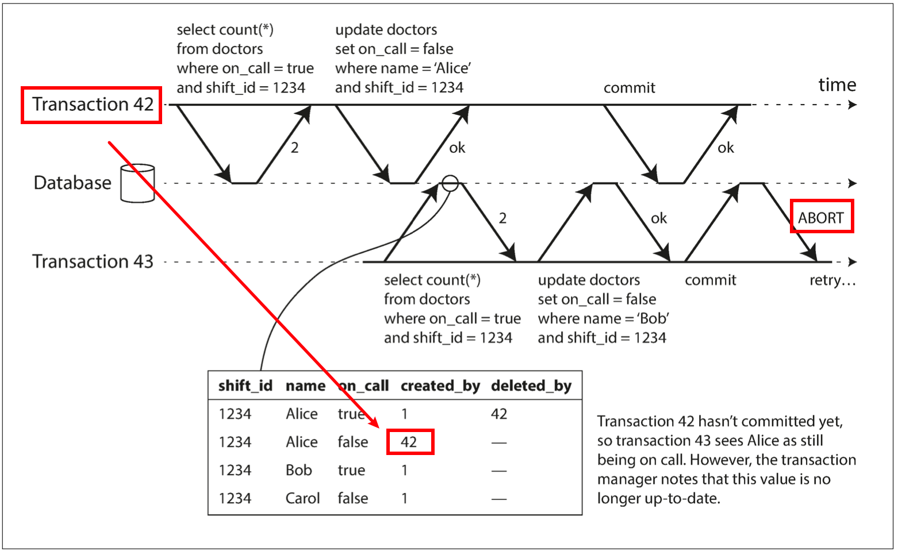 
 

- When the transaction **wants to commit** (not abort immediately), the database checks whether any of the ignored writes have now been committed. **If so, the transaction must be aborted** (*optimistic*)

**SSI: Detecting writes that affect prior reads**

  
 

### 6.3 Problems

#### 6.3.1 Read Skew

**Read Skew**

 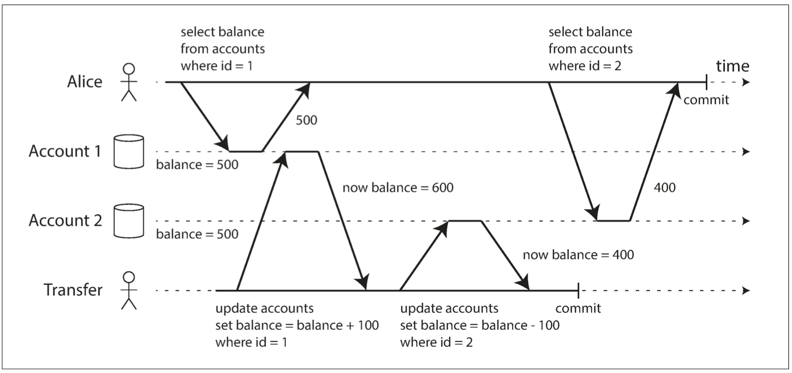 
 

#### 6.3.2 Write Skew

**Dirty Writes**

  
 

**Write Skew Example**

> The hospital tries to have serveral doctors on call at any one time, but it absolutely must have at least one doctor on call

 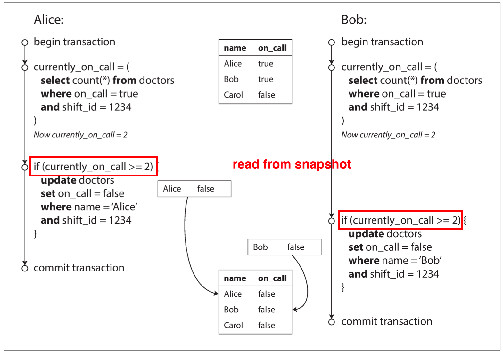 
 

- Since the database is using snapshot isolation, both checks return 2, so both transactions proceed to the next stage

**Explicit lock**

 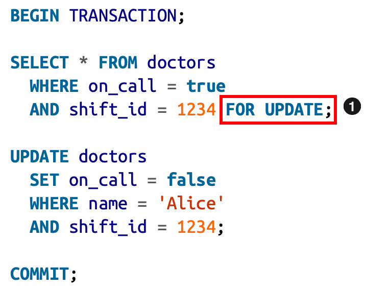 
 

- *SELECT FOR UPDATE* tells the database to lock all rows returned by this query. So, we could make the transaction safe and avoid *write skew*

## 7. Consensus

### 7.1 2PC

**Two-Phase Commit**

 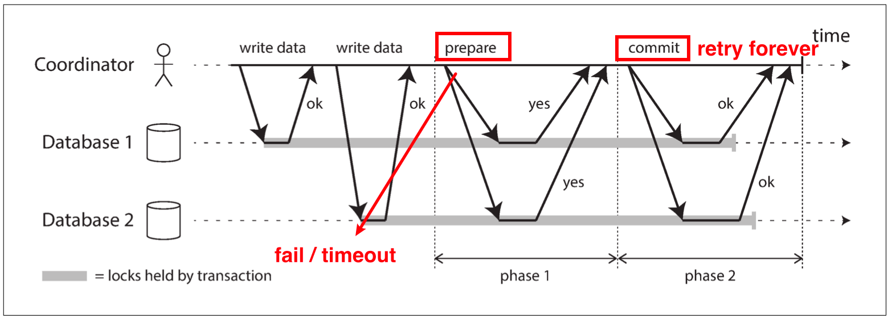 
 

1. The application begins a single-node transaction on each of the nodes (what if node crashes or request timeout?)
2. The coordinator sends a prepare request to all nodes (what if node crashes or request timeout?)
3. When a node receives the prepare request, it makes sure that it can **definitely** commit the *tx* under all circumstances
4. The coordinator makes a **definitely decision**, writes it to its log on disk

**Coordinator Failure**

 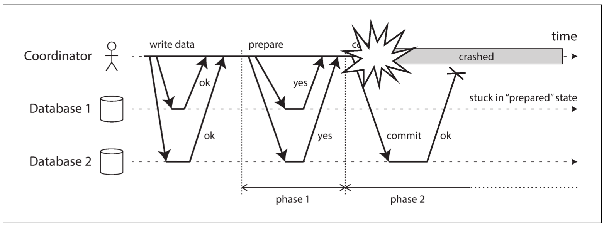 
 

- This is why the *coordinator* must write its commit / abort decision to a transaction log on disk before phase 2

## References

- *Designing Data-Intensive Applications: The Big Ideas Behind Reliable, Scalable, and Maintainable Systems*
- [How databases scale writes: The power of the log](https://www.youtube.com/watch?v=_5vrfuwhvlQ)
- [What are Bloom Filters? - Hashing](https://www.youtube.com/watch?v=bgzUdBVr5tE)
- [Merge sort in 3 minutes](https://www.youtube.com/watch?v=4VqmGXwpLqc)
- [Bloom Filters by Example](https://llimllib.github.io/bloomfilter-tutorial/)
- [An Illustrated Proof of the CAP Theorem](https://mwhittaker.github.io/blog/an_illustrated_proof_of_the_cap_theorem/)
