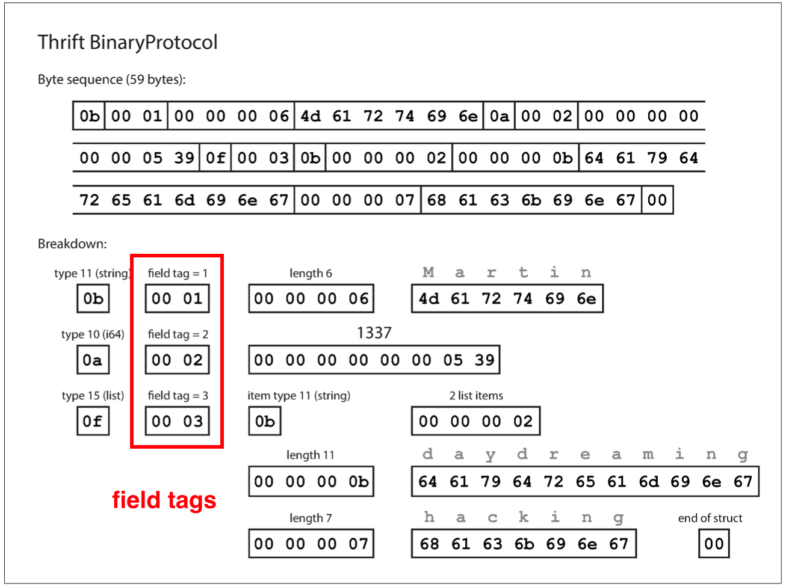

# Data-Intensive Application

## Table of Contents

- [Brainstorming](#brainstorming)
- [1. Overview](#1-overview)
- [2. Data Models](#2-data-models)
- [3. Storage and Retrieval](#3-storage-and-retrieval)
	- [3.1 Hash Index (log)](#31-hash-index-log)
	- [3.2 LSM-Trees Index (log)](#32-lsm-trees-index-log)
	- [3.3 B Trees Index (page)](#33-b-trees-index-page)
- [4. Encoding and Evolution](#4-encoding-and-evolution)
	- [4.1 Encoding](#41-encoding)
		- [4.1.1 Thrift](#411-thrift)
- [References](#references)

## Brainstorming

<div align="center">  </div><br>

## 1. Overview

**Reliable**

- Making system work correctly, even when the faults occur

**Scalable**

- Having strategies for keeping performance good, even when load increases

**Maintainable**

- Making life better for the engineering and operations teams who need to work with the system

**Data system**

<div align="center">  </div><br>

## 2. Data Models

> Relational model, document model, graph model

**Relational model**

<div align="center">  </div><br>

**Document model**

<div align="center">  </div><br>

- storage locality (stored as a single continuous string)
- one to many
- no relationships

**Graph model**

<div align="center">  </div><br>

- many to many

## 3. Storage and Retrieval

> How we can store the data that we're given, and how we can find it again when we're asked for

### 3.1 Hash Index (log)

**Hash index**

<div align="center">  </div><br>

**Compaction**

<div align="center">  </div><br>

**Pros**

- *Sequential write* operations, which are much faster than *random writes*
- Concurrency and crash recovery are much simpler if segment files are *append-only*

**Cons**

- The *hash table* must fit in memory, so it's not suitable for a very large number of keys
- *Range queries* are not efficient

### 3.2 LSM-Trees Index (log)

> Log-structured merge-tree

**Sorted String Table**

<div align="center">  </div><br>

- Merging segments, like ***mergesort***
- Keep the value from the **most recent** segment and discard the values in older segments, ***log-structed***
- *O(logn)* search, less *I/O* bandwidth

**Bloom filters**

- xxx

### 3.3 B Trees Index (page)

> B-tree with n keys always has a depth of O(logn)

**B-tree**

<div align="center">  </div><br>

- *KV* pairs sorted by key, which allows efficient lookups and queries
- *B-trees* breaks the database down into *pages* (fixed size block)

**Growing on disk**

<div align="center">  </div><br>

*P.S* : A four-level tree for 4KB pages with a branching factor of 500 can store up to 256TB

**WAL**

> *Write-ahead log*, also known as *redo log*

- An *append-only* file
- Every *B-tree* modifications must be written before it can be applied to the *pages*

**Why we need WAL?**

Because some operations require **several different** pages to be overwritten, it's a dangerous operation if the database **crashes** after only some of the pages have been written

## 4. Encoding and Evolution

> How encoding data handle schema changes and how they support systemts where old & new data and code need to coexist

### 4.1 Encoding

> The translation from the in-memory representation to a byte sequence

**Example**

```json
{
   "userName":"Martin",
   "favoriteNumber":1337,
   "interests":[
      "daydreaming",
      "hacking"
   ]
}
```

#### 4.1.1 Thrift

**BinaryProtocol**

<div align="center">  </div><br>


## References

- *Designing Data-Intensive Applications: The Big Ideas Behind Reliable, Scalable, and Maintainable Systems*
- [How databases scale writes: The power of the log](https://www.youtube.com/watch?v=_5vrfuwhvlQ)
- [What are Bloom Filters? - Hashing](https://www.youtube.com/watch?v=bgzUdBVr5tE)
- [Merge sort in 3 minutes](https://www.youtube.com/watch?v=4VqmGXwpLqc)
- [Bloom Filters by Example](https://llimllib.github.io/bloomfilter-tutorial/)
