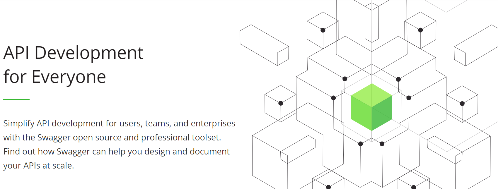
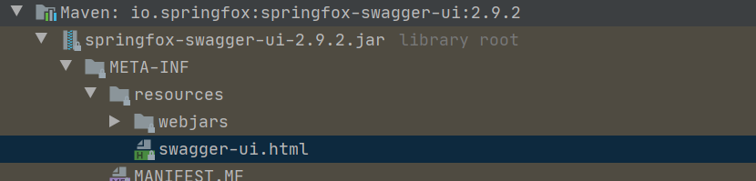
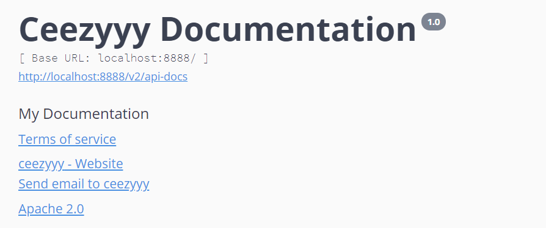

# Swagger

<div align="center">  </div><br>


## 目录

* [1.什么是 Swagger?](#1----swagger-)
* [2.为什么使用 Swagger?](#2------swagger-)
* [3.Quickstart](#3quickstart)
  + [3.1 引入依赖](#31-----)
  + [3.2 集成 SpringBoot](#32----springboot)
  + [3.3 配置 Swagger](#33----swagger)
    - [3.3.1 Docket](#331-docket)
    - [3.3.2 ApiInfo](#332-apiinfo)
    - [3.3.3 扫描接口](#333-----)
    - [3.3.4 配置分组](#334-----)
    - [3.3.5 swagger 注释](#335-swagger---)
* [参考链接](#----)


## 1.什么是 Swagger?

`Swagger` 是一款强大的 `API` 开发工具，可以贯穿全流程，从设计到文档，从测试到开发


## 2.为什么使用 Swagger?

- 通过 `swagger` 给一些较难理解的属性 / 接口，增加注释信息

- 接口文档实时更新
- 在线测试 `API` 接口


## 3.Quickstart

### 3.1 引入依赖

**pom.xml**

```xml
<dependency>
    <groupId>io.springfox</groupId>
    <artifactId>springfox-swagger2</artifactId>
    <version>2.9.2</version>
</dependency>


<dependency>
    <groupId>io.springfox</groupId>
    <artifactId>springfox-swagger-ui</artifactId>
    <version>2.9.2</version>
</dependency>
```

### 3.2 集成 SpringBoot

**SpringFoxConfig.java**

```java
@Configuration
@EnableSwagger2
public class SpringFoxConfig {

}
```

**HelloController.java**

```java
@RestController
public class HelloController {

    @GetMapping("/hello")
    public String hello() {
        return "Hello";
    }
}
```

访问

```html
http://localhost:8888/swagger-ui.html
```

:heavy_check_mark: `swagger` 搭建成功


<div align="center">  </div><br>

其中 `basic-error-controller` 就是我们常见的错误页面

<div align="center">  </div><br>

**如何知道要访问的 swagger-ui 网址？**

引入的 `jar` 包中

<div align="center">  </div><br>


### 3.3 配置 Swagger

#### 3.3.1 Docket

<div align="center">  </div><br>

`springboot` 配置 `swagger` 主要围绕着 `Docket` 类

`swagger` 配置类，交给 `spring` 帮我们实例化 `bean` 对象

```java
@Configuration
@EnableSwagger2
public class SpringFoxConfig {

    @Bean
    public Docket docket() {
        return new Docket(DocumentationType.SWAGGER_2);
    }

}
```

`Docket` 实现了插件接口

<div align="center">  </div><br>

进入源码，发现 `Docket` 只有一个构造方法

**Docket.class**

```java
public Docket(DocumentationType documentationType) {
    this.apiInfo = ApiInfo.DEFAULT;
    this.groupName = "default";
    this.enabled = true;
    this.genericsNamingStrategy = new DefaultGenericTypeNamingStrategy();
    this.applyDefaultResponseMessages = true;
    this.host = "";
    this.pathMapping = Optional.absent();
    this.apiSelector = ApiSelector.DEFAULT;
    this.enableUrlTemplating = false;
    this.vendorExtensions = Lists.newArrayList();
    this.documentationType = documentationType;
}
```

需要传入 `DocumentationType` 参数

进入 `DocumentationType` 


**DocumentationType.class**

```java
public static final DocumentationType SWAGGER_12 = new DocumentationType("swagger", "1.2");
public static final DocumentationType SWAGGER_2 = new DocumentationType("swagger", "2.0");
public static final DocumentationType SPRING_WEB = new DocumentationType("spring-web", "1.0");
private final MediaType mediaType;
```

我们使用 `SWAGGER_2`

#### 3.3.2 ApiInfo

看完了 `Docket` 类，还有一个重要的类：`ApiInfo`

**ApiInfo.class**

```java
public class ApiInfo {
    public static final Contact DEFAULT_CONTACT = new Contact("", "", "");
    public static final ApiInfo DEFAULT;
    private final String version;
    private final String title;
    private final String description;
    private final String termsOfServiceUrl;
    private final String license;
    private final String licenseUrl;
    private final Contact contact;
    private final List<VendorExtension> vendorExtensions;

    static {
        DEFAULT = new ApiInfo("Api Documentation", "Api Documentation", "1.0", "urn:tos", DEFAULT_CONTACT, "Apache 2.0", "http://www.apache.org/licenses/LICENSE-2.0", new ArrayList());
    }
```

其中包含了静态代码块

这刚好就是 `swagger-ui.html` 页面中的

<div align="center">  </div><br>

接下来让我们配置 `api info`

`Docket` 中有个方法：

**Docket.class**

```java
public Docket apiInfo(ApiInfo apiInfo) {
    this.apiInfo = (ApiInfo)BuilderDefaults.defaultIfAbsent(apiInfo, apiInfo);
    return this;
}
```

支持我们自定义 `apiInfo`

再看看 `ApiInfo` 的构造方法

**ApiInfo.class**

```java
public ApiInfo(String title, String description, String version, String termsOfServiceUrl, Contact contact, String license, String licenseUrl, Collection<VendorExtension> vendorExtensions) {
    this.title = title;
    this.description = description;
    this.version = version;
    this.termsOfServiceUrl = termsOfServiceUrl;
    this.contact = contact;
    this.license = license;
    this.licenseUrl = licenseUrl;
    this.vendorExtensions = Lists.newArrayList(vendorExtensions);
}
```

同样地，在配置类 

让 `ApiInfo` 交给 `Spring` 管理，并且作为参数传入到 `Docket` 中


**SpringFoxConfig.java**

```java
@Configuration
@EnableSwagger2
public class SpringFoxConfig {

    @Bean
    public Docket docket(@Autowired ApiInfo apiInfo) {
        return new Docket(DocumentationType.SWAGGER_2).apiInfo(apiInfo);
    }

    @Bean
    public ApiInfo apiInfo() {
        Contact contact = new Contact("ceezyyy", "https://github.com/ceezyyy", "ceezyyy11@gmail.com");
        return new ApiInfo("Ceezyyy Documentation", "My Documentation", "1.0", "urn:tos", contact, "Apache 2.0", "http://www.apache.org/licenses/LICENSE-2.0", new ArrayList());
    }

}
```

:heavy_check_mark: 配置 `ApiInfo` 成功

<div align="center">  </div><br>

#### 3.3.3 扫描接口

既然 `swagger` 是一个强大的 `api` 开发工具

那么我们在 `controller` 层写的所有接口都要被扫描吗？

这里引入了 **扫描接口** 的概念，`swagger` 提供了 `select()` 方法供我们选择需要扫描的接口

<div align="center">  </div><br>

需要一个 `ApiSelectorBuilder` 

(熟悉的工厂模式)

**SpringFoxConfig.java**

```java
@Bean
public Docket docket(@Autowired ApiInfo apiInfo) {
    return new Docket(DocumentationType.SWAGGER_2)
        .apiInfo(apiInfo)
        .select()
        .build();
}
```

<div align="center">  </div><br>

- apis
- paths

**SpringFoxConfig.java**

```java
@Bean
public Docket docket(@Autowired ApiInfo apiInfo) {
    return new Docket(DocumentationType.SWAGGER_2)
        .apiInfo(apiInfo)
        .select()    .apis(RequestHandlerSelectors.basePackage("com.ceezyyy.springbootswagger.controller"))
        .build();
}
```


<div align="center">  </div><br>


#### 3.3.4 配置分组

<div align="center">  </div><br>

在 `Docket` 中有 `groupName` 属性

**Docket.class**

```java
public Docket(DocumentationType documentationType) {
    this.apiInfo = ApiInfo.DEFAULT;
    this.groupName = "default";
    this.enabled = true;
    this.genericsNamingStrategy = new DefaultGenericTypeNamingStrategy();
    this.applyDefaultResponseMessages = true;
    this.host = "";
    this.pathMapping = Optional.absent();
    this.apiSelector = ApiSelector.DEFAULT;
    this.enableUrlTemplating = false;
    this.vendorExtensions = Lists.newArrayList();
    this.documentationType = documentationType;
}
```


多个分组是为了不同模块的区分

**SpringFoxConfig.java**

```java
@Configuration
@EnableSwagger2
public class SpringFoxConfig {

    @Bean
    public Docket docket(@Autowired ApiInfo apiInfo) {
        return new Docket(DocumentationType.SWAGGER_2)
                .apiInfo(apiInfo)
                .groupName("Group 1")
                .select()
                .apis(RequestHandlerSelectors.basePackage("com.ceezyyy.springbootswagger.controller"))
                .build();
    }

    @Bean
    public Docket docket1(@Autowired ApiInfo apiInfo) {
        return new Docket(DocumentationType.SWAGGER_2)
                .apiInfo(apiInfo)
                .groupName("Group 2")
                .select()
                .apis(RequestHandlerSelectors.basePackage("com.ceezyyy.springbootswagger.controller"))
                .build();
    }

    @Bean
    public Docket docket2(@Autowired ApiInfo apiInfo) {
        return new Docket(DocumentationType.SWAGGER_2)
                .apiInfo(apiInfo)
                .groupName("Group 3")
                .select()
                .apis(RequestHandlerSelectors.basePackage("com.ceezyyy.springbootswagger.controller"))
                .build();
    }

    @Bean
    public ApiInfo apiInfo() {
        Contact contact = new Contact("ceezyyy", "https://github.com/ceezyyy", "ceezyyy11@gmail.com");
        return new ApiInfo("Ceezyyy Documentation", "My Documentation", "1.0", "urn:tos", contact, "Apache 2.0", "http://www.apache.org/licenses/LICENSE-2.0", new ArrayList());
    }

}
```

设置 3 个 `Docket`

:heavy_check_mark: 配置分组成功


<div align="center">  </div><br>


#### 3.3.5 swagger 注释

`entity`

**User.java**

```java
@Data
@AllArgsConstructor
@NoArgsConstructor
@ApiModel("User entity")
public class User {

    @ApiModelProperty("Username of user")
    private String username;

    @ApiModelProperty("Password of user")
    private String password;

}
```


**HelloController.java**

```java
@RestController
public class HelloController {

    @GetMapping("/hello")
    public String hello() {
        return "Hello";
    }

    @PostMapping("/user")
    public User getUser() {
        return new User("ceezyyy", "123456");
    }
}
```

若返回值包含 `model`，则会被 `swagger` 检测到

<div align="center">  </div><br>


## 参考链接

[【狂神说Java】一小时掌握Swagger技术](https://www.bilibili.com/video/BV1Y441197Lw?from=search&seid=17955201807129821797)