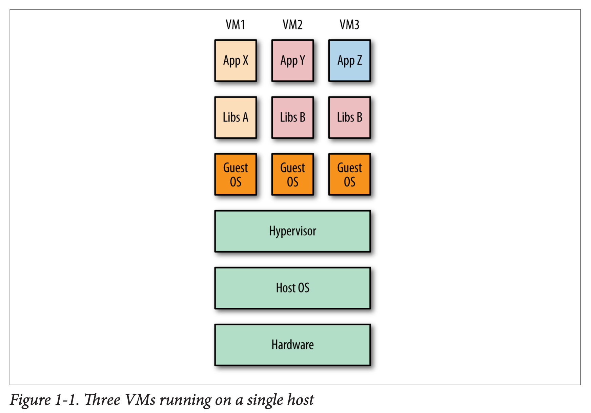
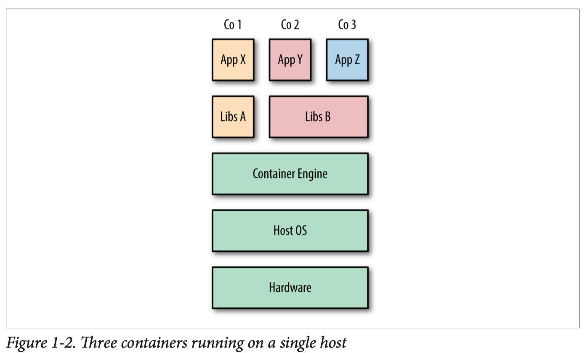

# Docker

Table of Contents
-----------------

* [1. Container](#1-container)
* [2. Components](#2-components)
   * [2.1 Container](#21-container)
   * [2.2 Image](#22-image)
   * [2.3 Repository](#23-repository)
* [References](#references)

## 1. Container

> Containers are an ecapsulation of an application w/ its dependencies

**VMs**

  
 

Unlike VMs, **the host's kernel is shared w/ running containers**, which means processes running inside containers are equivalent to native process

**Containers**

  
 

**Docker and Containers**

Docker took the existing Linux container tech and wrapped and extended it

## 2. Components

**Overview**

  
 

### 2.1 Container

A container is simply another process on your machine that has been isolated from all other processes on the host machine

### 2.2 Image

  
 

- filesystem
- all dependencies, configuration, scripts, binaries, etc
- configuration for the container

### 2.3 Repository

**Docker Hub**

  
 

## References

- *Docker in Action*
- *Using Docker*
- [Install Docker Engine on CentOS](https://docs.docker.com/engine/install/centos/)
