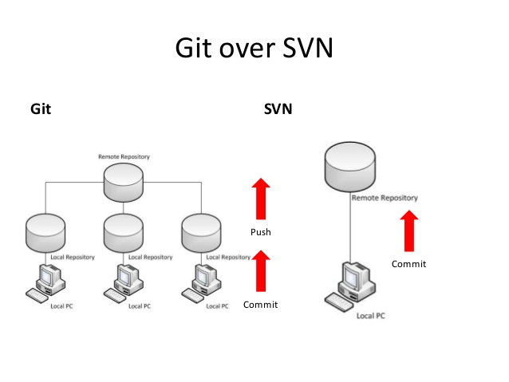

# Git

  
 

Table of Contents
-----------------

* [1. 什么是 git?](#1-什么是-git)
* [2. Git &amp; svn](#2-git--svn)
* [3. Git workflow](#3-git-workflow)
* [4. Git 常用命令](#4-git-常用命令)

## 1. 什么是 git?

维基百科

> git 是一个分布式版本控制软件，最初由林纳斯·托瓦兹创作，于 2005 年以 GPL 发布。最初目的是为更好地管理 Linux 内核开发而设计。

## 2. Git & svn

`svn` 的缺点：

- 容错性差（服务器单点故障）

  
 

 `git` 优于 `svn` 的点：

- 分布式（分为目的仓库和远程仓库）

## 3. Git workflow

## 4. Git 常用命令

