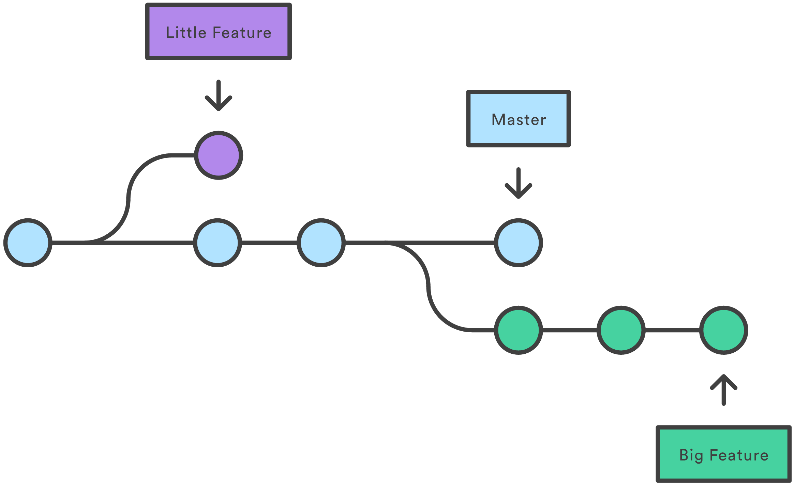

# Git

  
 

Table of Contents
-----------------

* [1. 什么是 git?](#1-什么是-git)
* [2. Git workflow](#2-git-workflow)
* [3. Git branch](#3-git-branch)
* [参考链接](#参考链接)

## 1. 什么是 git?

维基百科

> git 是一个分布式版本控制软件，最初由林纳斯·托瓦兹创作，于 2005 年以 GPL 发布。最初目的是为更好地管理 Linux 内核开发而设计。

## 2. Git workflow

  
 

- remote：远程仓库
- repository：本地仓库 / 版本库
- index：暂存区
- workspace：工作区（本地）

## 3. Git branch

  
 

## 参考链接

- [Git教程 - 廖雪峰的官方网站](https://www.liaoxuefeng.com/wiki/896043488029600)