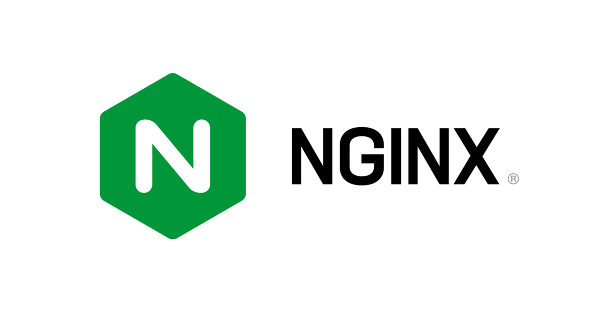
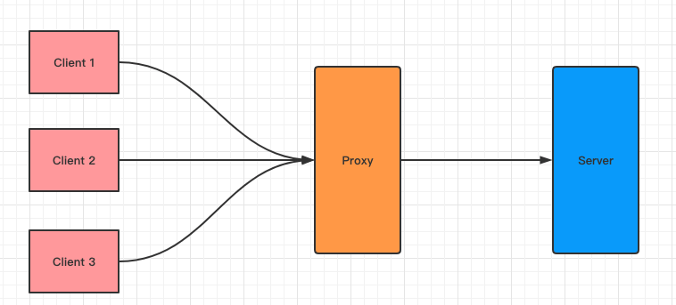
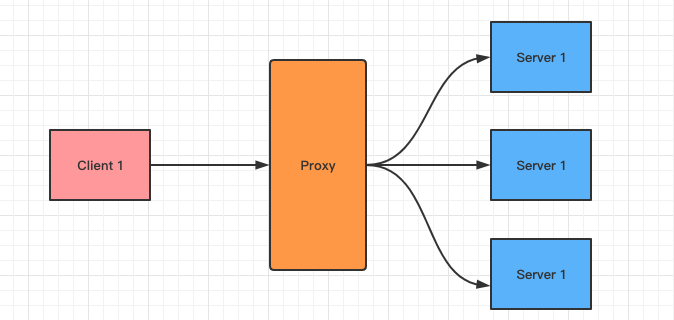

# Nginx

  
 

Table of Contents
-----------------

* [1. 什么是 nginx ?](#1-什么是-nginx-)
* [2. 什么是正向代理 ?](#2-什么是正向代理-)
* [3. 为什么需要正向代理 ?](#3-为什么需要正向代理-)
* [4. 什么是反向代理 ?](#4-什么是反向代理-)
* [5. 为什么需要反向代理 ?](#5-为什么需要反向代理-)
* [6. 什么是负载均衡 ?](#6-什么是负载均衡-)
* [7. 什么是动静分离 ?](#7-什么是动静分离-)
* [参考链接](#参考链接)

## 1. 什么是 nginx ?

> **NGINX** is open source software for web serving, reverse proxying, caching, load balancing, media streaming, and more. It started out as a web server designed for maximum performance and stability. In addition to its HTTP server capabilities, NGINX can also function as a proxy server for email (IMAP, POP3, and SMTP) and a reverse proxy and load balancer for HTTP, TCP, and UDP servers.

## 2. 什么是正向代理 ?

正向代理，指的是在客户端访问服务器的途中，加了一层代理服务器

## 3. 为什么需要正向代理 ?

正向代理的特点有：

- 匿名：隐藏客户端的身份
- 缓存：加速访问资源
- 屏蔽禁网：对客户端访问授权，上网进行认证

  
 

## 4. 什么是反向代理 ?

如果说正向代理

  
 

## 5. 为什么需要反向代理 ?

## 6. 什么是负载均衡 ?

## 7. 什么是动静分离 ?

## 参考链接

- [尚硅谷Nginx教程(nginx快速上手)](https://www.bilibili.com/video/BV1zJ411w7SV?from=search&seid=14801352366954859743)
- [What is NGINX?](https://www.nginx.com/resources/glossary/nginx/)
- [Proxy vs. Reverse Proxy (Explained by Example)](https://www.youtube.com/watch?v=ozhe__GdWC8)
- [写给后端的Nginx初级入门教程:基础篇](https://juejin.im/post/6844903966128635918)
- [正向代理与反向代理【总结】](https://www.cnblogs.com/Anker/p/6056540.html)
